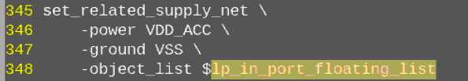
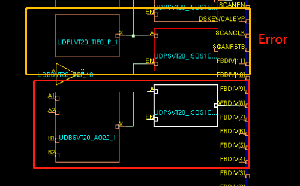

# pre dft upf
* top -innolink的连线有些port mismatch

# post dft upf clp_check

floating input缺少设置；

类似上面，floating input 缺少配置；

下面解决方式：

Top上的cell没有设置releate power，导致clp自己推断了一个，与实际名称冲突；set_domain_supply_net，

下面解决方式：

<mark>下面解决方式：</mark>

缺少 off > on 的iso；跟pst有关；

# 0527~0531
##  需要补充一下trng (osc_clk osc_data)x8,  osc_cell_block x3
 

## analog 和 digital连接问题
* [x]Efuse Pin  VDD18 VQPS多supply set驱动SS_VDD，SS_VDD_CHIP；这个不管，后面没有efuse了；
* digital port直接练到了 analog port上；就是这么连得，可以找rock确认；
* [x]IO port AY500(1.65)连到了vts analog port(1.62)上；lib的问题，不用管；

## 为什么要过pin_mux，两个on之间插了一个off的buffer；

## floating input需要设置related local power
有两种，1种只有nvme nfi，另一种包含eda dielink osc等；

## pll有一些aon tie值经过了iso，又接到了aon的port上
需要看tie的值是否是设计写的，能否直接连接aon tie不插iso；

## floating得 可能需要加noiso
