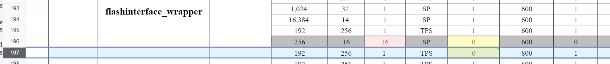
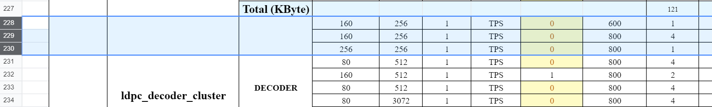
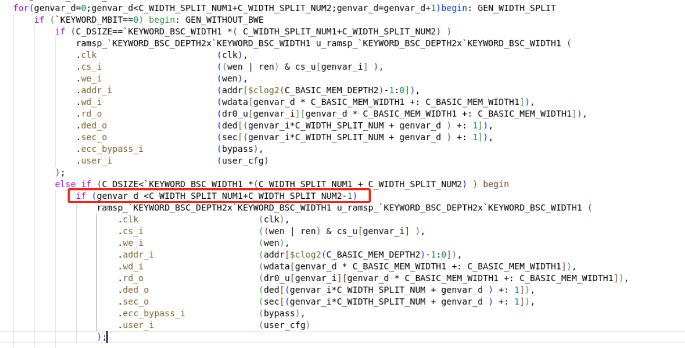

# Memory仿真

## 仿真报warning的Memory：

DI要求留120ps余量

讲深度在15-30um之间的时候说到一个log ？

check_mem、find_file用不到了；

将每个block用到mem list出来，

# 问题
ecc 和  necc 对比
repair 和 non_repair 对比

\cp 的问题？
模板中的`define是不是没必要？只需要字符串匹配就行？
C_ECC_WIDTH的： 后面为什么不需要乘C_WIDTH_SPLIT_NUM？

width2才有拆分，width1没有拆分

这个小于是什么意思，感觉和上面的一样。
