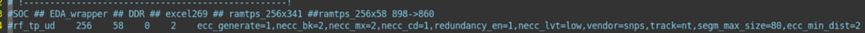
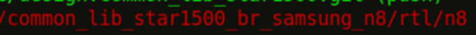
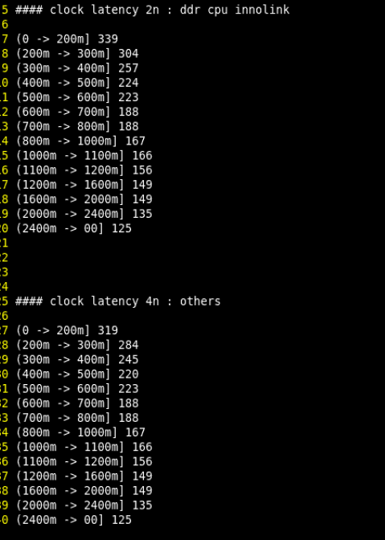
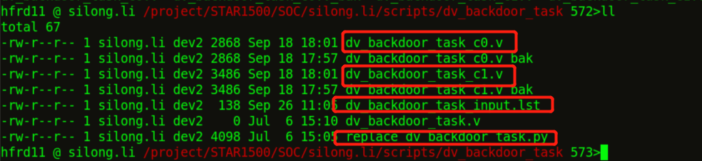
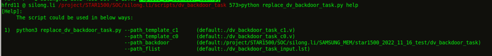
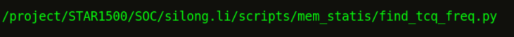
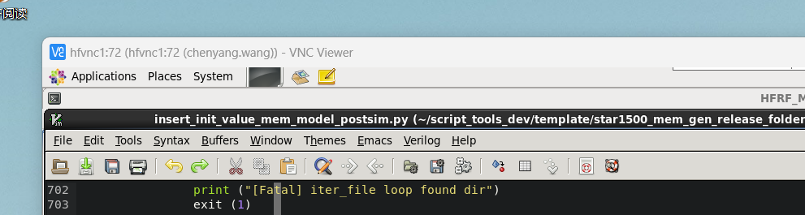

# Memory生成
# 首先从git上拉下脚本。
  
# Memory生成
1）cp 目录下的mem_gen_tools，然后将star1500_mems.lst放到这个目录下。下面是目录内容

然后make run
# 包wrapper
Git 上下拉库

 
进入目录

打开 replace_all.sh
 
source replace_all.sh
#	仿真

timing 余量

函数结构

repair memory 后台访问的task生成脚本呢

比较的脚本

对比timing

