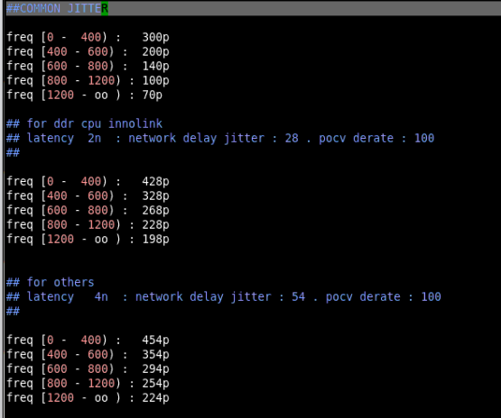

# Memory生成
# 首先从git上拉下脚本。
  
# Memory生成
1）cp 目录下的mem_gen_tools，然后将star1500_mems.lst放到这个目录下。下面是目录内容

然后make run
【注意】
rf_sp_ed：single port extrame high density register file
rf_sp_hd：single port high density register file
rf_sp_hs：single port high speed register file
ra_sp_ed：single port extrame high density sram
ra_sp_hd：single port high density sram
ra_sp_hs：single port high speed sram
ra_sp_ud：single port ultra high density (DISCARD)
ra_dp_hd：dual port high density sram (True Two-clock)
rf_tp_hd：two port high density register file (Pesudo Two-clock）
rf_tp_ud：two port ultra high density register file (one-clock)

# 包wrapper
Git 上下拉库

 
进入目录

打开 replace_all.sh
 
source replace_all.sh

source gen_mem_all_flow.sh
>  gen_mem_all_flow.sh 结构如下
    1. 生成db。(1500不用)
    2. 前仿model插入mem init。
    3. 后仿model插入mem init。
    4. 总结所有的filelist到/ux/lib/1500_mem。
    5. 将生成的mem copy到/ux/lib/1500_mem。
    6. 在/ux/lib创建1500_mem/filelist。
    7. 合并filelist到1500_mem/filelist；删除filelist中重复的mem。
    8. 将mem/fielist 转换为emu filelist。
    9. 生成后仿的filelist。
    10. 更新后端Memory/lib链接。
    11. 检查 mem width 15-30之间的。
    12. gen model cell filelist。
    13. timing check。
    14. freq check。

# 检查后端lib等
1.filelist
2.backend

#	仿真

timing 余量（旧）

函数结构

repair memory 后台访问的task生成脚本呢

比较的脚本

对比timing

