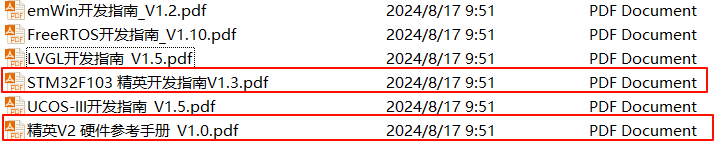
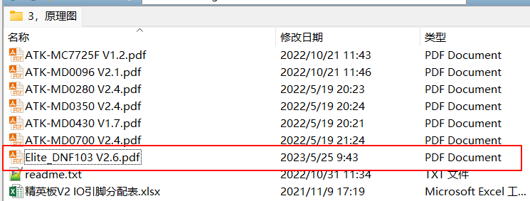
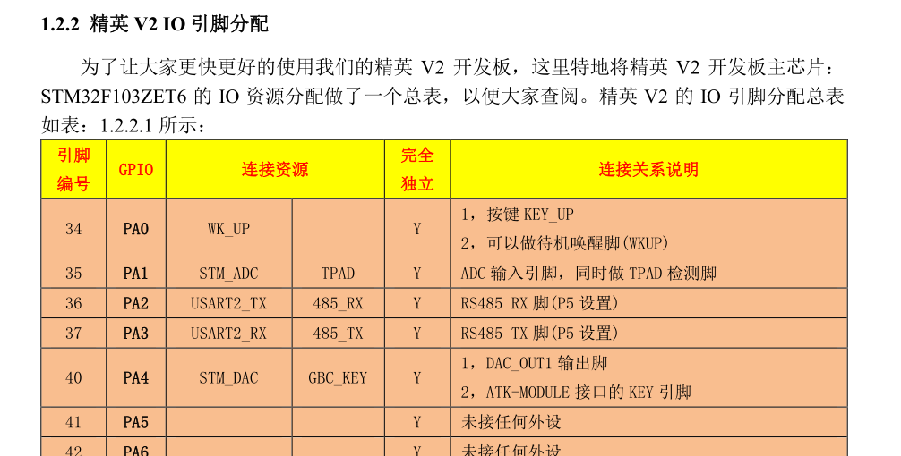
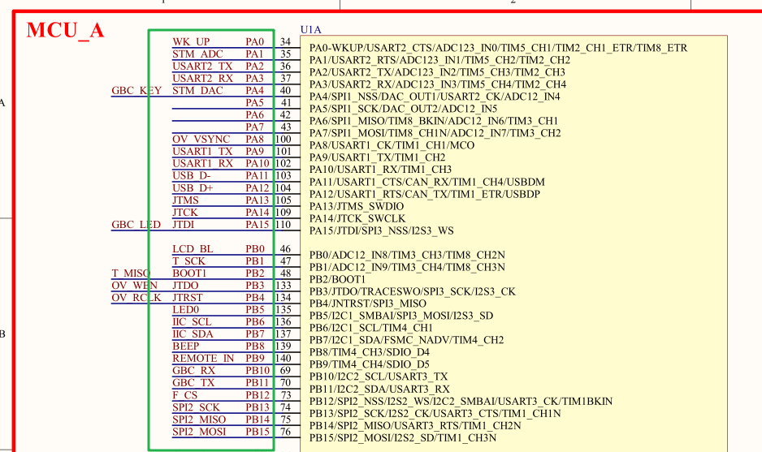

# STM32学习指导
# 学习原则
<mark>通用的基础知识要多学习</mark>

# 三个关键文档

* 《STM32F103 精英开发指南V1.3.pdf》学习基础知识、实验流程、实验知识的
* 《精英V2 硬件参考手册_V1.0.pdf》 学习开发板上有哪些硬件资源的
* 《Elite_DNF103 V2.6.pdf》 学习开发板上硬件模块是如何连接的

# GPIO

<mark>GPIO资源总数可以在《STM32F103 精英开发指南V1.3.pdf》中查询；</mark>

<mark>GPIO分配表可以在《精英V2 硬件参考手册_V1.0.pdf》中查询；</mark>

<mark>GPIO硬件原理图可以在《Elite_DNF103 V2.6.pdf》中查询；</mark>

<mark>也可以在《STM32F103 精英开发指南V1.3.pdf》中查询每个实验相关的硬件原理图；</mark>

