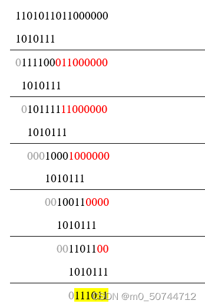
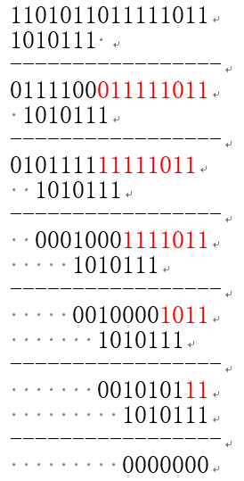

# CRC校验原理

发送端：发送端根据信息字段与<mark>生成多项式</mark>生产一个CRC码，CRC码作为数据发送给接收端，同时也会把计算出的校验字段的数据一同发送(注：目的是如果接受端检测到发送的数据是正确的，接收端能够从CRC码中提取出信息字段的数据)。

接收端：接收到CRC码数据后，检测接收到的数据是否正确，方法：将CRC码数据与生成多项式进行模2除，如果余数为0，则说明接收到的数据是正确的。然后，从CRC码中提取出信息字段的数据。

# CRC计算过程演示
- 第一步：展开多项式，得到除数（参照常用的CRC多项式模型）
例如多项式 x6+x4+x2+x+1 ，即 1x6+0x5+1x4+0x3+1x2+1x+1
得到除数：1010111
- 第二步：在原来的数据末尾加0，多项式有几阶就加多少零，该多项式的阶数为6
原始数据： 1101011011
补0之后的数据：1101011011000000
- 第三步：按位异或
将数据串第一个1与除数左对齐，按位进行异或（相同得0，不同得1）操作，将未处理的数据搬下来作为新字符串，重复操作,直到所有数据都处理过为止。

原始数据：1101011011
除数：1010111
带有CRC校验的数据：1101011011111011
若最后得到的CRC校验有效位数较少的时候，例如000011，不要忽略前面的0.所拼接的校验和长度应于之前加0的个数相等。

# CRC校验

将CRC码数据与生成多项式进行模2除，如果余数为0，则说明接收到的数据是正确的。

原始数据：1101011011
除数：1010111
带有CRC校验的数据：1101011011111011

# 参考文献
[简单易懂的CRC手算直观演示](https://blog.csdn.net/m0_50744712/article/details/128734917)