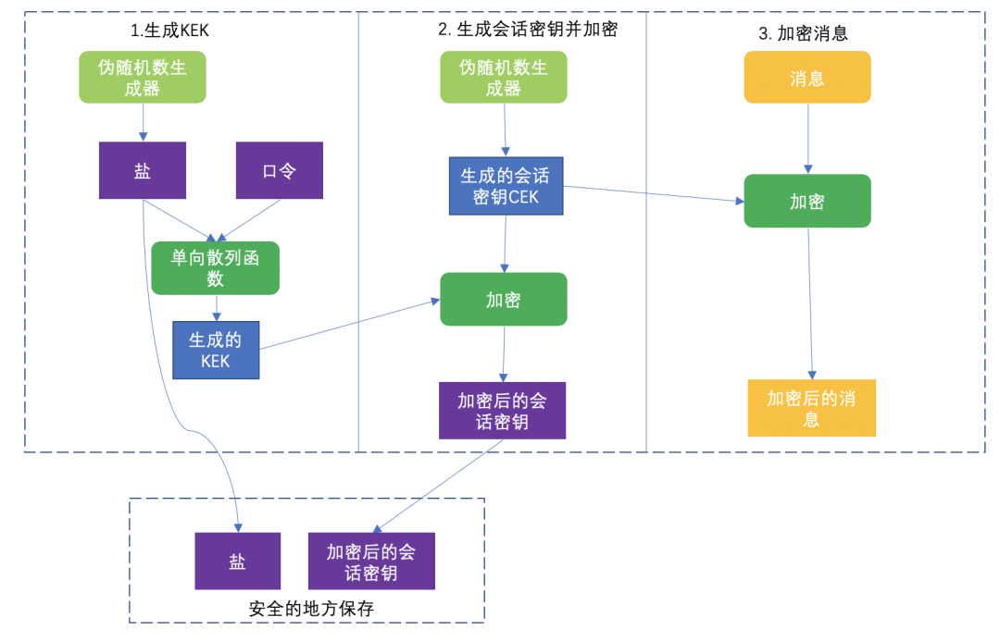

# PBE
[基于口令的密码](https://cloud.tencent.com/developer/article/1657442)

基于口令的密码(Password Based Encryption,PBE)是一种基于口令生成密钥，并使用该密钥进行加密的方法。其中加密和解密使用的是同一个密钥。根据用户自己的口令和salt生成口令密码。
加密过程：

1.生成KEK密钥
使用伪随机数生成器来生成salt；将salt和用户自己的口令使用单向散列函数算法生成KEK密钥。

2.生成会话密钥并加密
使用伪随机数生成器生成会话密钥CEK。
使用步骤1生成的KEK密钥对会话密钥CEK进行加密，得到加密后的会话密钥。
将步骤1生成的salt和步骤2生成的加密后的会话密钥保存起来，以供后面解密的时候使用。

3.加密消息
使用步骤2中生成的会话密钥CEK来对消息进行加密，从而得到加密后的消息。
步骤1生成的KEK并不需要保存，因为它完全可以根据salt来重构。

