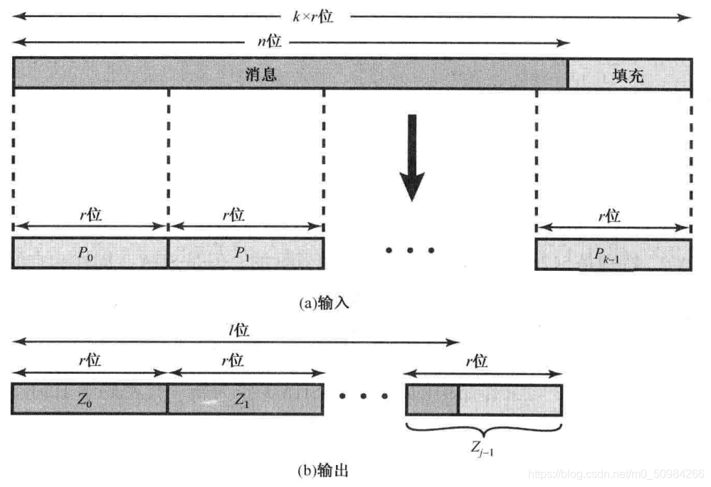
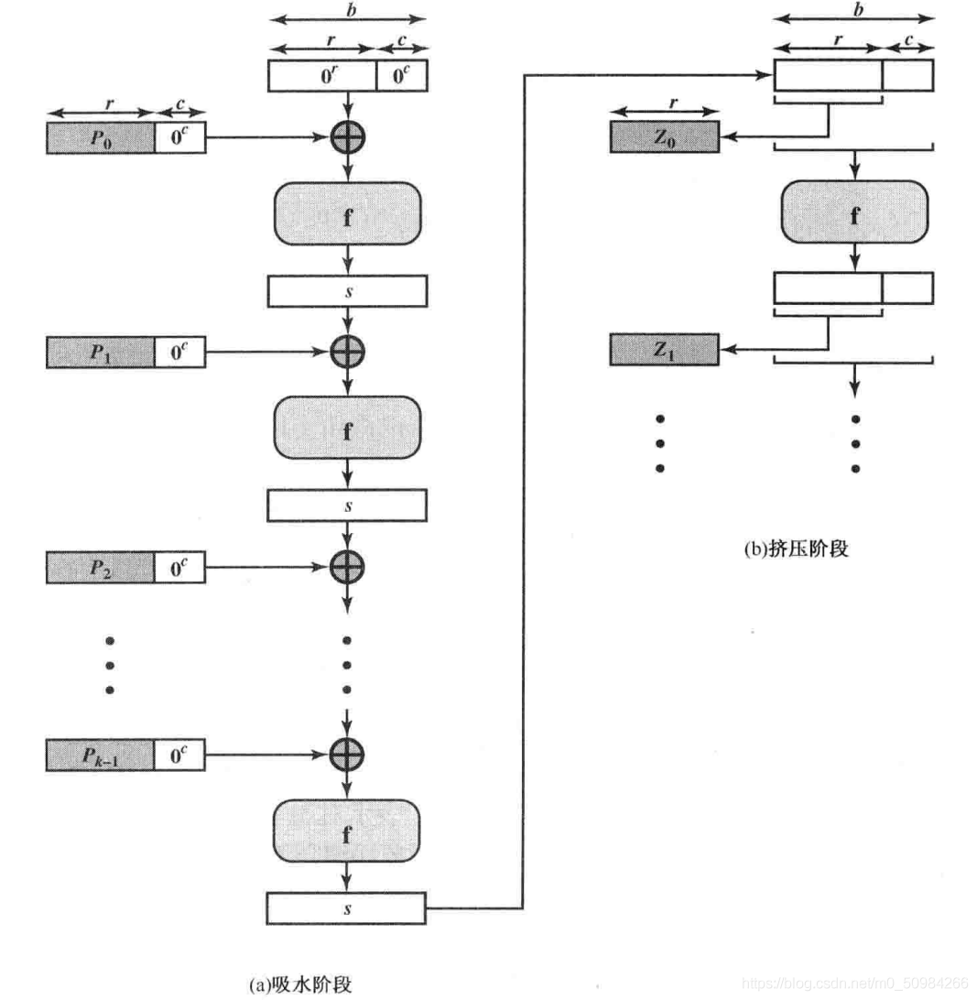
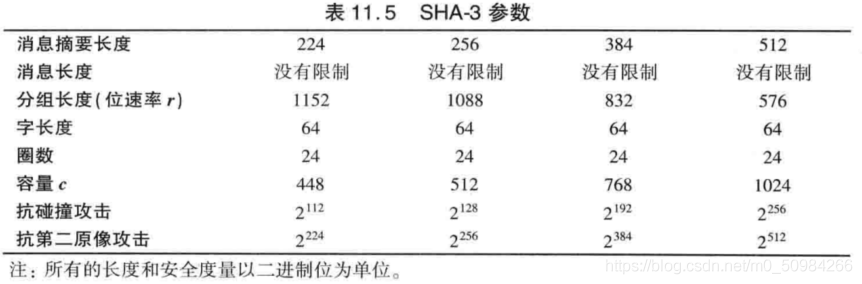

# SHA3
[NIST-SHA3 Standard](https://csrc.nist.gov/pubs/fips/202/final)是新一代NIST的Hash函数标准，称为SHA-3。SHA-3需要满足：

SHA-3算法对于任意应用都能直接替代SHA-2算法，即需要支持产生224/256/384/512位的Hash值。

- SHA-3必须保持SHA-2的在线处理能力。
- 评估标准有：安全性、效率、算法和实现特性。 

2012年公布了SHA-3的设计作品优胜者，SHA-3作为新一代密码学Hash函数的标准，将在各类应用中逐渐取代SHA-2。

SHA-3的设计者将SHA-3使用的基本迭代结构称为**海绵结构**，与其他的Hash函数的结构相似，海绵函数中，输入消息被分块为**固定长度的分组**。海绵函数的输入和输出如图所示。

海绵函数允许输入长度和输出长度都可变，长度为n为的输入消息，被分为k个固定长度的分组，每个分组长度为r位。如果需要，消息将被填充一个r位的完整块，有两个填充方案：

- 简单填充：用一个1和后面若干个0进行填充，0的个数是使用总长度为分组长度整数倍数的最小值
- 多重位速率填充：用一个1后面若干个0，再跟一个1进行填充。0的个数是使用总长度为分组长度整数倍的最小数
海绵函数产生一组输出块Z，输出块的个数由需要的输出位数决定。

下面是海绵函数的迭代结构，如图所示

海绵结构对长度为b=r+c位的状态变量s进行操作，状态变量的初值都是0，其值在每轮迭代中更新。数值r为位速率，位速率反映了每轮迭代中处理的位数：r越大，处理消息的速率越快。数值c称为容量，是度量海绵结构能够达到的复杂程度已经安全度。实际应用中，可以降低速度提高安全度。

海绵结构包括两个阶段。吸水阶段：对于每轮迭代，通过填充若干个0，将输入数据块的长度从r位扩展为b位，然后将扩展的消息分组和s进行XOR异或运算得到b位的结果，并作为迭代函数f的输入，f函数的输出作为下一轮迭代中s的取值。

如果需要的输出长度满足，那么在吸水阶段完成后，返回s的前l位，海绵结构运行结束。否则进入挤压阶段。s的前l位被保留作为输出分组Z，然后在每轮迭代中通过重复执行f函数来更新s的值，s的前l位被依次保留作为输出分组Z，并于前面已经生成的分组连接起来。

基于海绵结构的Hash函数的安全性的度量与容量具有对应函数关系

SHA-3迭代函数f的具体实现过程比较复杂，待后续研究。