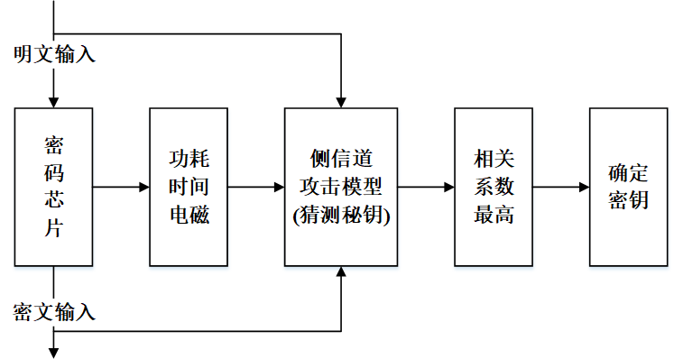
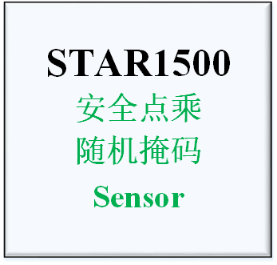

# 什么是侧信道？
在现代化系统中，信道指通信的通道，是信号传输的媒介。边信道(Side Channel)，又称侧信道，也就是标准信道之外，能够泄漏信息的其他途径。对于一颗芯片而言，其内部的电路传输各类用户数据，这些电路就是一些很好的信道，传输效率高、质量好。但一颗芯片在工作的过程中，难免会发热、发出电磁波以及不同时刻可能会有不同的功耗，这些热量、电磁波、功耗都是随着芯片的工作内容变化的，这其中就有信息的泄露。加密软件或硬件在工作过程中产生的声音、温度、功耗、电磁、色彩等等，都是侧信道；之所以称为侧信道，是因为上述的信息均是在加密过程中附带产生的物理量。


# 侧信道如何攻击？
通过收集分析加密软件或硬件在工作时附带产生的各类侧信道物理量来破解密钥的方法就称为边信道攻击(Side Channel Attack，SCA)，又称侧信道攻击。从广义上讲，针对安全设备的侵入式攻击、半侵入式攻击、非侵入式攻击等任何攻击方法都属于侧信道攻击的范畴。从狭义上讲， 侧信道攻击主要针对密码设备的非侵入是攻击，其方法主要是通过对密码算法的功耗分析攻击、电磁分析攻击、计时攻击、故障注入攻击等。




上图概括了侧信道攻击实施的基本原理，攻击者输入大量的明文，同时捕获并记录密码芯片运行过程中所泄漏的侧信道信息，当攻击者采集到大量的样本后，将侧信道信息与猜测密钥侧信道攻击模型做相关性校验，相关性最大的猜测密钥即为正确的密钥。

## 功耗分析攻击
功耗分析攻击是最为充分、成功实例最多的一种侧信道攻击技术。功耗分析攻击本质上是利用密码芯片在运算时所消耗的功耗来破译出密钥的一种攻击方法。由于密码芯片在处理不同运算以及不同的操作数时消耗的功耗不同，所以可以通过分析密码芯片的功耗特征来判断运算所涉及的操作数，从而恢复出密钥信息。根据功耗分析攻击的分析方法不同可以分为以下几种：

(1) **简单功耗分析(Simple Power Analysis：SPA)攻击**

简单功耗分析攻击是通过直接观察密码芯片的功耗轨迹来推断芯片密钥的一种攻击方法，这种方法对攻击者的要求较高，且受噪声影响较大。在对称加密算法的功耗攻击中SPA攻击强度较低，SPA更适合与ECC、RSA等公钥加密算法的模乘、模平方的功耗分析。它主要针对RSA、SM2等公钥密码算法的模幂、点乘计算过程中，每次循环迭代的运算取决于当前扫描位是0还是1，不同的值有不同的运算过程，导致功耗不同。
如下图所示，为RSA简单功耗分析攻击统计功耗图，其中S为模平方，M为模乘，而模平方和模乘与密钥强相关，可以看出通过简单功耗分析攻击可以破解RSA密码算法。


(2)   **差分功耗分析(Differential Power Analysis：DPA)攻击**

差分功耗分析攻击方法通过分析功耗曲线，利用数据在运算过程中与功耗的相关性可以获得在芯片内部执行加密和解密运算的相关密钥信息，这种攻击方法严重威胁到AES、SM4等对称加密算法的安全。 

(3) **相关功耗分析(Correlation Power Analysis：CPA)攻击**

相关功耗分析攻击采用相关系数的统计学方法。该方法首先利用功耗模型对进行攻击的实际电路进行理论功耗的预测，然后将实际的电路功耗与预测的理论功耗联系起来，得出两者之间的相关系数。因为如果猜测的密钥正确，那么根据电路功耗模型计算的理论功耗一定与实际电路的功耗具有一定的相关性。根据相关性的大小也就是相关系数的大小来判定密钥的猜测是否正确。

(4) **高阶差分功耗分析(High Order DPA：HODPA)攻击**

高阶差分功耗分析主要研究功耗曲线上多个时刻、多个点与密钥数据的统计相关性，是比常规DPA更复杂也更难防的一种功耗分析方式，因为常规的DPA(也称一阶DPA)只是研究单个点的统计相关性。但这种HO-DPA分析方式实现起来较为困难，而且对密码算法有一定的针对性，不具备普适性。

## 电磁分析攻击
电磁分析攻击是通过测量芯片运算过程中的电磁辐射来实现功耗分析攻击的目的。电磁辐射攻击的原理是：当设备内部状态的某比特由0变为1，或相反的由1变为0时，晶体管的N极或P极会有一小段时间是接通的，这将导致一个瞬时的电流脉冲，从而导致周围的电磁场发生变化。通过放置在附件的探头即可测量出设备运行时的电磁辐射情况，经过采样、数字化及信号放大后，即可使用类似于功耗分析攻击的统计方法来恢复出密钥。
功耗分析攻击只能对整个芯片的功耗进行分析，这些功耗中会包含密码算法执行模型的功耗，同时也包含其他模块的功耗；电磁辐射攻击可以将探头靠近芯片上方执行密码算法的模块，这样可以降低芯片上的其他模块引入的噪声影响，因此电磁辐射攻击有更高的信噪比。电磁辐射攻击与功耗分析攻击所采用的分析方法、攻击步骤完全一样，因此可以看作是功耗分析攻击的一种变种攻击方法，对于功耗分析攻击的攻击技术和防护技术也同样适用于电磁辐射攻击。

## 计时攻击
计时攻击的基本原理是利用加密算法所采用的各种运算执行时间上的差异来恢复密钥信息。这是因为密码算法在执行运行时间不固定的操作时，如分支操作、有限域乘法、幂指数运算等，其具体的运行时间是由所涉及的操作数决定的。由于每步的操作均依赖于所使用的密钥，所以算法的运行时间在一定程度上依赖于所使用的密钥。据此，根据算法运行时间上的差异与所使用的密钥间的关系，利用统计方法分析时间差异即可恢复部分或全部密钥信息。

## 故障注入攻击
故障注入是一种半入侵式攻击，其攻击原理是通过改变环境参数(芯片的电性能将随着不同的电压、温度、光、电离辐射以及周围的磁场的变化而变化)，来试图在芯片的程序逻辑中引入一些错误行为，将芯片带入一个不确定的运行状态，如扰乱程序流程或使算法结果出错，并且在这种状态下对芯片实施攻击。攻击者在密码系统运行时导入故障，使其执行某些错误的操作、过程或产生错误的结果，并通过差分分析，获取密码系统的关键信息。

# 如何防御侧信道攻击？
## 防御SPA攻击
针对SPA的攻击，防护主要是使用Ladder算法以及基于此类思想的其他方法。在SM2运算中，主要特点就是去除了普通二进制算法中的条件判断语句，使标量乘算法有固定的功耗轨迹图，一般都是每位都需要一个点加和一个倍点；在RSA运算中，主要特点就是去除了普通二进制算法中的条件判断语句，使模幂算法有固定的功耗轨迹图，一般都是每位都需要一个模乘和一个模平方。SM2 Montgomery Ladder点乘算法示例如下：

```
Montgomery Ladder for SM2
输入:基点P、标量k
输出：Q = k*P
(1)初始化 R0 = P， R1 = 2*P
(2)For i from KLen-1 to 0
    if(k[i]==0) {
        R1 = R0 + R1
        R0 = 2 * R0
    } 
    else {
        R0 = R0 + R1
        R1 = 2 * R1
    }
(3)返回 R0
```

## 防御DPA攻击
防御DPA攻击的手段主要是采用掩码技术，在运算过程中加入一个随机数，使得每次运算产生的侧信道信息都与这个随机数相关。ECC 防御DPA攻击方法包括随机化标量、随机化基点以及随机化曲线等。上述方法核心手段均是在密码算法运算过程中的标量、基点、曲线上引入随机数，每一次运算的功耗信息都与随机数有关，使得难以从多次运算的功耗差值进行分析攻击。RSA防御DPA攻击方法主要在每次RSA模幂运算时都生成一个随机的加法链来表示指数，从而随机化内部的运算。ECC防御DPA攻击算法示例如下：
```
随机化P点的点乘算法(随机化点乘，调用底层Ladder点乘)
输入：基点P、随机数r、数乘k；
输出：Q=k*P
原理：k*P= k*r-1*r*P = r^-1*(k*(r*P))
实现过程：
(1)取随机数r，计算其逆r^-1
(2)随机化基点P：
  P’=r*P
(3)执行点乘：
  Q’=k*P’=k*r*P
(4)解除扰码：
  Q=r-1*Q’=r^-1*k*r*P
  
```
对于对称密码算法，S盒是唯一的非线性变换，用来对数据混淆。在对称密码算法的功耗攻击中，通常将S盒的输出作为功耗分析攻击的中间变量。因为S盒将输入数据映射到输出数据具有很大的扩散性，即输入数据即使有1位的差异，也会引起输出数据很多位的变化，从而消耗大量的能量，因此S盒是对称密码算法中功耗分析攻击最薄弱的环节。
目前比较实用的防护方案是算法级的掩码方案，线性操作可直接添加布尔掩码，而非线性操作的S盒掩码方案基于符合域运算的分解进行，将非线性的GF(256)上的运算通过一步步分解到GF(4)上，将所有运算都分解为线性运算，然后增加掩码，使用加法掩码。S盒防御DPA掩码算法示例如下：
```
SM4的Sbox定义为：S(x)=I(x*A1+C1)*A2+C2, 也就是输入x首先经过一次Aff变换做x*A1+C1的变化；然后经过一次求逆I，最后再经过一次Aff变换做*A2+C2的变化。加入掩码后, S盒计算为：	
 S(x+r)=I((x+r)*A1+C1)A2+C2
       =I(x*A1+r*A1+C1)A2+C2
       =(I(x*A1+C1)+r*A1)A2+C2
       =I(x*A1+C1)A2+r*A1*A2+C2
       =I(x*A1+C1)A2+C2+r*A1*A2
       =Sbox(x)+r*A1*A2
对于掩码r通过S盒后应为rMask=r*A1*A2;
这样最终实现可通过S(x)=S(x+r)-rMask还原出真正的S盒运算结果。
```
## 防御计时攻击
由于对称密码算法没有基于密钥的分支运算，因此对称算法对计时攻击天然免疫，故无须针对上述算法做专门的计时攻击防护设计。ECC公钥密码算法，点乘计算采用Ladder点乘算法，能有效防御计时攻击，Ladder点乘算法一次扫描 1 位密钥位，每次进行 1 次点加运算和 1 次倍点运算，可以实现任意相同长度的密钥位运算都没有时间区别。RSA公钥密码算法，模幂计算采用Ladder模幂算法，能有效防御计时攻击，Ladder模幂算法一次扫描 1 位密钥位，每次进行 1 次模乘运算和 1 次模平方运算，可以实现任意相同长度的密钥位运算都没有时间区别。

## 防御故障注入攻击
故障攻击的防御措施就是避免、检测或纠正故障，最简单的防御方法是对计算结果作输出前检查，或者在设备内增加一些错误校验位来保护内部存储器等。分组密码算法在实际中还可以使用基于复用的技术等用于防御故障攻击。针对工作环境故障攻击增加相应的Sensor，检测芯片工作环境的异常，当芯片工作环境异常时，报告给主处理器，由固件决定采用相应的措施，如禁止算法调用，复位芯片，甚至自毁芯片等达到防护效果。同时增加固件启动和算法启动前的自校验功能，可很大程度减轻故障攻击者的攻击效果。


# 解决方案
忆芯科技即将流片的新一代高性能消费级PCIe5.0 SSD主控芯片STAR1500，全面支持国际和国内商用密码算法。同时在STAR1500中为国密算法设计了完整的侧信道防御措施。



对于功耗分析攻击和电磁分析攻击主要目标是进行SPA和DPA的防御，其中SM2密码算法引入Montgomery Ladder点乘和随机化基点，两种算法混合使用全面增强SM2密码算法的侧信道攻击防御能力，SM4密码算法加解密及密钥拓展的全流程均引入随机掩码进行保护，对于侧信道攻击薄弱点S盒进行复合域运算分解，再增加随机掩码，可全面防护SM4密码算法在运算过程中的信息泄露。
对于计时攻击，SM4对称密码算法不存在时间泄露问题，主要针对SM2密码算法，底层采用了Montgomery Ladder点乘使得运算过程中的每一次位扫描都执行相同的计算步骤，可掩盖时间差，防御计时攻击。
对于故障注入攻击，STAR1500内设计了多个工作环境检测Sensor，可实时检测芯片工作环境，一旦检测芯片工作环境异常，报告给主处理器，由固件决定采用相应的措施，如禁止算法调用，复位芯片，甚至自毁芯片等达到防护效果。