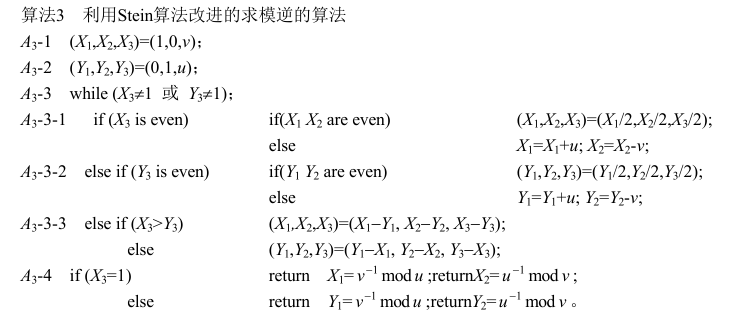

# 参考文献
1. 模逆算法的分析、改进及测试.谭丽娟，陈 运
2. 统一架构的ECC与RSA密码处理器的设计.刘兵


# 欧几里得算法
欧几里得算法又称**辗转相除法**，是指用于计算两个非负整数a，b的最大公约数。两个整数的最大公约数是能够同时整除它们的最大的正整数。
应用领域有数学和计算机两个方面。计算公式 `gcd(a,b) = gcd(b,a mod b)`。
辗转相除法基于如下原理：两个整数的最大公约数等于其中较小的数和<mark>两数相除余数</mark>的最大公约数。 

> 
    假如需要求 1997 和 615 两个正整数的最大公约数,用欧几里得算法，是这样进行的：
    1997 ÷ 615 = 3 (余 152)
    615 ÷ 152 = 4(余7)
    152 ÷ 7 = 21(余5)
    7 ÷ 5 = 1 (余2)
    5 ÷ 2 = 2 (余1)
    2 ÷ 1 = 2 (余0)
    至此，最大公约数为1
    以除数和余数反复做除法运算，当余数为 0 时，取当前算式除数为最大公约数
    
``` verilog
`define WNL 256
`define WOP 64

// Input : A B;
// Output: S = A和B的最大公约数;

task gcd;
    input   [`WNL-1:0] A;
    input   [`WNL-1:0] B;
    output  [`WNL-1:0] S;

    reg     [`WNL-1:0] r;
    integer i;

    $display("gcd is start !");
    begin
      
      // 保证 A > B
      if(A < B)begin
        r = A;
        A = B;
        B = r;
      end
      
      // 辗转相除
      do  begin
         r = A % B;
         A = B;
         B = r;
      end
      while((A % B)!=0);
      
      S = B;   
      
    end
    $display("gcd: gcd = %h", S);
    $display("gcd is finish ! ");

endtask

`undef WNL
`undef WOP

```

# 拓展欧几里得算法
扩展欧几里得算法不但能计算(a，b）的最大公约数，而且能计算a模b及b模a的乘法逆元。
扩展欧几里得算法对于最大公约数的计算和普通欧几里得算法是一致的。
计算乘法逆元则显得难以理解：
如果gcd(a，b)=d，则存在m，n，使得d = ma + nb，称呼这种关系为a、b组合整数d，m，n称为组合系数。当d=1时，有 ma + nb = 1 ，此时可以看出m是a模b的乘法逆元，n是b模a的乘法逆元。
> 
    由 ma + nb = 1 可得
    (ma + nb) mod b = 1 : 此时可以看出m是a模b的乘法逆元;
    (ma + nb) mod a = 1 : 此时可以看出n是b模a的乘法逆元。
    
>
    裴蜀定理 ：
    有一个线性不定方程 ax+by=c
    若此方程有解，那么 c=k*gcd(a,b) ，k 为任意正整数
    证明：
    以下 gcd(a,b) 简称 gcd
    ∵ (ax+by) mod gcd=0
    又 c mod gcd=0
    ∴ (ax+by-c) mod gcd=0
    ∴ ax+by≡c (mod gcd)
    证毕
    ∴ 当 ax+by=c 成立时，c=k*gcd
    特殊的：
    当 a，b 互质时，方程满足 ax+by=1


通常谈到最大公因子时, 我们都会提到一个非常基本的事实: **给两个整数 a 与 b, 必存在有整数 x 与 y 使得ax + by = gcd(a,b)**。
有两个数a,b，对它们进行辗转相除法，可得它们的最大公约数。然后，收集辗转相除法中产生的式子，倒回去，可以得到ax+by=gcd(a,b)的整数解。





``` verilog
`define WNL 256
`define WOP `WNL+64

// Input : p = N 
//         u = A;
// Output: S = A^-1 mod N;

task exgcd;
    input   [`WNL-1:0] p;
    input   [`WNL-1:0] u;
    output  [`WNL-1:0] S;

    reg     [`WOP-1:0] x1,x2,x3;
    reg     [`WOP-1:0] y1,y2,y3, r, cnt,cntx,cnty;
    integer i;


    $display("exgcd is start !");
    begin
      i    = 1;
      cnt  = 531; // (N-1)^-1 mond GMN max cnt is 531;
      cntx = cnt;
      cnty = cnt;

      x1 = 1;
      x2 = 0;
      x3 = p;

      y1 = 0;
      y2 = 1;
      y3 = u;

      while((x3!=1) || (y3!=1)) begin
        if(x3[0]==0)begin
          if(x3[`WOP-1]) x3 = {1'b1,x3[`WOP-1:1]};  else x3 = x3 / 2 ;
          if(i==cntx) $display("exgcd: %2d x3 = %h", i,x3);
          if((x1[0]==0)&&(x2[0]==0))begin
            if(x1[`WOP-1]) x1 = {1'b1,x1[`WOP-1:1]};  else x1 = x1 / 2 ;
            if(x2[`WOP-1]) x2 = {1'b1,x2[`WOP-1:1]};  else x2 = x2 / 2 ;
          end
          else begin
            x1 = x1 + u;
            x2 = x2 - p;
            if(i==cntx) $display("exgcd: %2d x1 = %h", i,x1);
            if(i==cntx) $display("exgcd: %2d x2 = %h", i,x2);
            if(x1[`WOP-1]) x1 = {1'b1,x1[`WOP-1:1]};  else x1 = x1 / 2 ;
            if(x2[`WOP-1]) x2 = {1'b1,x2[`WOP-1:1]};  else x2 = x2 / 2 ;
          end
          if(i==cntx) $display("exgcd: %2d x1 = %h", i,x1);
          if(i==cntx) $display("exgcd: %2d x2 = %h", i,x2);
        end
        else if(y3[0]==0) begin
          if(y3[`WOP-1]) y3 = {1'b1,y3[`WOP-1:1]};  else y3 = y3 / 2 ;
          if(i==cnty) $display("exgcd: %2d y3 = %h", i,y3);
          if((y1[0]==0)&&(y2[0]==0))begin
            if(y1[`WOP-1]) y1 = {1'b1,y1[`WOP-1:1]};  else y1 = y1 / 2 ;
            if(y2[`WOP-1]) y2 = {1'b1,y2[`WOP-1:1]};  else y2 = y2 / 2 ;
          end
          else begin
            y1 = y1 + u;
            y2 = y2 - p;
            if(i==cnty) $display("exgcd: %2d y1 = %h", i,y1);
            if(i==cnty) $display("exgcd: %2d y2 = %h", i,y2);
            if(y1[`WOP-1]) y1 = {1'b1,y1[`WOP-1:1]};  else y1 = y1 / 2 ;
            if(y2[`WOP-1]) y2 = {1'b1,y2[`WOP-1:1]};  else y2 = y2 / 2 ;
          end
          if(i==cnty) $display("exgcd: %2d y1 = %h", i,y1);
          if(i==cnty) $display("exgcd: %2d y2 = %h", i,y2);
        end
        else if(x3 > y3) begin
          x1 = x1 - y1;
          x2 = x2 - y2;
          x3 = x3 - y3;
          if(i==cnt) $display("exgcd: %2d x1 = %h", i, x1);
          if(i==cnt) $display("exgcd: %2d x2 = %h", i, x2);
          if(i==cnt) $display("exgcd: %2d x3 = %h", i, x3);

        end
        else begin
          y1 = y1 - x1;
          y2 = y2 - x2;
          y3 = y3 - x3;
          if(i==cnt) $display("exgcd: %2d y1 = %h", i, y1);
          if(i==cnt) $display("exgcd: %2d y2 = %h", i, y2);
          if(i==cnt) $display("exgcd: %2d y3 = %h", i, y3);
        end

        i = i + 1;

      end

      r = y2;

      // if(x3==1)begin
      //   r = x1;
      //   $display("exgcd:x3==1 %d",i);
      //   $display("exgcd:y3= %h",y3);
      // end
      // else begin
      //   r = y1;
      //   $display("exgcd:y3==1 %d",i);
      //   $display("exgcd:x3= %h",x3);
      // end

      if(r[`WOP-1]==1) begin
        r = r + p;
        while (r[`WOP-1]==1) begin
          r = r + p;
        end
      end
      else begin
        r =  r - p;
        while (r[`WOP-1]!=1) begin
          r = r - p;
        end
        while (r[`WOP-1]==1) begin
          r = r + p;
        end
      end

      S = r[`WNL-1:0];


    end
    $display("exgcd: exgcd = %h", S);
    $display("exgcd is finish ! ");

endtask

`undef WNL
`undef WOP
```

# 例子
已知模逆的式子如下 ax=1 (mod p)，如果a和p互质那么就可以用拓展欧几里得求模逆。ax = 1 (mod p) 可写成ax - pn = 1; 用拓展欧几里得求模逆的一个例子，根据互质的两个数的最大公约数为1，因此进行辗转相除的时候算到1即可。
>
    例1：
    a = 5, p = 14；
    4 = 14 - 5 * 2；（1）
    1 = 5  - 4 * 1；（2）
    由上面两式可反推得到：
    1 = 5 - (14 - 5 * 2) * 1; (3)
    1 = 5 - 14 * 1 + 5 * 2;   (4)
    1 = 5 * 3 - 14 * 1;       (5)
    则式(5)中的3就是x，-1就是n；
    
    例2：
    a = 5, p = 18；
    3 = 18 - 5 * 3；（1）
    2 = 5  - 3 * 1；（2）
    1 = 3  - 2 * 1；（3）
    由上面三个可反推得到：
    1 = 3 - （5 - 3 * 1）* 1；（4）
    1 = （18 - 5 * 3）- （5 - （18 - 5 * 3）* 1）* 1；（5）
    1 = 18 * 2 - 5 * 7；（6）
    此时式（6）中的x为-7，而将-7转换到 mod 18 的数域就是 18 - |-7| = 11；
    因此x可等于11； 


