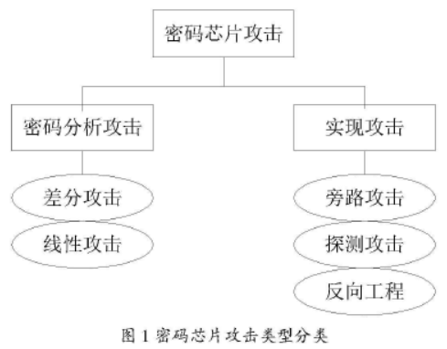
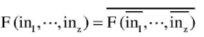
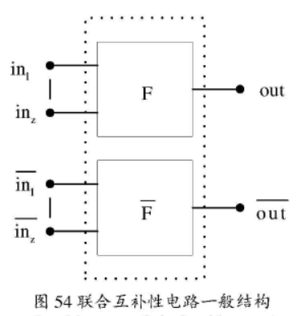
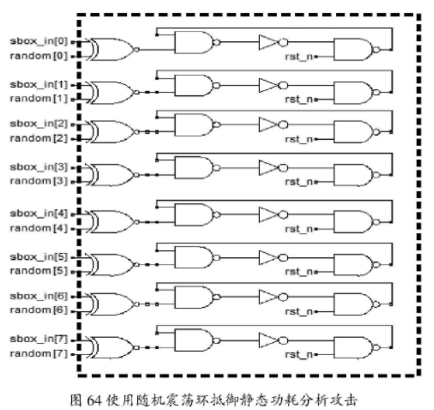
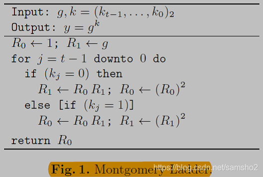

# 物理攻击
按照**实现方式**划分，密码算法都可以采用**软件**和**硬件**两种实现形式。

用**软件**实现的密码算法，具有轻便、灵活的优点，但是通常使用的机架构，对信息安全的考虑不足，这使得密码算法运行在一个相对开放的环境中，容易受到攻击者的篡改和破译。

**硬件**实现的密码芯片解决了这一难题。密码算法通过硬件的方式实现，具有相对较好的封闭性，破解的难度较大和破解的代价较高。

# 理论基础

**有限域**又称伽罗瓦域，它指的是拥有有限个元素的集合。它是一个由有限个元素组成的集合，在这个集合内可以执行加、减、乘、除和逆操作。域内包含元素的个数称为域的**阶**或**基**。

**素域**，他指的是阶为素数的域。域GF(p)的元素可以用整数0...，p-1来表示，p为素数。

**拓展域**，其中的元素并不是用整数表示的，而是用系数为于GF(2)中元素的多项式表示。

# 对密码算法的攻击

\*\*对密码算法的攻击，其根本目的就是要破解运算过程中所保密的密钥。\*\*其攻击方式主要有两种：

一是从算法本身出发，从数学的角度分析算法是否存在理论上的漏洞，称为**传统的密码分析攻击**；

二是从密码算法的载体密码芯片出发，寻找一些可被观察的物理信息，称为**实现攻击**。

**传统的密码分析攻击**方法专注于算法本身，攻击者在已知算法、明文、密文的情况下试图根据算法的数学特征对其安全性进行分析，尽可能地恢复出密钥。传统密码分析方法的主要手段是**差分攻击**和**线性攻击**两种。

**实现攻击**专注于密码算法的执行载体密码芯片，一方面密码芯片自身存储着个人敏感信息，而另一方面，密码芯片在执行过程中不可避免地会向外界产生各种各样的可被检测到的物理现象，这些信息通常被称为旁路信息（Side-Channel-Leakage）。这些容易被忽视的旁路信息被攻击者获取后，可以用于分析密码芯片运算过程中所泄漏的密钥。实现攻击根据其实现形式又可以分为**物理攻击**和**旁路攻击**两种。



[物理攻击](https://www.wolai.com/aJhS4fwZvLqVtGv5p1SAsG)

[旁路攻击](https://www.wolai.com/edyApm2KXSukpAgjJh1nHQ)

# 静态功耗分析攻击技术

**差分功耗分析方法**和**相关功耗分析方法**都可以用在静态功耗分析攻击中。

静态功耗分析攻击的**实施方法**，为了测量静态功耗需要**暂停时钟**，这时整个芯片就不会出现动态功耗，测量得到的功耗即是静态功耗。

# 抗PA攻击量化评估方法

**基于相关系数的量化评估**:在功耗分析攻击中，相关系数经常被用来对电路防护性能进行评估。通常采用皮尔森系数作为相关系数的计算公式。

\*\*防御能力量化评估模型:\*\*攻击者对密码芯片的功耗分析攻击，首先要选取一个与密钥相关的中间变量，然后输入各种可能的明文，并记录电路计算该中间变量所实际消耗的能量。该中间变量需要与密钥和明文都有关系。此评估模型可以细粒度地逐个评估密码算法所有关键操作的功耗泄漏程度。比如密码算法，包括轮密钥加、字节代换、行移位、列混淆等四个基本操作。

# 对称密码防御功耗攻击方法

## Sbox

S 盒的部分主要有两种实现方法，一种是**查表法**，另一种是**有限域进行乘法求逆**的操作替代S 盒查表法。

**乘法掩码**的方案虽能抵抗低阶的 CPA 攻击且改进的方案易于实现，但乘法掩码对策容易遭受到零值攻击(Zero-Value Attack)。

**乘法掩码**和**加法掩码**结合的方式，能够抵御零值攻击，从而保证了侧信道功耗分析攻击的安全性。

## 基于掩码操作

S盒：进行**复合域改造**，可减少面积；

Plain^Rand作为循环迭代的输入；

掩码性S盒变换：S(x)+Rand

如果S盒的输入和输出为同一个随机数，称为**一阶掩码**，可以抵御一阶功耗分析攻击，但不能抵御二阶功耗分析攻击。如果不相同，则称为**二阶掩码**，可以抵御二阶功耗分析攻击。

加解密电路S盒二阶掩码；

密钥拓展电路S盒一阶掩码；

## 基于功耗均衡

**双轨差分逻辑**：差分编码。融合了双轨逻辑和预充电逻辑的概念，这可以保证元件在各个时钟周期的能量消耗相等。无法使用现有的工具进行仿真、综合。

**互补型电路**：可以从算法级别上实现。主电路实现函数F的功能，与其对应的互补型电路实现函$\\bar{F} $数的功能，互补型电路输入必须是主电路输入值按比特取反，两者共同组成联合互补型电路，同时有下面的公式成立。





假设out是一个n比特的数据，其汉明重量记为w，很容易就可计算出 out¯\\bar{out}​out​¯​​的汉明重量：

HW(out¯)\=n−wHW(\\bar{out})=n-w HW(​out​¯​​)\=n−w

式中，HW表示汉明重量。如果把图54所组成的电路看作是一个整体，其汉明重量是一个定值，总是为n，有下面的公式成立：

HW(out¯)+HW(out)\=nHW(\\bar{out})+HW(out)=n HW(​out​¯​​)+HW(out)\=n

而且该电路输出值的汉明距离总是0，HD表示汉明距离,即：

HD(out¯+out)\=0HD(\\bar{out}+out)=0 HD(​out​¯​​+out)\=0

密码芯片计算敏感变量所**消耗的能量**与该**中间变量**的**汉明重量**或**汉明距离**存在一定的**相关性**。如果密码芯片中的密码引擎的所有中间变量的**汉明重量**和**汉明距离**都**相等**，那么它们**消耗的能量**在任何时候都**近似相等**，与密码芯片所处理的数据**不再存在相关性**。

互补型电路的思想，并不能起到功耗的完全互补，即不可能让整个密码芯片的功耗达到完全的均衡。只是尽可能地让密码芯片消耗的能量与敏感中间值之间的相关性降低。通过降低功耗分析攻击时的信噪比，来增加攻击的难度，从而达到抵御功耗分析攻击的目的。

# 对称密码防御静态功耗攻击

## 互补型电路抵御静态功耗分析攻击

主电路中的每一个中间变量都与互补型电路相应中间变量互补，因此在联合互补型电路中，其中间变量的汉明重量为一定值。因电路的静态能量消耗与中间变量的汉明重量是线性相关的，因此当汉明重量恒定时，其静态能量消耗也处于一个相对恒定的值。从而可以抵御静态功耗分析攻击。

## 随机震荡环抵御静态功耗分析攻击

目前的集成电路基本上采用同步设计的思想，即芯片在全局时钟的控制下，脉冲式的改变信号的值。每个时钟上升沿到来时，电路将产生大量的动态功耗。上升沿过后，等信号稳定了，电路开始产生耗静态功耗。为了随机化此时的静态功耗，可以采用震荡环的方法，对电路的静态功耗产生干扰，使电路产生的静态能量消耗与中间数据的汉明重量的相关性减弱。

震荡环的复位控制信号rst\_n采用芯片的全局复位信号。当芯片处于**复位**阶段时，所有的震荡环都是**关闭**的；当芯片的复位信息**释放后**，震荡环开始**起震**。震荡环的能量消耗情况**不受时钟信号的控制**，在芯片处于**静态能量消耗的阶段**，震荡环仍然可以**消耗随机的能量**，从而**破坏**了整个芯片的**静态功耗**与**数据**的**相关性**。



图64使用8了个随机震荡环，同时还需要一个8比特的随机数据，该8比特的随机数与对称密码算法s盒的输入数据异或，异或的结果用来控制震荡环的开和关，所以震荡环的开关信号由下面的信号产生：

open\[7:0\]\=sbox\_in\[7:0\]⊕random\[7:0\]open\[7:0\] = sbox\\\_in\[7:0\]\\oplus random\[7:0\] open\[7:0\]\=sbox\_in\[7:0\]⊕random\[7:0\]

震荡环由**一个反相器**和**两个与非门**组成，可以看作是由**三个反相器**串联起来的震荡环。为了维持震荡，**反相器**的**个数**必须为**奇数**，且反相器的具体个数由S盒的**静态功耗决定**。**震荡环**产生的**静态功耗**必须**大于**S盒的**静态功耗**，只有这样才能明显的**破坏**静态功耗与数据的**相关性**。

## 掩码技术抵御静态功耗分析攻击

密码芯片的**静态能量消耗**与**中间敏感数据**的**汉明重量**成**线性**正相关或线性反相关。

如果能使密码芯片的**中间敏感变量**的**汉明重量随机化**，攻击者无法知道密码芯片的中间敏感值，从而无法计算出密码芯片的理论静态功耗，所以无法实施静态功耗分析攻击。

对称密码算法中掩码方式采用和动态功耗分析中相同的方式，对S盒进行掩码操作。

**互补型电路**通过构造一个与主电路逻辑关系完全互补的电路，来补偿主电路的静态能量消耗。其根本原因是使密码算法引擎的所有敏感中间变量的**汉明重量**等于一个**定值**，不随输入明文和密钥的变化而变化。

**随机震荡环技术**通过构造一个不受时钟控制的震荡环，随机化电路中间变量产生的静态功耗，使电路的**静态功耗**与中间变量的**汉明重量**成为两个**相互独立的变量**，从而起到抵御功耗分析攻击的目的。

**随机掩码技术**随机化中间数据的汉明重量，使攻击者不能从理论上计算电路的静态功耗值，从而起到抵御静态功耗分析攻击的目的。

*   将电路抗攻击的量化研究方法进一步应用于**电磁辐射攻击**、**时间攻击**、**错误注入攻击**以及多种攻击方式的组合攻击中。
    
*   进一步完善本文提出的**互补型电路**设计思想。研究在**公钥密码算法**中构造互补型算法的复杂度与可行性，使互补型设计思想不仅可以应用于对称密码算法中，也可以应用于公钥密码算法中。
    
*   将**互补型电路**应用于密码芯片的**系统总线**上，构造完全互补的系统总线，使CPU与从设备交换数据的系统总线不泄漏敏感信息。
    

# RSA密码算法防PA

## 防御SPA

模幂（Montgomery Powering Ladder）

在整个扫描过程中，每一位也都需要做一次模平方和模乘，程序执行的序列为 SM……SM，可以**防御SPA**。Ladder模幂没有加入伪操作，不易受到故障注入分析攻击。



## 防御DPA

可采用**随机盲化底数和指数**的方法**抵抗 DPA**（SEMD和 MESD 攻击）。

盲化和去盲过程如下：

1、盲化底数 M： M′\=viMmodnM'=v\_iM mod nM​′​​\=v​i​​Mmodn;

2、盲化指数 e： e′\=e+rϕ(n)e'=e+r\\phi(n)e​′​​\=e+rϕ(n);

3、模幂运算： S'= M'^{e'} mod n = (v\_iM)^{e+r\\phi(n)} mod n;

4、去盲： S\=vfS′modn\=vi−e(viM)e+rϕ(n)modn\=MemodnS=v\_fS' mod n = v\_i^{-e}(v\_iM)^{e+r\\phi(n)} mod n = M^e mod nS\=v​f​​S​′​​modn\=v​i​−e​​(v​i​​M)​e+rϕ(n)​​modn\=M​e​​modn ;

## 防御FIA

### 针对RSA-CRT实现的FIA

防御FIA措施的一个共同点就是最后都要做一次**比较**，根据比较的情况决定是否将结果输出。

**RSA-CRT算法**：

其中 dp = d mod p, dq = d mod q, qInv = q-1mod p,n = p\*q。

输入：密文C, dp, dq, p, q, qInv;

输出：明文 M;

Cp = C mod p;

Cq = C mod q;

m1= Cp^( dp) mod p;

m2= Cq^( dq) mod q;

while(m1< m2)

{

m1= m1+p ;

}

h = ( m1-m2)\*qInv mod p;

M = m2 + q\*h;

Return (M).

**抗 FIA 的 RSA-CRT 算法**

输入：密文C, dp, dq, p, q, qInv;

输出：明文M;

Cp = C mod p;

Cq = C mod q;

用Ladder模幂计算 Cp^( dp) mod p 可以得到 (mdp,mdp−1)(m\_{dp},m\_{dp-1})(m​dp​​,m​dp−1​​);

用Ladder模幂计算 Cq^( dq) mod q 可以得到 (mdq,mdq−1)(m\_{dq},m\_{dq-1})(m​dq​​,m​dq−1​​);

Md= CRT(mdp, mdq);

Md−1\=CRT(mdp−1,mdq−1)M\_{d-1} = CRT(m\_{dp-1},m\_{dq-1})M​d−1​​\=CRT(m​dp−1​​,m​dq−1​​);

if(md\=\=Md−1∗C)if(m\_d == M\_{d-1}\*C)if(m​d​​\=\=M​d−1​​∗C)

Return (M).

else

Return (0).

**CRT算法**：

输入：m1, m2, p, q, qInv;

输出：M;

while(m1< m2)

{

m1= m1 + p ;

}

h = ( m1 - m2)\*qInv mod p;

M = m2 + q\*h;

Return (M).

### 针对RSA模数N的FIA

1、针对于算法使用的密钥 d，模数 n 分别计算其偶校验位后再存入存储器中，在运算时，先对密钥 d，模数 n 进行完整性验证。

2、计算两次模幂然后比较两次结果。

改进 **MIST 算法**使之能够抵抗针对模数 n 的故障注入分析。为了提高效率，不需要完整计算两次模幂运算，可以在计算**模幂**的最后一步时进行**两次同样的操作**，然后比较两次运算的结果。如果相同则返回结果，反之则返回 0。

# ECC密码算法防PA

椭圆曲线离散对数问题（**ECDLP**: Elliptic Discrete Logarithm Problem）是一个纯粹的数学问题，与椭圆曲线密码系统无关。但是椭圆曲线密码系统是根据它的困难性而构造的。所谓的困难性是相对于椭圆曲线阶的位数以及当前的计算能力，位数越多困难性越大。

基于椭圆曲线离散对数问题难解性的椭圆曲线密码系统（**ECC**：Elliptic Curve Cryptosystem）

椭圆曲线综合加密算法（**ECIES**: Elliptic Curve Integrated Encryption System）

椭圆曲线数字签名算法（**ECDSA**: Elliptic Curve Digital Signature Algorithm）

椭圆曲线 Diffie-Hellman 密钥协商协议（**ECDHKA**: Elliptic Curve Diffie-Hellman Key Agreement）

**标量乘算法**还是**二进制编码算法**和 **NAF 编码算法**

## **二进制编码算法**

k\=∑i\=0m−1ki2i,ki∈{0,1}k=\\sum\_{i=0}^{m-1}k\_i2^i,k\_i\\in\\{0,1\\} k\=​i\=0​∑​m−1​​k​i​​2​i​​,k​i​​∈{0,1}

*   **从左到右二进制标量乘算法**:
    
    输入： k(k\_{l-1}, k\_{l-2}, … , k\_0), P∈EP\\in EP∈E ;
    
    输出：Q = k\*P;
    
    Q\=∞Q=\\inftyQ\=∞
    
    for i= l-1 down to 0
    
    Q = 2Q ;
    
    If (ki == 1) then
    
    ```
    Q = Q + P ; 
    ```
    
    Return (Q).
    
*   **从右到左二进制标量乘算法**
    
    输入： k(k\_{l-1}, k\_{l-2}, … , k\_0), P∈EP\\in EP∈E ;
    
    输出：Q = k\*P;
    
    Q\=∞Q=\\inftyQ\=∞
    
    for i= 0 to l -1
    
    If (ki = = 1) then
    
    ```
    Q = Q + P ; 
    
    P = 2P ; 
    ```
    
    Return (Q).
    

## **NAF 编码算法**

k=\\sum\_{i=0}^{l-1}k\_i2^i,k\_i\\in\\{0,±1\\},k\_{l-1}\\ne0

*   **一个正整数的 NAF 编码**：
    
    输入: 正整数k, k\=(kl−1,kl−2,...,k0)2k = (k\_{l-1}, k\_{l-2}, ... , k\_0)\_2k\=(k​l−1​​,k​l−2​​,...,k​0​​)​2​​
    
    输出: kNAFk\_{NAF}k​NAF​​, kNAF\=(kl,kl−1,kl−2,...,k0)NAFk\_{NAF}= (k\_l, k\_{l-1}, k\_{l-2}, ... , k\_0)\_{NAF}k​NAF​​\=(k​l​​,k​l−1​​,k​l−2​​,...,k​0​​)​NAF​​
    
    i = 0.
    
    While( k >0) do
    
    if(k is odd) then
    
    ```
    ki = 2－(k mod 4); 
    ```
    
    else
    
    ```
    ki = 0; 
    ```
    
    k = (k－ki)/2;
    
    i = i + 1;
    
    Return ( kNAFk\_{NAF}k​NAF​​).
    
*   **NAF 编码的标量乘算法**:
    
    输入: 正整数k, P∈EP\\in EP∈E ; 输出: Q = k\*P
    
    1.  用前面的NAF编码算法计算 kNAFk\_{NAF}k​NAF​​ .
        
    2.  Q=O.
        
    3.  For i from l−1 downto 0 do
        
        3.1 Q = 2Q.
        
        3.2 If ki= 1 then Q = Q＋P;
        
        3.3 If ki= -1 then Q = Q－P;
        
    4.  Return (Q).
        

## 防御SPA

同RSA可采用ladder点乘的方式；

也可采用原子算法；

## 防御DPA

抵抗 DPA 攻击最好的方法就是采用**随机化技术**，包括随机化**标量**k、**计算的点**以及**曲线**等各种随机化方法。

**随机化标量k**：

Q′\=k∗(r∗P)Q'=k\*(r\*P)Q​′​​\=k∗(r∗P)

Q\=Q′∗r−1\=k∗r∗r−1∗PQ=Q'\*r^{-1}=k\*r\*r^{-1}\*PQ\=Q​′​​∗r​−1​​\=k∗r∗r​−1​​∗P

还包括随机分隔标量k=(k-r)+r、随机化标量的加法链。

**随机化点**：

随机点R;

S=kR;

Q'=k(P+R);

Q=Q'-S=k(P+R)-kR=kP.

## 倍点攻击

该攻击主要对从左往右的二进制标量乘算法既和增加了伪操作的算法有效，而对从**右往左算法无效**。

抵抗倍点攻击主要可以从两个方面考虑，一种是采用随机化技术，使得运算 kP 和k(2P)产生的中间结果不同。

## 零点攻击

零点攻击（ZPA: Zero-Value Point Attack）是改进型能量攻击（RPA: Refined Power Analysis）的另一种形式。

抵抗 ZPA 攻击最有效的方法就是**随机分割标量**和**盲化计算的点**，这样就不能保证在计算过程中出现**零值点**。

## 随机分隔标量

采用新型NAF编码的多标量乘算法

## 基于随机化加法链

MIST算法构建了一个可以抵抗 DPA 攻击的随机化加法链。

[sm3实现](https://www.wolai.com/uZhBLmiijqEyrN62wGKEp1)