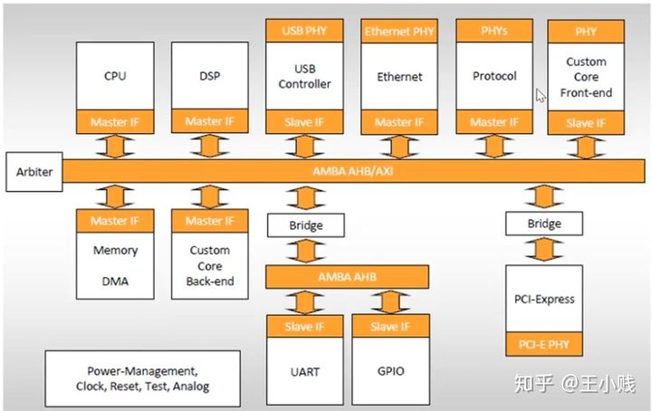
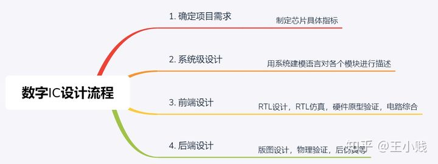
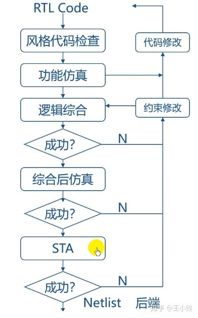
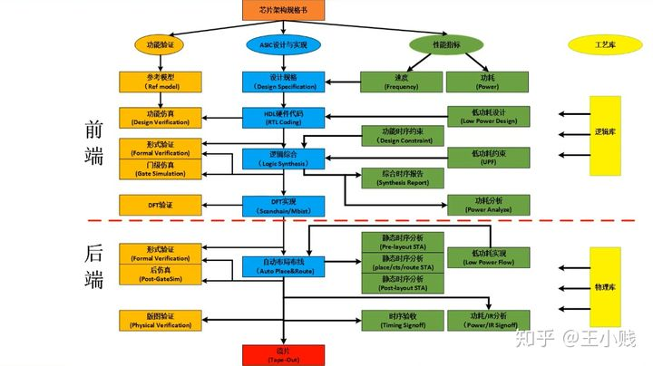

# 数字IC设计流程
在介绍设计流程之前，我们先来看看数字芯片内部的架构。 如下图所示，一个芯片是包含很多模块的，有CPU，DSP，USB外设，memory等，然后通过总线连接，1通常我们都是把各个模块先设计好（IP team),然后再把他们集成到一起（SOC team).

[数字IC设计各流程工具](./数字IC设计流程中的软件.md)

## 一、数字IC设计的流程

设计主要分四大步

1.  确定项目需求

首先做一款芯片需要有市场，一般公司会先做市场调研，比如最近市面上比较火的人工智能芯片，物联网芯片，5G芯片，需求量都比较大。有了市场的需求我们就可以设计芯片的spec了。先由架构工程师来设计架构，确定芯片的功能，然后用算法进行模拟仿真，最后得出一个可行的芯片设计方案。

有了芯片的spec,下一步就可以做RTL coding了。

2.  前端设计

RTL（register transfer level) 设计：利用硬件描述语言，如VHDL，Verilog，System Verilog, 对电路以寄存器之间的传输为基础进行描述。

功能仿真：通常是有DV工程师来完成这部分工作，通过搭建test bench, 对电路功能进行验证。

逻辑综合：逻辑综合是将电路的行为级描述，特别是RTL级描述转化成为门级表达的过程。也就是将代码翻译成各种实际的元器件。

STA：（static timing analysis) 静态时序分析，也就是套用特定的时序模型，针对特定电路分析其是否违反设计者给定的时序限制。

整个IC设计流程都是一个迭代的过程，每一步如果不能满足要求，都要重复之前的过程，直至满足要求为止，才能进行下一步。

除了以上的步骤，前端设计还有一个步骤就是DFT，随着芯片越来越大，DFT也就成为必不可少的一步。DFT通常要做scan chain, mbist ,ATPG等工作。

完成以上的工作后，就生成nestlist交给后端。

3.  后端设计

下图给出了后端设计的流程及主要工作。

Place & Route一般由后端工程师来做，Physical Design Engineer.

后端里DRC就是要检查设计规则是否符合芯片制造商的要求，这样才能正确的生产芯片。

后端完成工作后，最终会生成GDSII格式的文件，交由芯片制造商流片。

最后上一个全家福：

这里就不对每一步做具体的介绍了，因为内容实在太多，每一点都可以挖掘的很深入。