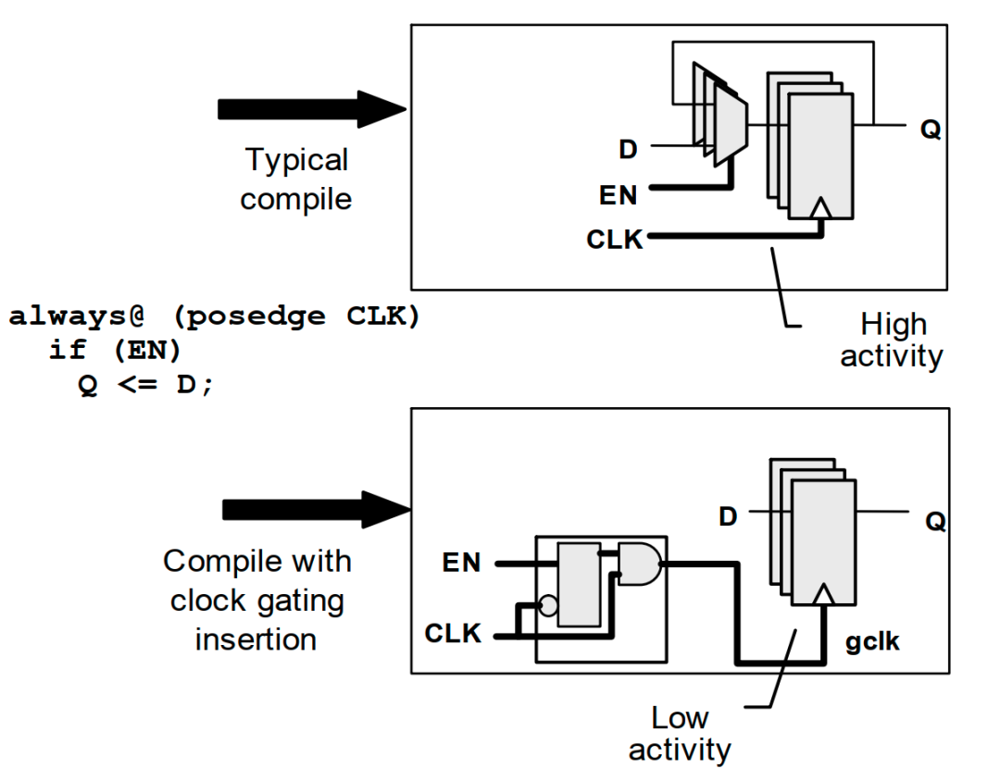

# Verilog 代码规范
**命名规范**

命名规范包括**模块命名规范**和**代码命名规范**，代码命名需要有确定的含义，提高代码可读性和可维护性。模块名命名规范处理好认，一眼就能把看出你是哪个IP里面的一个子模块之外，更重要的一个原因是防止两个module重名 ，比如你把模块起名叫，shift\_reg\_dly\_module，但是整个soc中可能会有其他IP也叫这个module名，这样同名不同工的文件，会影响集成级的工作。

所以代码规范module命名这样，**子系统\_子模块\_function\_module**。例如**ddr\_shift\_reg\_dly\_module**。避免模块名重名。

**综合自动插时钟门控**

并不是所有的寄存器都需要带复位，这样规范颠覆初入行的朋友认知。有研究表明，带复位的寄存器和不带复位的寄存器相比，面积会相差10%。但是这样也有一个原则，就是控制寄存器必须带复位，数据寄存器可以不复位，但是不能用去做条件。



计数器，必须有使能端和清零端，不允许裸奔

```Verilog
always @(posedge clk or negedge rst_n)begin
  if(rst_n == 1'b0)begin
    o_cnt[7:0] <= 8’d0;
  end
  else if(cnt_clr == 1’b1)begin
    o_cnt[7:0] <= 8’d0;
  end
  else if (cnt_en == 1’b1)begin
    o_cnt[7:0] <= o_cnt[7:0] + 1'b1;
  end
end
```

数据寄存器带使能打拍锁存使用

```Verilog
always @(posedge clk)begin
  if(data_vld)
    dout[63:0] <= din;
end
```

这种写法综合自动插时钟门控，而且不带复位。注意不能裸奔。

```Verilog
always @(posedge clk)begin
    dout[63:0] <= din;
end
```

这样写就GG了

**优先使用spram**

有一种代码规范是要求必须使用spram，single port ram。即使有同时读写的需求，也自己做逻辑，将读写分开做。强烈这么要求的原因是，有研究数据表明，在某工艺下，spram比dpram的面积基本会小30%。30%的memory收益，这个收益还是很猛的。

**memory规范操作**

Memory必须先写后读，读写使能默认复位值必须是无效值。不用的时候不允许读，否则会出现上电后芯片的memory一直扫描读写，徒增功耗。

Memory的数据读出必须锁存后使用。

**memory和logic分开**

Memory不散在逻辑中，将memory的读写控制端口都从IP的顶层伸出统一管理，为的是mem方便统一替换处理。而且后端实现上memory放边摆开。

方便不同工艺的适配，比如你要换一个工艺，那你的memory要全部替换，就要在logic里面找，假如有些工艺十分恶心，要加个寄存器或者输出到寄存器上，你就要一层层穿线到顶层寄存器模块。作为IP供应商也应该做好memory的wrapper提供给客户，方便客户替换。

后端实现memory放边摆开，logic要也考虑到memory的走线，所以对于memory的入口和出口都要是寄存器。不然PR出了问题，该做的还是得做。

**模块必须寄存器入寄存器出**

在后端布局布线过程中，逻辑少的模块之间还好，但harden之间有逻辑交互，两个harden的距离并不一定摆的位置靠近。如果不是寄存器入寄存器出，会导致两个harden之间交互的信号时序差。造成工作反复。

**自研IP不建议用\`define来定义参数**

要求用parameter，define使用要谨慎，因为define是全局定义的，如果再使用过程中不当，没有undef掉，可能会影响其他IP的同名define值。正确使用没问题，无对错，遵守公司代码规范即可 。