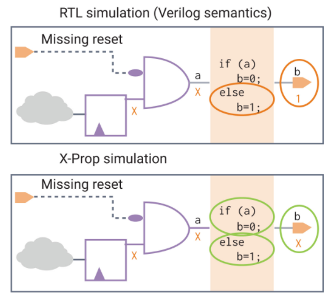

# 前端设计中的一些知识点
# 电路中出现X态的原因？

*   寄存器未复位；
*   memory未初始化；

vcs仿真开启Xprop的作用：开启之后仿真x态才会传递。

【参考连接】[https://www.synopsys.com/verification/simulation/vcs-xprop.html](https://www.synopsys.com/verification/simulation/vcs-xprop.html)

# 运算结果位宽

两数相乘，位宽相加；  
两数相加，位宽加一；

# GPIO
## NAND Tree功能
GPIO的NAND Tree output功能是一种通过构建一个由NAND逻辑门构成的级联网络，用以观察和测试IC的管脚连接状态的测试方法。
GPIO（通用输入输出）的NAND Tree功能是一种用于测试和验证集成电路（IC）的管脚I/O Pin和芯片的PAD之间连接是否正常的一种技术。具体来说，NAND Tree测试技术通过在所有的Pin和PAD连接中引入NAND门，将这些NAND门级联起来，最后通过一根output Pin输出。通过观察该output Pin的跳变，可以确定芯片的管脚连接是否存在问题。
在NAND Tree测试中，output功能的Pin被隔离，双向Pin的output模式也被禁用，只打开input的功能。所有的Pin在初始阶段都输入Low，这样NAND tree最后的output就会是Low。然后逐个将Pin的输入调成HIGH，观察NAND tree的输出变化。如果NAND tree的输出能够按照Pin编号从小到大，呈现时钟脉冲一样的Low到High再到Low的变化，这表明芯片的Pin和PAD之间的连接没有问题。反之，如果在某个时刻点NAND tree的输出保持恒Low或者恒High，不会因后续Pin节点的输入变HIGH而变化，这表明连接有断开的地方。