# 数字IC（SoC）低功耗设计方法总结
# 数字IC（SoC）低功耗设计方法总结

***

# **一、为什么需要低功耗设计**

1、便携式设备——电池寿命。

2、桌面系统——高功耗。

3、高功耗对系统的影响：（1）系统可靠性；（2）系统性能；（3）系统生产及封装成本；（4）系统散热成本。

# **二、功耗的类型**

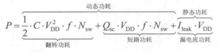

式中，C为结点电容，Nsw为单时钟内翻转晶体管数目，f为系统工作时钟频率，VDD为供电电压，Qsc为翻转过程中的短路电量，Ileak为漏电流。

## **1、动态功耗**

**动态功耗**是由**翻转电流**和**短路电流**引起的功耗，其中翻转电流引起的功耗称为翻转功耗，短路电流引起的功耗称为短路功耗，如下图所示。翻转功耗与传输的数据相关（是否有0到1或1到0的变化），翻转功耗在当前的设计电路中仍然占主要部分，短路功耗在动态功耗中所占比例较小。

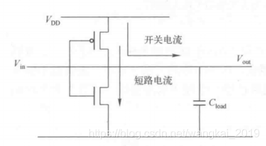

## **2、静态功耗**

在CMOS电路中静态功耗主要是由**漏电流**引起的功耗。

如下图所示，漏电流主要由以下几部分组成：

（1）PN结反向电流I1（PN-junction Reverse Current）；

（2）源极和漏极之间的亚阈值电流I2（Sub-threshold Current）；

（3）栅极漏电流，包含栅极和漏极之间的感应漏电流I3（Gate Induced Drain Leakage）；

（4）栅极和衬底之间的隧道漏电流I4（Gate Tunneling）。

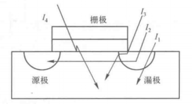

为了满足工作频率越来越高的需求，就会降低晶体管的阈值电压Vt，使得晶体管能够高速翻转。但是，如果Vt太低，晶体管不能完全关断，这将产生很大的静态功耗。

## **3、CMOS工艺的发展与功耗的变化**

（1）随着工艺的进步，电源电压随之减小以降低动态功耗，同时降低了阈值电压Vt，导致了系统静态功耗的增加；

（2）随着工艺的进步，系统的工作电压降更低，同时带来更低的晶体管动态功耗，但是由于时钟频率的提高和晶体管数目的增多，导致系统的总功耗将越来越大；

（3）随着工艺的改进，系统的功耗在不断增加，同时待机功耗和工作功耗越来越相近，这主要是由电路中漏电流增大引起的。

总结：随着工艺的进步，晶体管的尺寸将越来越小，同时带来的是更低的工作电压和更大的漏电流。工作电压的降低减小了晶体管的动态功耗，但是由于主频的提高及晶体管数目的增多，系统的总功耗越来越大。由于漏电流的增大，静态功耗在系统总功耗中所占比例不断增大。

## **4、SoC中的主要动态功耗**

输入/输出；时钟树；处理器；存储器。

# **三、低功耗设计方法**

各层次优化方法及优化效果：

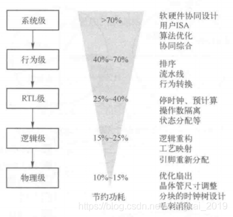

# **四、低功耗技术**

## **1、静态低功耗技术**

### **（1）多阈值工艺（Multi-Vt Design）方法**

低阈值的标准逻辑单元：速度快、漏电流大；高阈值的标准逻辑单元：速度慢、漏电流小。

一种多阈值工艺的设计流程如下图：

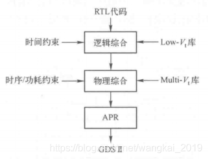

总结：在设计中可以在关键路径上使用低阈值的标准逻辑单元来优化时序，在非关键路径上使用高阈值的标准逻辑单元来优化漏电流。

优点：A、可以大大减少系统的静态功耗；

B、没有任何面积开销，工艺库设计是将两种阈值库中的相应单元的面积设计成一样，这样可以方便替换。

### **（2）电源门控（Power Gating）方法**

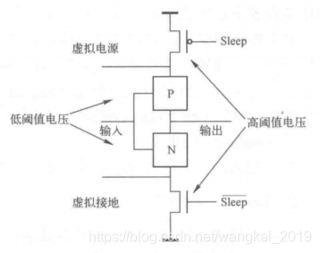

如上图所示，电源开关单元（Power Switch Cell）中的高阈值MOS管作为电源闸门，用来将低阈值电源和地隔离开。

在正常工作状态，Sleep信号为低电平，高阈值MOS管处于导通状态；当处于睡眠状态时，Sleep信号为高电平，切断电源，并且由于采用了高阈值MOS管作为开关，可以有效地减少漏电流。

### **（3）体偏置（Body Bias）**

晶体管阈值电压随体偏置而变化。在工作模式下，MOS管的体偏置为0，MOS管处于低阈值状态，翻转速度快。在等待模式下，MOS管的体偏置为反向偏置，处于高阈值状态，漏电小。

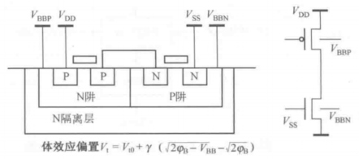

注意：MOS管的体偏转需要时间，电路有等待模式转为工作模式的时间较长。

## **2、动态低功耗技术**

### **（1）多电压域（Multi-Voltage Domain）**

对于多电压域设计，要在不同的电压域之间使用一些电平转换单元（Level Shifter），将输入电压范围转换成输出需要的不同电压范围。

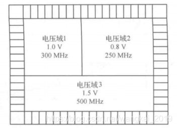

如果不同电压与之间的驱动信号与接受信号之间的距离很长，需要插入特殊的驱动单元（Repenter）来增强信号的驱动能力；

如果不同的电压域可以单独断电（MV with Power Gating），还要考虑添加保持寄存器（Retention Register）和电压隔离单元（Isolation Cell）。

### **（2）预计算**

预计算是指通过判断输入向量在满足一些特定条件时将输入释放或屏蔽。

上图所示为一个简单的停时钟电路的例子。在遇到不需要计算的指令的时候，译码逻辑单元就会使输出EN\_B信号为0，时钟将会被关闭，寄存器的值保持不变，ALU不需要进行无用的计算，因而减少了系统的功耗。

### **（3）门控时钟（Clock Gating）**

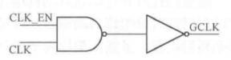

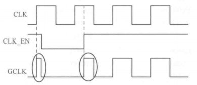

上图所示的门控时钟可能会产生毛刺。

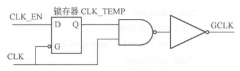

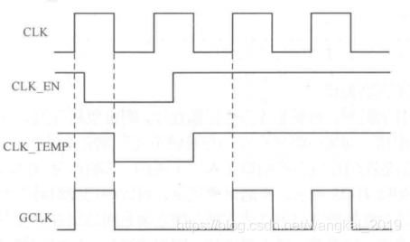

使用锁存器的门控时钟可以避免毛刺。

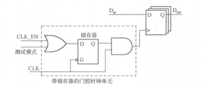

上图为门控时钟的可测性设计，在测试模式下，时钟的门控时钟单元将被旁路。在门控时钟结构中，无法检测锁存器使能端Stuck-at-0的故障，因此需要用功能测试去覆盖此类故障。

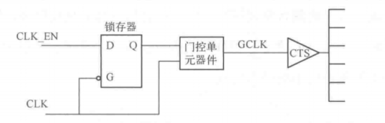

在布局时将门控时钟电路的部件摆放在一起，并摆放在时钟源GCLK附近，停掉时钟后，整个时钟树上的缓冲器（CTS）和时钟树驱动的模块都停止了翻转。通常SoC设计中，门控时钟单元会被做成一个硬核或标准单元。

## **3、门级优化技术**

### **（1）毛刺的消除**

这里的毛刺是指由于电路中信号的传输延迟引起的不必要的翻转，下图为两个消除毛刺前后的电路示意图。由于信号A和信号B的传输延迟不同，信号C上将会产生毛刺，插入缓冲器后，信号C上面的毛刺被消除了。

### **（2）逻辑级优化**

这里讨论门级优化，也就是基于网表的优化。基于网表的功耗优化是一种与工艺无关的优化。

A、调整门的大小

可以在那些非关键路径上使用一些比较小的门，这样可以减小输入电容，从而减小他们前驱的翻转电流，降低了电路的翻转功耗。也可以增大负载比较大的门，这样可以增加他们的输出斜率，减少短路电流，降低了电路的短路功耗。

B、引脚的重分配

可以使用负载电容低的引脚去连接快速翻转的一些信号。这样可以减少高翻转信号的负载电容，降低了系统的动态功耗。

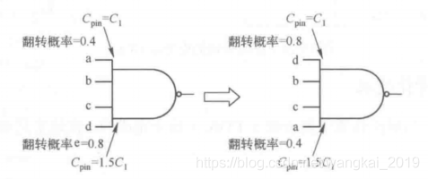

C、重排序操作

电路中b信号是翻转率比较大的信号，在排序前的电路中，b的每次翻转要驱动4个门，在排序后的电路中，b的每次翻转只需要驱动2个门，显然有效地降低了系统的动态功耗。下图所示为排序前后的两个电路模块。

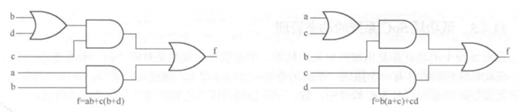

D、重新映射

对于电路中的信号a，重新映射之前要驱动两级的与非门，在重新映射之后，只需要驱动一级优化的逻辑门AOI，显然降低了系统的动态功耗。下图所示为重新映射前后的两个电路模块。

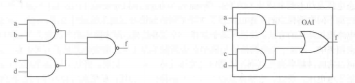

### （3）物理级优化

物理级优化主要有以下几种方法：使用低功耗的库；使用低功耗的布局规划；基于功耗优化的布局规划；通过布局布线来减少毛刺；在优化布局的时候调整缓冲器和连线的大小；调整晶体管的大小减少负载电容。

### （4）控制输入向量

系统在睡眠状态下，控制输入向量可以明显减少系统的漏电流（选择最小漏电流的向量作为组合逻辑的输入）。

## **4、补充：RTL级的一些低功耗设计方法**

（1）并行结构：一定程度可以减低某一区域的频率，从而可能降低功耗。

（2）流水结构：路径长度缩短为原始路径长度的1/M。这样，一个时钟周期内充电/放电电容变为C/M。如果在加入流水线之后，时钟速度不变，则在一个时钟周期之内，只需要对C/M进行充放电，而不是原来对C进行充/放电。因此，在相同的速度要求下，可以采用较低的电源电压来驱动系统。

（3）优化编码：通过优化编码来降低开关活动，如对于一些状态转移固定的状态机，比如序列生成之类的，可以采用格雷码代替二进制编码。

（4）操作数隔离：原来：在某一段时间内，数据通路的时钟是无用的，则将它的输入置成某个固定值，这样数据通路部分没有翻转，功耗会降低。例如APB总线在下一次传输来临之前，地址/控制信号可以不变，以此来降低功耗。

# 参考书籍

SoC设计方法与实现（第3版）——郭炜

# 总结

今天更新一篇数字IC低功耗设计方法，参考的内容基本都是郭老师的书的第11章，如果有同学想要这本书的电子版，可以在留言区输入邮箱或私信我。