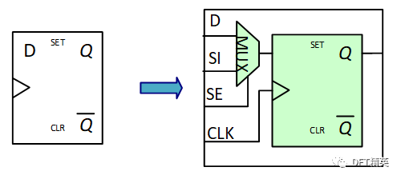
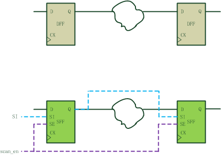
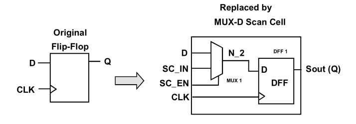
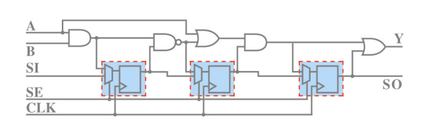
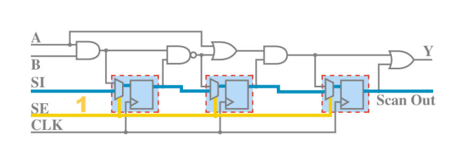
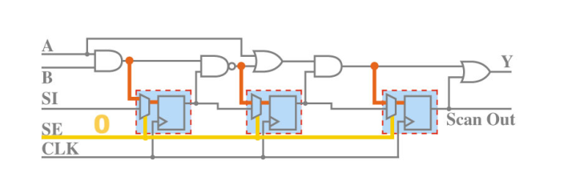

# DFT_scan_chain介绍
现代集成电路的制造工艺越来越先进，但是在生产过程中的制造缺陷也越来越难以控制，甚至一颗小小的 PM2.5 就可能导致芯片报废，为了能有效的检测出生产中出现的废片，需要用到扫描链测试（scan chain），由此产生了可测性设计即 DFT flow。

注意scan test 只能检测出制造瑕疵，无法检测芯片功能瑕疵。

在芯片功能设计完成后，整个网表是由一堆普通的寄存器和组合逻辑构成的。**扫描链的插入就是指将普通寄存器替换成为扫描寄存器（scan flip-flop）的过程**。

SE scan enable为其切换信号。正常工作模式时，SE为0，这时scan FF的功能与原有的D-FF完全一致，data path 为D到Q。芯片的功能得以保持不变。当SE被切换为1时，这时候scan FF执行其scan属性，data path为SI到Q。SI即为测试时的数据流向入口。

Function        SE=0       datapath：D->Q       Scan FF act as DFF
Scan               SE=1       datapath:   SI->Q       Scan FF act as Scan

将片上的扫描寄存器Q-SI连接起来，就成为了扫描链。通过**shift的方式**可以由scan chain将**数据串行输入的每个寄存器的SI端**，达到控制每个寄存器的目的。在**capture模式**下，**将芯片组合逻辑的反馈传回寄存器**，达到对芯片内部观测的作用。

DFT 第一步是做 scan chain，首先将电路中的普通 DFF 换成 scan DFF：

scan DFF 是在原DFF 的输入端增加了一个 MUX，于是多了几个 pin ：scan\_in，scan\_enable，scan\_out

换完之后将所有的 scan DFF 首尾依次串接起来，就构成了一条 scan chain ：

当 SE 信号（即 scan enable ）有效时，电路进入scan 状态，此时数据通路如下图蓝色粗线所示：

当 SE 信号无效时，电路工作在 normal 状态，数据通路如下图红色粗线所示：

那么，这样一条 scan chain 是如何检测到电路中的缺陷呢？

简单来讲，scan chain 工作时分为三个步骤： load ····>  capture ····> unload

load 是将input pattern 打入 scan chain

capture 是将每一级组合逻辑的结果打入下一级register

unload 是将scan chain 中的数据串行输出，得到 output pattern

 下图是一个简单的 scan chain 工作原理示意图：
 

结合上图，可知scan mode 的工作步骤如下：

1. 将普通的 register 替换为 scan register
2. 将 scan register 首尾依次串接起来
3. 在 SE 有效拉高时，将 input pattern 串行打入scan register
4. 然后 SE 拉低，等 Reg/Q 的值经过组合逻辑运算后到达下一级 reg 的D 端
5. 再产生一个 capture pulse 将 D 端的值打入寄存器
6. 最后 SE 拉高，将 reg 中的值依次串行输出，得到 output pattern
7. 如果 output  pattern 和预期的输出结果相同，说明电路工作正常；否则说明电路制造有问题，属于废片了