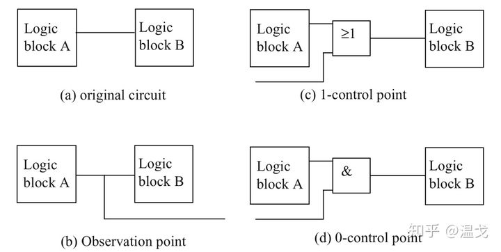
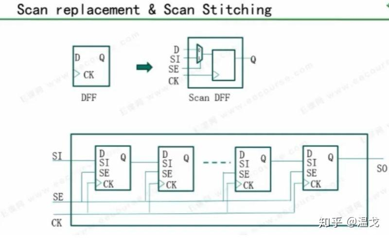
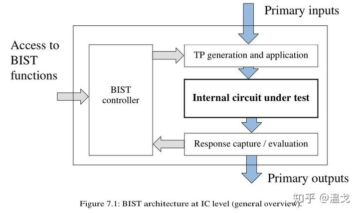
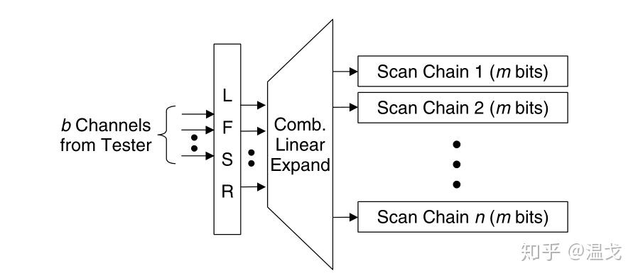

# DFT介绍
*   作者：温戈
    
    链接：[https://www.zhihu.com/question/401109345/answer/1387028607](https://www.zhihu.com/question/401109345/answer/1387028607)
    
    来源：知乎
    
    著作权归作者所有。商业转载请联系作者获得授权，非商业转载请注明出处。
    

DFT的全称是 Design For Test。

指的是在芯片原始设计中阶段即插入各种用于提高芯片可测试性（包括可控制性和可观测性）的硬件逻辑，通过这部分逻辑，生成测试向量，达到测试大规模芯片的目的。

Design--实现特定的辅助性设计，但要增加一定的硬件开销

For test--利用实现的辅助性设计，产生高效经济的结构测试向量在ATE上进行芯片测试。

**一、DFT的逻辑都有哪些？**

在回答DFT的逻辑有哪些之前，要先知道DFT的核心技术有哪些。

**1、扫描路径设计(Scan Design)**

提高可控性和可观测性，如下图所示:

图（a）是原始电路。通过在逻辑A和逻辑B之间插入一些额外的硬件电路，便可观测&控制逻辑A传递到逻辑B的值。

扫描路径法是一种针对时序电路芯片的DFT方案.其基本原理是时序电路可以模型化为一个组合电路网络和带触发器(Flip-Flop，简称FF)的时序电路网络的反馈。

Scan 包括两个步骤，scan replacement和scan stitching，目的是把一个不容易测试的时序电路变成容易测试的组合电路。

**2、JTAG**

JTAG(Joint Test Action Group，联合测试工作组)是一种国际标准测试协议（IEEE 1149.1兼容），主要用于芯片内部测试.

JTAG的基本原理是在器件内部定义一个TAP（Test Access Port，测试访问口）通过专用的JTAG测试工具对内部节点进行测试。JTAG测试允许多个器件通过JTAG接口串联在一起，形成一个JTAG链，能实现对各个器件分别测试.

**3、内建自测试(LBIST/MBIST)**

内建自测试(BIST)设计技术通过在芯片的设计中加入一些额外的自测试电路，测试时只需要从外部施加必要的控制信号，通过运行内建的自测试硬件和软件，检查被测电路的缺陷或故障。和扫描设计不同的是，内建自测试的测试向量一般是内部生成的，而不是外部输入的。内建自测试可以简化测试步骤，而且无需昂贵的测试仪器和设备(如ATE设备)，但它增加了芯片设计的复杂性。

**4、fuse 相关的硬件电路**

**5、测试向量的压缩以及解压缩结构**

一个典型的线性解压缩结构如下图：

**二、工作内容（流程）大概是怎样的？**

DFT的工作流程相信不同的公司都不完全一样，主要看公司的流程以及芯片的规模。

大公司如英特尔、英伟达、AMD等DFT的架构基本成熟。DFT 相关的design 也比较solid, DFT的逻辑直接在各个function IP 例化即可。DFT的工作内容大致都流程化了，其余主要就是要对各种EDA工具比较熟悉，其他答主关于流程这一块说的比较详细了，在此不做赘述。

很多小公司小规模的芯片，测试比较简单，也不会有DFT这个职位，很多DFT的逻辑都是designer手动插入的。