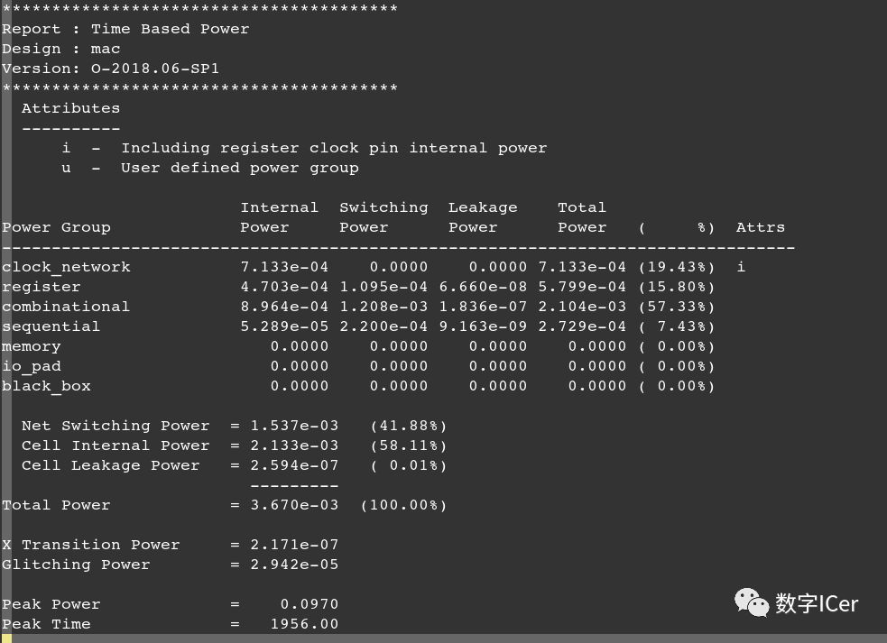
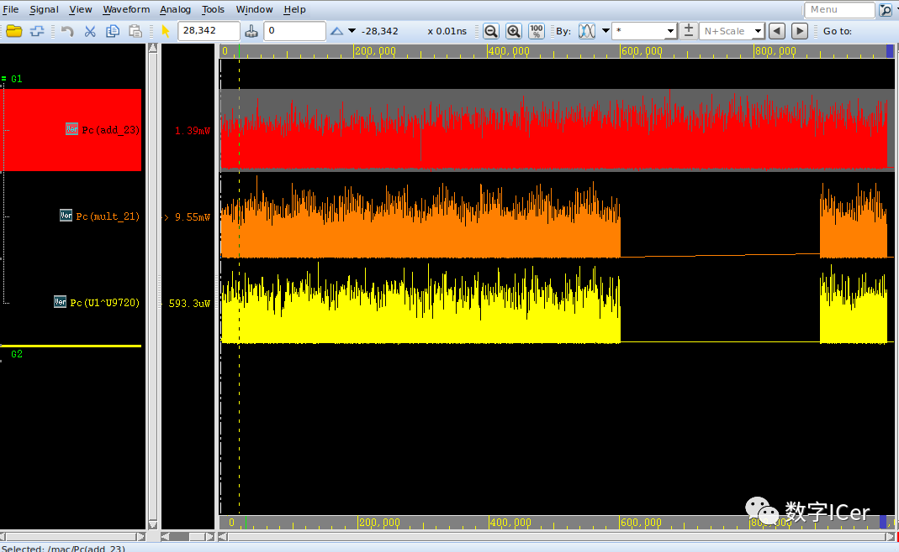

# PTPX功耗分析_Peak Power Analysis
在time-based power analysis模式下，需要提供VCD或FSDB文件，工具会分析峰值功耗，并生成功耗波形等，SAIF格式对此不支持；

time-based power analysis会显示每一时刻对应的瞬时功耗，而且报告给出peak power的信息。

这里只关注gate level的功耗分析，对于RTL level的，需要进行mapping操作(主要是对于RTL级别的design进行功耗分析的时候，需要将RTL级别的activity与门级网表进行map,这里不赘述);

gate level的VCD文件可能会非常大，尽管PTPX能够处理大于2G的VCD文件，但是还是要尽量避免使用储存大的VCD文件。可以将生成的VCD文件进行压缩或者用FSDB文件。

**基本流程**

设置功耗分析模式

```Tcl
 power_enable_analysis TRUE
 power_analysis_mode time_based
```

其他具体流程和Averaged类似，不再赘述。

功耗报告



**功耗分布图**

PTPX查看功耗的分布，在nWave里面查看每个模块在不同时刻的动态功耗，从而着重对功耗高的模块进行低功耗设计，降低设计的功耗。

PTPX查看功耗曲线图需要在 Time-based power analysis模式。

首先，读取fsdb格式的仿真文件来做动态功耗分析，并生成 vcd.fsdb格式的波形;

```Tcl
set_power_analysis_options -waveform_format fsdb -waveform_output vcd
```

然后在nWave后加上波形文件打开vcd.fsdb文件:

```Tcl
nWave vcd.fsdb &
```



time-based power analysis Mode Script脚本：

```Tcl
setpower_enable_analysis TRUE
setpower_analysis_mode time_based

#####################################################################
#link design
#####################################################################
setsearch_path "../src/hdl/gate../src/lib/snps ."
setlink_library "* *core_typ.db"
*
*read_verilog mac.vg*
*current_design mac
link
*
*#####################################################################
#       set transition time / annotate parasitics
#####################################################################
read_sdc ../src/hdl/gate/mac.sdc
set_disable_timing [get_lib_pinsssc_core_typ/*/*G]

#####################################################################
#set transition time/annotate parasitics
#####################################################################
read_parasitics ../src/annotate/mac.spef.gz

#####################################################################
#check/update/report timing
#####################################################################
check_timing
update_timing
report_timing

#####################################################################
#read switching activity file
#####################################################################
read_vcd " ../sim/vcd.dump.gz" -strip_path "tb/macinst"
#read_saif "../sim/mac.saif" -strip_path "tb/Dut"
report_switching_activity -list_not_annotated

#####################################################################
#check/update/report power
#####################################################################
check_power
set_power_analysis_options -waveform_format fsdb -waveform_output vcd
update_power
report_power
quit
```