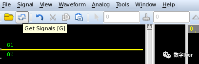
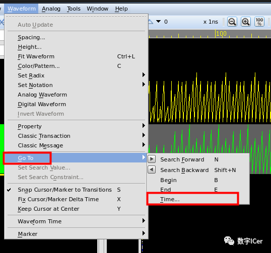
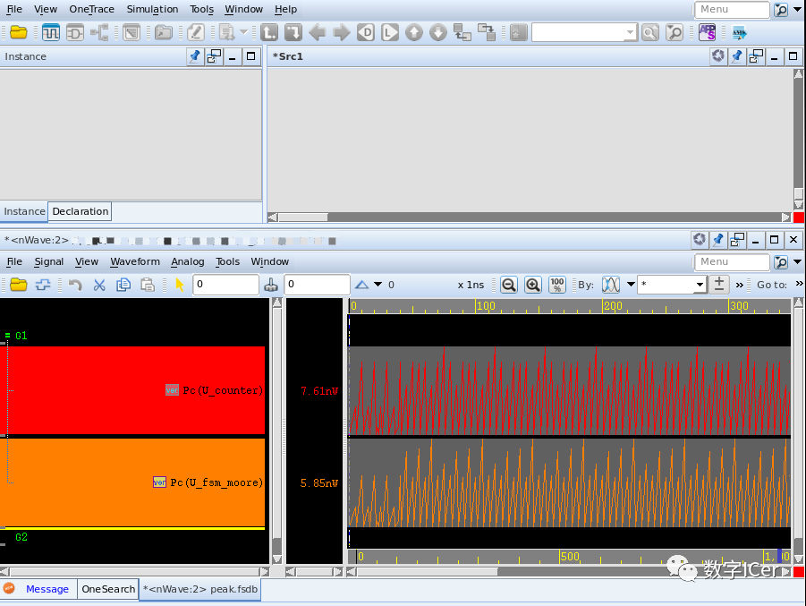

# PTPX功耗分析_nWave查看功耗波形图
PTPX查看功耗的分布，在nWave里面查看每个模块在不同时刻的动态功耗，从而着重对功耗高的模块进行低功耗设计，降低设计的功耗。

PTPX查看功耗曲线图需要在 Time-based power analysis模式。

首先，读取fsdb格式的仿真文件来做动态功耗分析，并生成 peak.fsdb格式的波形;

```Tcl
set_power_analysis_options -waveform_format fsdb -waveform_output peak  
```

然后在nWave后加上波形文件打开peak.fsdb文件:

```Tcl
nWave -ssf peak.fsdb &
```

get Signals 添加波形或者快捷键g；



菜单栏waveform中，go to 功能可以指定到某个时间点，在我们分析峰值功耗，我们得到峰值报告中的峰值时刻后，可以在nWave中快速定位峰值时刻的波形；



当然也可以直接利用verdi打开，nWave其实就是verdi内嵌的一个工具；

```Tcl
verdi -ssf peak.fsdb
```




