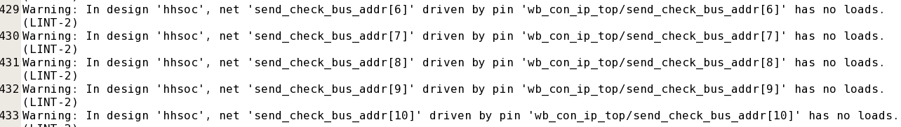
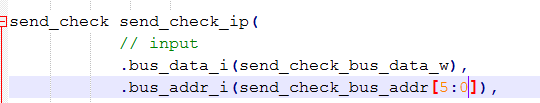
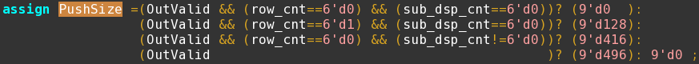
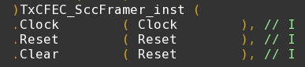

# check_design
在Design Compiler中，check_design命令用于对设计进行检查以发现潜在的问题。以下是一些Lint规则的解释：

## <mark>LINT-2(Unloaded nets): drive by pin xxx has no loads</mark>
**常用在检查输出端口。** 当综合之后出现这种类型的 warning 时，说明你的代码中在**实例化某个模块的时候输出端口未连接负载**，或者你只把**该信号的某几 bit 连接到了该模块的端口上**，这种警告的出现是比较常见的，比如下图所示：这表明在代码中 send_check_bus_addr 是一个 11bit 的输入信号，它的第 6~10bit 没有连接到该模块的端口上，即：

这样的警告虽然对 DC 综合的结果没有太大的影响，但是必须按照代码规范的要求，把未连接负载的部分信号重新以  NC  （  Not Connect  ）为后缀来命名 。

## <mark>LINT-28(Unconnected ports): xxx is not connected to any nets</mark>
**常用在检查输入端口。** DC 综合如果出现这样的 warning ，就说明你的这个信号的某些  bit  是悬空的 ，对于总线的输入数据信号 bus_data_i 是一个 32bit 的信号，但是当前模块中只用到了低 20bit ，而高 12bit 是没有连接到任何信号上面去的，那么 DC 就会给出这样的警告。
这种警告的消除方法就是：
在你的该模块中你用到了某个信号的多少 bit ，那么你在顶层调用该模块的时候只把你用到的该信号对应的那些  bit  连进来 ，这样就不会出现这样的警告。
另外需要说明的是，有些时候我们为了代码的简洁性，必须要把某个信号完全连到该模块，那么这个时候造成这种  warning  我们是可以接受的 。
还有一种可能就是有些时候你的设计需要发生变化，比如某个信号要去掉，却忘记把该信号的端口连接给删掉 ，这样就会导致这个信号的所有 bit 都是没有连接到任何信号，这样的情况就是必须进行修改的，否则会对 DC 的综合造成不必要的影响。

## <mark>LINT-29: input port xxx is connected directly to output port</mark>
**用在检查输入端口。**  当 DC 综合后出现这类警告的时候，说明你的相关模块中出现了把输入信号或者输入信号的某些位直接赋值到了输出端口信号，这类警告的出现是正常的，只需检查你的设计是否确实是这样即可 。

## <mark>LINT-3(Undriven nets): net xxx has no drivers</mark>

## <mark>LINT-31: output port xxx is conneted directly to output port xxx</mark>
**用在检查输出端口。** 这类警告的意思是输出端口某信号的一些比特直接和另外一些比特相连。  这类警告的出现可能是正常的，只需检查你的设计是否确实是这样即可 。本例的设计代码如下所示：

输出信号 PushSize 的位宽为 9 比特，而实际取值为有限几个数值： 0 、 128 、 416 、 496 。恰好所有二进制数值的最低四位为 0 。所以信号 PushSize 的这四位比特连接的都是零。

## <mark>LINT-32: xxx is conneted to logic 0 or 1</mark>
**用在检查输入端口。** 当 DC 综合出现这种类型的警告的时候，就说明你的代码中在模块调用的时候，直接把常值 0 连接到该模块的某个信号中了，  这种警告的出现是正常的，因为我们的设计有些时候就是要把某些信号接 0  或者接 1。
那么对于信号 DC 综合的时候就会报出这样的警告。所以真的这样的警告我们只需要检查代码，看出现警告的地方我们的设计是不是这样设计的 ，  这样会防止粗心大意给某个端口错误的赋了一个常值 1  或者 0 。 

## <mark>LINT-33: is connected to more than one pin</mark>
表明在模块实例化的时候，你将一个相同的信号同时连到了调用模块中不同的两个或者几个端口信号中 ，例如

上述警告在代码中的体现就是：
即：把 Reset 信号同时连到了 Clear 和 Reset 这两个端口信号上了。  这样  warning  是否正常的，必须检查自己的设计意图 。该例子中，设计师把模块的 Clear 和 Reset 信号分开使用，所以以上端口连接错误，需要修改。

## <mark>LINT-5(Undriven outputs): output port xxx is not driven</mark>

## <mark>LINT-52: output port xxx is connected directly to logic 0 or 1</mark>
**用在检查输出端口。 **DC 综合结果出现上述警告时，说明输出端口的某些信号的某些位直接被赋值常数 0 （也可以是 1 ，跟具体设计有关），如图所示，

表明输出信号 PushSize[8:0] 的第 0bit~3bit 被直接赋值 0 。  这种  warning  的出现也可能是正常的，需检查是否与当前设计相符合 。在该例子中， PushSize 的取值为有限几个数值： 0 、 128 、 416 、 496 。恰好所有二进制数值的最低四位为 0 。

## <mark>LINT-63: net xxx has a single tri-state dirver</mark>
一般出现在设计中调用存储器的模块中，例如延迟线，FIFO等模块，并且  warning  的位置都是存储器的  DOUT 端口 。此 warning 是说明DOUT 端口用三态电路的驱动方式。  这样的  warning  也是正常的，检查是否与当前设计相符合即可 。（这里面警告的对象都为 ram 的输出 DOUT ，对于其他信号如果出现此类 warning 就需要检查是否设计就是这样设置的）

## <mark>LINT-8(Unloaded inputs): input port xxx is unloaded</mark>

## <mark>signed to unsigned</mark>

当出现这种 signed to unsigned warning 出现的时候一般是代码中出现了一下两种不规范的写法：

第一种：例如： wire data_A； assign data_A= （判断条件）？ 1 ： 0 ；
即：定义一个 wire 类型的信号 data_A ，然后通过一个判断条件的真假来给 data_A 进行赋 1 或者 0 ，那么这样的写法就会造成上面例句的 warning ，这是因为在 verilog 中直接写 1 或者 0 ，  那么  verilog  就会把 1 或者 0  默认为整型变量，而整型变量默认的是有符号数 ，而我们定义的 data_A 是一个无符号信号。
那么正确的写法应该为 wire data_A; assign data_A= （判断条件）？1'b1 : 1'b0, 这样写才是规范的写法。  即把常数赋值给给无符号数时，一定要加上位宽描述，不能写成整形常数。

第二种：这种情况 warning 主要出现在一些用到了有符号数运算的电路中，比如我们要计算两个 8bit 有符号数的加法、减法、乘法等，而其中一个有符号数要通过别的寄存器进行赋值，比如总线寄存器（即：要进行运算的数通过总线赋值），
那么我们可能会这样写： wire signed [7:0] A; assign A=bus_data_reg[7:0]，这样写  verilog  就会把  bus_data_reg[7:0]默认为一个无符号数 ，可是我们的 A 要求是一个有符号数，故就会出现上面列举的 warning ，
正确的写法应该是 wire signed [7:0] A; assign A=  $signed( bus_data_reg[7:0]); 总的来说就是，我们要给一个有符号数的信号赋值，那么我们就应该保证等号两边都是有符号数，  verilog 中可以用  $signed  将一个数定义成有符号数。