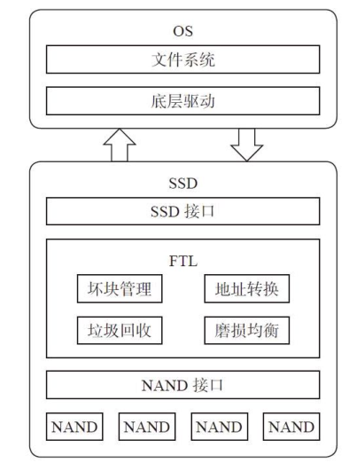
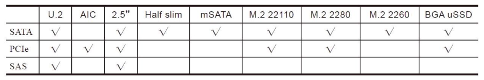

# 第1章：综述

**SSD硬件**：主控、闪存、缓存芯片（可选）、PCB接口。

**软件**：SSD内运行固件负责**调度数据从接口端到介质端的读写**，还包括**核心闪存介质寿命**和**可靠性管理调度算法**，以及其他一些**SSD内部算法**。

\*\* SSD vs HDD\*\*

性能好：连续读写吞吐量、随机读写IOPS、功耗低、抗震防摔、无噪声、身形百变

**元年**：1997年Altec Computer Systeme推出了一款并行SCSI闪存SSD，接着1999年BiTMICRO推出了18GB的闪存SSD。

**赶超**：2009年SSD的容量赶超HDD，PureSilicon公司的2.5寸SSD做到了1TB容量，由128片64Gb的MLC闪存组成。

**PCIe出现**：2013年，PCIe SSD进入消费者市场。

（DIMM全称Dual-Inline-Memory-Modules，中文名叫双列直插式存储模块。）

**SSD基本工作原理**

**SSD系统调用**

**SSD主要有三大功能模块组成：**

*   前端接口和相关的协议模块；
*   中间的FTL层（Flash Translation Layer）模块；
*   后端和闪存通信模块。

**以写为例看SSD是怎么进行读写的：**

主机通过接口发送写命令给SSD，SSD接收到该命令后执行，并接收主机要写入的数据。

数据一般会先缓存在SSD内部的RAM中，FTL会为每个逻辑数据块分配一个闪存地址，当数据凑到一定数量后，FTL便会发送写闪存请求给后端，然后后端根据写请求，把缓存中的数据写到对应的闪存空间。

由于闪存不能覆盖写，闪存块需擦除才能写入。

主机发来的某个数据块，它不是写在闪存固定位置，SSD可以为其分配任何可能的闪存空间写入。

因此，SSD内部需要FTL这样一个东西，完成逻辑数据块到闪存物理空间的转换或者映射。

FTL需要实现**垃圾回收**、**磨损均衡**、**坏块管理**、**读干扰处理**、**数据保持处\*\*\*\*理**、**错误处理**等很多其他事情。

**SSD核心参数**

\*\*基本信息：\*\*包括容量配置（Capacity）、介质信息（Component）、外观尺寸（Form Factor）、重量（Weight）、环境温度（Temperature）、震动可靠性（Shock和Vibration）、认证（Certifications）、加密（Encryption）等信息。

**性能指标**：连续读写带宽、随机读写IOPS、时延（Latency）、最大时延（Quality of Service）。

**数据可靠性和寿命**：Reliability、Endurance。

**功耗**：Power Management、Active Power和Idle Power。

**兼容性等**：Compliance、Compatibility（与操作系统集成时参考）。

***

**基本信息剖析**

**SSD容量**

SSD容量是指**提供给终端用户**使用的**最终容量大小**，以**字节**（Byte）为单位。这里要注意，标称的数据都以**十进制**为单位的，程序员出身的人容易把它当成二进制。同样一组数据，二进制比十进制会多出\*\*7%\*\*的容量，例如：

**十进制128GB：128×1000×1000×1000=128000000000字节**

**二进制128GB：128×1024×1024×1024=137438953472字节**

以**二进制为单位的容量**行业内称为**裸容量**，以**十进制为单位的容\*\*\*\*量**称为**用户容量**。

SSD可以利用这多出来的7%空间管理和存储内部数据，比如把这部分额外的空间用作FTL映射表存储空间、垃圾回收所需的预留交换空间、闪存坏块的替代空间等。

这里的7%多余空间也可以转换为OP概念（Over Provisioning），公式是：

**OP=（SSD裸容量-用户容量）/用户容量**

**介质信息**

当前SSD盘核心存储介质是闪存，闪存分**SLC、MLC、TLC**（甚至QLC）。

*   **SLC**（Single-Level Cell）即单个存储单元存储**1bit**的数据。SLC速度快，寿命长（**5万～10万次擦写寿命**），但价格超贵（约是MLC 3倍以上的价格）。
*   **MLC**（Multi-Level Cell）即单个存储单元存储**2bit**的数据。MLC速度一般，寿命一般（**约为3k～10k次擦写寿命**），价格一般。
*   **TLC**（Trinary-Level Cell）即单个存储单元存储**3bit**的数据，也有闪存厂家叫8LC，速度慢，寿命短（**约500～1500次擦写寿命**），价格便宜。

闪存发展到现在，经历了2D平面到现在的3D立体制程（Process）的大发展，目标只有一个：硅片单位面积（mm 2 ）能设计生产出更多的比特（bit），让每GB成本和价格更低。

**外观尺寸**

SD是标准件，外观尺寸需要满足一定的规定要求（长宽高和接口连接器），这又通常称为Form Factor。

那SSD会有哪些Form Factor呢？

细分为3.5寸、2.5寸、1.8寸、M.2、PCIe card、mSATA、U.2等FormFactor标准，每个Form Factor也都有三围大小、重量和接口引脚等明确规范。

***

**性能剖析**

**性能指标**

硬盘性能指标一般包括**IOPS（Input Output Operations Per Second，\*\*\*\*反映的是随机读写性能）**、**吞吐量（Throughput，单位MB/s，反映的\*\*\*\*是顺序读写性能）**、**Response Time/Latency（响应时间/时延，单位ms\*\*\*\*或μs）**。

*   **IOPS**：单位IOPS，即设备**每秒完成IO请求数**，一般是小块数据读写命令的响应次数，比如4KB数据块尺寸。IOPS数字越大越好。
*   **吞吐量**：单位MB/s，即**每秒读写命令完成的数据传输量**，也叫**带\*\*\*\*宽**（Bandwidth），一般是大块数据读写命令，比如512KB数据块尺寸。吞吐量越大越好。
*   **响应时间**：也叫时延（Latency），即**每个命令从发出到收到状态\*\*\*\*回复所需要的响应时间**，时延指标有平均时延（Average Latency）和最大时延两项（Max Latency）。响应时间越小越好。

**访问模式**

性能测试设计上要考虑访问模式（Access Pattern），包括以下三部分：

*   **Random/Sequential**：随机（Random）和连续（Sequential）数据命令请求。何为随机和连续？指的是**前后两条命令LBA地址是不是连续**的，连续的地址称为Sequential，不连续的地址称为Random。
*   **Block Size**：块大小，即单条命令传输的数据大小，性能测试从4KB～512KB不等。随机测试一般用小数据块，比如4KB；顺序测试一般用大块数据，比如512KB。
*   **Read/Write Ratio**：读写命令数混合的比例。

**时延指标**

时延有**平均时延**和**最大时延**，数值越低越好。

**平均时延**计算公式是整个应用或者测试过程中所有命令响应时间总和除以命令的个数，反映的是SSD总体平均时延性能；

**最大时延取**的是在测试周期内所有命令中响应时间最长的那笔，反映的是用户体验，例如最大时延影响应用通过操作系统操作SSD时有无卡顿的用户体验。

时延上了秒级，用户就会有明显的卡顿感知。

***

**寿命剖析**

衡量SSD寿命主要有两个指标:

一是**DWPD**（Drive Writes Per Day），即在SSD保质期内，用户**每天可以把\*\*\*\*盘写满多少次**；

另一指标是**TBW**（Terabytes Written），在SSD的生命周期内可以写入的总的字节数。

\**TBW = Capacity *(Nand PE Cycles / WA)**

*   **NAND PE Cycles**：SSD使用的闪存标称写擦除次数，如3K、5K。
*   **Capacity**：SSD单盘用户可使用容量。
*   **WA**：写入放大系数，这跟SSD FW的设计和用户的写入的数据类型（顺序写还是随机写）强相关。

TBW 和 DWPD 的计算公式：

\**DWPD = TBW / ( Years \* 365 *Capacity)**

*   Years：SSD标称使用年限。

***

**数据可靠性剖析**

SSD有几个关键指标来衡量其可靠性：UBER、RBER和MTBF。

*   **UBER**：Uncorrectable Bit Error Rate，不可修复的错误比特率。
*   **RBER**：Raw Bit Error Rate，原始错误比特率。
*   **MTBF**：Mean Time Between Failure，平均故障间隔时间。

UBER是一种**数据损坏率**衡量标准，等于在应用了任意特定的错误纠正机制后依然产生的每比特读取的数据错误数量占总读取数量的比例（概率）。

RBER反映的是闪存的质量。

MTBF指标反映的是产品的无故障连续运行时间，也是产品的可靠性指标。

***

**功耗剖析**

SSD定义了以下几种功耗类型：

*   **空闲（Idle）功耗**：当主机无任何命令发给SSD，SSD处于空闲状态但也没有进入省电模式时，设备所消耗的功耗。
*   **Max active功耗**：**最大功耗**是SSD处于最大工作负载下所消耗的功耗，SSD的最大工作负载条件一般是连续写，让闪存并发忙写和主控ASIC满负荷工作，这时的功耗值对应最大功耗。
*   **Standby/Sleep功耗**：规范规定了SSD状态，包括：Active、Idle、Standby和Sleep，功耗值从Active到Sleep逐级递减，具体的实现由各商家自行定义。一般来讲，在Standby和Sleep状态下，设备应尽可能把不工作的硬件模块关闭，降低功耗。一般消费级SSD Standby和Sleep功耗为100～500mW。
*   **DevSleep功耗**：这是SATA和PCIe新定义的一种功耗标准，目的是在Standby和Sleep基础上再降一级功耗，配合主机和操作系统完成系统在休眠状态下（如Hibernate），SSD关掉一切自身模块，处于极致低功耗模式，甚至是零功耗。一般是10mW以下。

***

**接口形态**

不同应用场景下的SSD，其Form Factor尺寸也不一样，如图1-31所示。表1-11列出了当下SATA、PCIe、SAS接口和协议的SSD所使用的Form Factor。

**各种类型的SSD示意图**

**SSD 接口形态和接口**

***

**SSD市场**

从2000年年初SSD雏形诞生，到几大闪存原厂布局SSD产品，SSD经历了用户对闪存和数据可靠性的质疑，到实际产品的试水、铺开，一直到2015年才掀起SSD替换HDD的浪潮。到2017年，消费级SSD市场中SSD的装机率已到30%～40%，预测在2018年，SSD装机率将超过50%。

在HDD和SSD二分天下的今天，SSD主要用于存放和用户贴近的热数据，其对总容量需求较小，性能优先；HDD主要用于存放和用户较远的温（warm）数据或冷（cold）数据，其对总容量需求较大，价格优先。

这是一种设计的平衡。具体来讲：

*   **数据加速层**：采用PCIe接口的高性能的SSD。
*   \*\*热数据（频繁访问）层：\*\*采用普通SATA、SAS SSD。
*   **温数据层**：采用高性能HDD。
*   **冷数据层**：采用HDD。
*   **归档层**：采用大容量价格低廉的HDD，甚至磁带。

SSD的研发模式，三方配合：**主控厂商**+**闪存厂商**+**生产制造**。