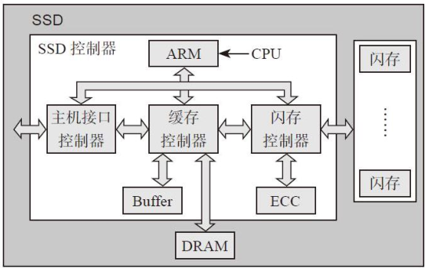
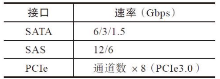

# 第2章：主控和全闪存
SSD主要由两大模块构成——**主控**和**闪存介质**。其实除了上述两大模块外，可选的还有**缓存单元**。

主控是SSD的大脑，承担着指挥、运算和协调的作用，具体表现在：

**一是实现标准主机接口\*\*\*\*与主机通信；**

**二是实现与闪存的通信；**

**三是运行SSD内部FTL算法。**

下图是一个SSD系统架构的概略图，采用ARM CPU，主要分为前端和后端两部分。

**前端**：（Host Interface Controller，**主机接口控制器**）跟主机打交道，接口可以是SATA、PCIe、SAS等。

**后端**：（Flash Controller，**闪存控制器**）跟闪存打交道并完成数据编解码和ECC。

除此之外还有缓冲（Buffer）、DRAM。

模块之间通过AXI高速和APB低速总线互联互通，完成信息和数据的通信。

**SSD主控模块硬件图**

***

**前端：主机接口**

与主机进行通信（数据交互）的标准协议接口，当前主要代表为SATA、SAS和PCIe等。

**SATA、SAS、PCIe接口速率**

**SATA**的全称是Serial Advanced Technology Attachment（串行高级技术附件），是一种基于行业标准的串行硬件驱动器接口，是由Intel、IBM、Dell、APT、Maxtor和Seagate公司共同提出的硬盘接口规范。

**SAS**（Serial Attached SCSI）即串行连接SCSI，是新一代的SCSI技术，和现在流行的Serial ATA（SATA）硬盘相同，都是采用串行技术以获得更高的传输速度，并通过缩短连接线改善内部空间等。SAS是并行SCSI接口之后开发出的全新接口；SAS接口和SATA接口完全兼容，SATA硬盘可以直接用在SAS的环境中。

**PCIe**（Peripheral Component Interconnect Express）是一种高速串行计算机扩展总线标准，它原来的名称为3GIO，是由英特尔在2001年提出的，旨在替代旧的PCI、PCI-X和AGP总线标准。PCIe属于高速串行点对点多通道高带宽传输，所连接的设备分配独享通道带宽，不共享总线带宽，主要支持主动电源管理、错误报告、端对端的可靠性传输、热插拔以及服务质量（QoS，Quality o? Service）等功能。

***

**后端：ECC和控制器**

后端两大模块分别为ECC模块和闪存控制器。

**ECC模块**是数据编解码单元，由于闪存存储天生存在误码率，为了数据的正确性，在数据写入操作时应给原数据加入ECC校验保护，这是一个编码过程。读取数据时，同样需要通过解码来检错和纠错，如果错误的比特数超过ECC纠错能力，数据会以“不可纠错”的形式上传给主机。SSD内的ECC算法主要有BCH和LDPC，其中LDPC正逐渐成为主流。

**闪存控制器**使用符合闪存ONFI、Toggle标准的闪存命令，负责管理数据从缓存到闪存的读取和写入。

***

**主控厂商**

\*\*Marvell 美满（迈威）\*\*在低功耗、高性能设计、封装、先进制程方面有了很多的积累。

Marvell在高端SoC设计上处于领先地位，Marvell通过复杂的**SoC架\*\*\*\*构**、**领先的纠错机制、接口技术**、**低功耗**等多项优势建立起领先竞争对手的技术壁垒：

*   **Marvell专有的NANDEdge技术**。 这种LDPC（低密度奇偶校验）纠错机制是目前业界任何其他功能所无法比拟的技术。
*   **可扩展、可延续的开发架构**。
*   **特性丰富的SDK**。 Marvell为合作伙伴提供了完善的SDK开发工具。
*   **全产品线转向16nm工艺**。 Marvell在业界率先使用28nm工艺。

**三星主控**

自有闪存，自有主控

**国产主控**

台湾主流 智微（JMicron）、慧荣（Silicon Motion）和群联（Phison）

记忆科技、湖南国科微、杭州华澜微

北京得瑞领新科技、忆芯（Starblaze）、浪潮和山东华芯半导体、中勍科技、硅格

***

**企业级和消费级主控需求的归一化设计**

SSD有企业级与消费级之分。企业级SSD产品更加注重随机性能、延迟、IO QoS的保证及稳定性；而消费级产品则更加注重顺序性能、功耗、价格等。

归一化主要的问题在于能否在控制器硬件架构上实现**成本、功耗和功能**的统一。

1.  成本方面，企业级SSD对控制器成本较不敏感，归一化SSD控制器需要着重满足消费级SSD的成本预算。
2.  经过市场沉淀，NVMeU.2形态与M.2形态的SSD逐渐成为主流，两种形态的SSD产品性能需求也趋于一致。
3.  在寿命上，企业级与消费级SSD需求差别较大。但影响SSD寿命的主要因素在于闪存的耐久能力。SSD控制器则确保加强对闪存的纠错能力。因此，企业级与消费级SSD控制器在寿命方面的设计目标是一致的。
4.  在容量上，企业级SSD与消费级SSD差异较大。SSD控制器需要以比较小的代价支持大容量闪存，以便同时覆盖企业级与消费级SSD的需求。
5.  可靠性方面，企业级SSD一般要求ECC与DIE-RAID两层数据保护能力。而随着3D闪存逐步普及，闪存厂商开始建议在消费级SSD上提供DIE-RAID能力。
6.  在功耗方面，消费级产品对功耗最为敏感，特别是像平板、笔记本电脑这种电池供电设备，对功耗有严格的限制。企业级SSD对功耗相对不敏感。然而对于整个数据中心，电力成本已占数据中心运营成本近20%。随着SSD的大规模部署，低功耗设计也成为企业级SSD控制器的追求目标。

***

**全闪存阵列**

大量的SSD集合体

**带计算功能的固态硬盘**

Google的机器学习处理器TPU2.0，性能直接震惊了深度学习界扛把子NVIDIA。本来GPU只是耗电厉害，性能在通用方面还能称霸，没想到TPU来了之后，一下子GPU性能被比下去了，功耗还是TPU的好几倍。

**TPU：Tensor Processing Unit，张量处理单元**

**专用ASIC和FPGA等可定制逻辑的深度学习计算平台才是未来的\*\*\*\*发展方向**，因为它们有很大的潜力可以挖掘，通过架构的不断创新，未来能达到的性能会很高。

上海的**方一信息科技**推出了一款黑科技产品：带FPGA的SSD——CFS（Computing Flash System，计算闪存系统）。

它采用PCIe 3.0x8高速接口，性能可达5GB/s。SSD提供高速数据存储，FPGA能提供计算加速，这样数据从SSD出来就由FPGA顺带算好，释放了CPU。

一切回归原位，CPU做控制，FPGA做计算，SSD做存储。