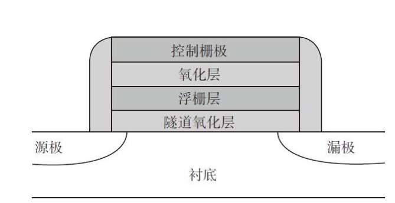
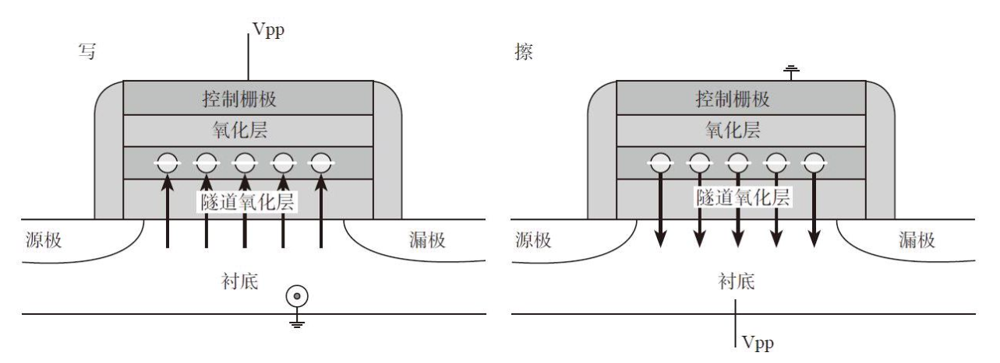
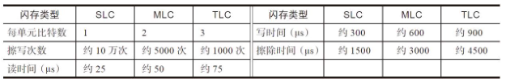
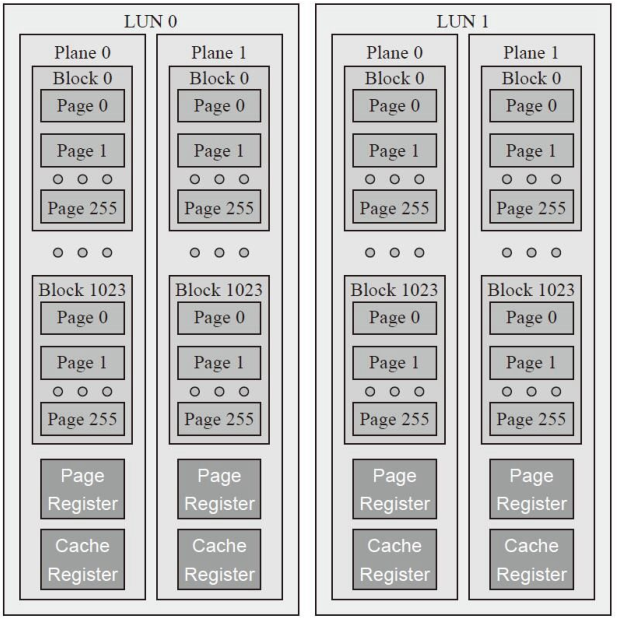
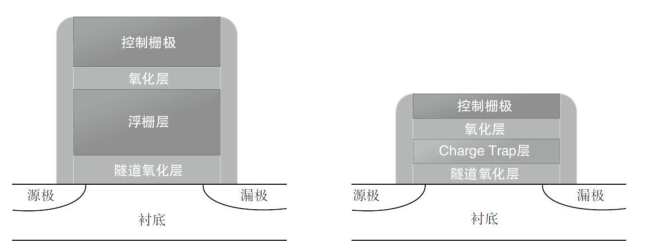
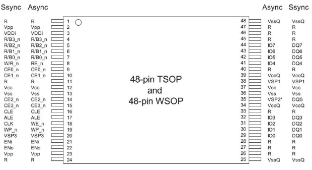
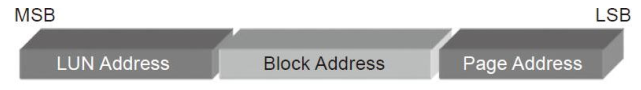
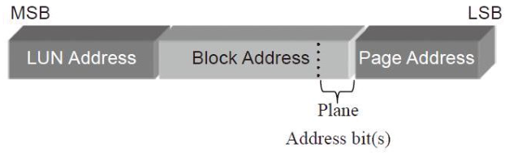

# 第3章：SSD存储介质--闪存
**物理结构**

**闪存的物理结构**

闪存是一种**非易失性存储器**，也就是说，掉电了数据也不会丢失。闪存基本存储单元（Cell）是一种**类NMOS**的\*\*双层浮栅（Floating \*\***Gate）MOS管**。

在**源极**（Source）和**漏极**（Drain）之间电流单向传导的半导体上形成存储电子的**浮栅**，**浮栅上下被绝缘层包围**，存储在里面的电子不会因为掉电而消失，所以闪存是非易失性存储器。

**浮栅晶体管结构**

**写操作**是在**控制极加正电压**，使电子通过绝缘**层进入浮栅极**。**擦\*\*\*\*除**操作正好**相反**，是在**衬底加正电压**，把电子**从浮栅极中吸出来**。

**擦写原理**

一个存储单元存储1bit数据的闪存，我们叫它为**SLC（Single Level \*\*\*\*Cell）**，存储2bit数据的闪存为**MLC（Multiple Level Cell）**，存储3bit数据的闪存为**TLC（Triple Level Cell）**。

对**SLC**来说，一个存储单元存储两种状态，**浮栅极**里面的**电子多于\*\*\*\*某个参考值**的时候，我们把它**采样为0**，否则就**判为1**。

对**MLC**来说，如果一个存储单元存储4个状态，那么它只能存储2bit的数据。通俗来说就是把**浮栅极**里面的**电子个数**进行一个**划分**，比如低于10个电子判为0；11～20个电子判为1；21～30个电子判为2；多于30个电子判为3。

依此类推，**TLC**若是一个存储单元有8个状态，那么它可以存储3bit的数据，它在MLC的基础上对浮栅极里面的电子数又进一步进行了划分。

同样面积的一个存储单元，SLC、MLC和TLC分别可以存储1bit、2bit、3bit的数据，所以在同样面积的DIE上，闪存容量依次变大。

但同时，一个**存储单元电子划分得越多**，那么在写入的时候，控制**进入浮栅极**的**电子个数**就要**越精细**，所以**写耗费**的时间就**越长**；同样的，读的时候，需要尝试用**不同的参考电压**去**读取**，一定程度上**加\*\*\*\*长了读取时间**。所以我们会看到在**性能上**，**TLC不如MLC，MLC不如\*\*\*\*SLC。**

SLC、MLC和TLC在性能和寿命（Endurance）上的直观对比：

**SLC、MLC、TLC参数比较**

**闪存芯片的物理结构**

一个闪存内部的存储组织结构如图所示：

一个闪存芯片有若干个**DIE**（或者叫**LUN**），

每个**DIE**有若干个**Plane**，

每个**Plane**有若干个**Block**，

每个**Block**有若干个**Page**，

每个**Page**对应着一个**Wordline**，

**Wordline**由成千上万个**存储单元**构成。

**闪存内部组织架构**

DIE/LUN是**接收和执行闪存命令的基本单元**。**LUN0和LUN1**可以同时**接收和执行不同的命令**（但还是有一定限制的，不同厂家的闪存限制不同）。但在**一个LUN**当中，一次只能**独立\*\*\*\*执行一个命令**，你不能对其中某个Page写的同时，又对其他Page进行读访问。

一个LUN又分为若干个Plane，市面上常见的是1个或者2个Plane，现在也有4个Plane的闪存了。每个Plane都有自己独立的**Cache Register**和**Page Register**，其大小等于一个Page的大小。

固态硬盘主控在**写某个\*\*\*\*Page**的时候，先把数据从主控传输到该Page所对应Plane的**Cache \*\*\*\*Register**当中，然后再把整个**Cache Register**当中的数据**写到闪存阵列**；

**读**的时候则**相反**，先把这个Page的**数据**从**闪存介质读取到Cache \*\***Register**，然后再**按需\*\*传给主控。

无论是从闪存介质**读数据**到Cache Register，还是把Cache Register的**数据写入**闪存介质，都以**Page为单位**。

需要**Cache Register**和**Page Register**两个缓存的主要**目的**是**优\*\*\*\*化**闪存的**访问速度**。

主控读数据时：

\*\*Cache Register→主\*\*\*\*控，同时 \*\***闪存介质→Page Register。**

主控写数据时：

\*\*Page Register→闪存介质，同时 \*\***主控→Cache Register。**

闪存一般都支持**Multi-Plane**（或者Dual-Plane）操作。那么什么是Multi-Plane操作呢？

对写来说，主控先把数据写入第一个Plane的CacheRegister当中，数据保持在那里，并不立即写入闪存介质，等主控把同一个LUN上的另外一个或者几个Plane上的数据传输到相应的CacheRegister当中，再统一写入闪存介质。

对读来说，使用Dual-Plane操作，两个不同Plane上的Page数据会在一个闪存读取时间加载到各自的Cache Register当中，这样用一个读取时间读取到两个Page的数据，读取速度加快。

**闪存的擦除是以Block为单位的**。那是因为在组织结构上，一个**Block**当中的**所有存储单元**是**共用一个衬底的（Substrate）**。当你对某衬底施加强电压，那么上面所有浮栅极的电子都会被吸出来。

每个**闪存Block**都有**擦写次数**的限制，这个最大擦写次数按SLC、MLC、TLC依次递减：**SLC**的擦写次数可达**10万次**，**MLC**一般为**几千\*\*\*\*到几万次**，**TLC**降到**几百到几千次**。

**三维闪存**

基于**二维平面**单元结构的**尺寸缩小**已经**无法**进一步**降低比特成本**了，即达到了技术上的**瓶颈**。

**Charge Trap型闪存**

施敏和他的搭档在MOSFET中间加了一个**浮栅极**，创造了闪存的历史。

此后有牛人在想，你中间加的是**浮栅极**，是**导体**，那我换个**绝\*\*\*\*缘体**怎么样？于是，CT技术的晶体管诞生了。

**浮栅晶体管与CT晶体管对比**

**CT**与**浮栅**最大的不同是**存储电荷**的**元素**不同，**后者**是用**导体存储\*\*\*\*电荷**，而**前者**是用**高电荷捕捉（Trap）密度的绝缘材料**（一般为氮化硅，SI3N4）来存储电荷。CT的绝缘材料上面就像布了很多**陷阱**，电子一旦陷入其中，就**难以逃脱**，而**浮栅**是**导体材料**，**电子**可以在里面**自由移动**。

浮栅晶体管对浮栅极下面的绝缘层很敏感，该**氧化物厚\*\*\*\*度变薄**（**制程不断减小**导致的）或者**老化（Degradation，擦写次数多\*\*\*\*了）**，**浮栅极**里面存储的**电子进出变得容易**。浮栅极里面的电子可以自由移动，因此对**氧化层变得敏感**。

如果里面的**电子本来就深陷其\*\*\*\*中**，行动困难，即使**绝缘层老化**，**电子还是不容易出来**。因此，相对浮栅晶体管来说，CT的一个优势就是：**对隧道氧化层不敏感，当厚度\*\*\*\*变薄或者擦除导致老化时，CT表示压力不大。**

***

**闪存实战指南**

闪存接口有**同步异步**之分，一般来说，**异步传输速率慢**，**同步传\*\*\*\*输速率快**。**异步**接口**没有时钟**，每个数据**读**由一次**RE\_n信号触发**，每个数据**写**由一次**WE\_n信号触发**。同步接口有一个**时钟信号**，**数据读写\*\*\*\*和时钟同步**。

ONFI2.3协议规定的一个典型的闪存芯片管脚图。这个芯片对外输出数据位宽为8bit，Ssync是同步，Async是异步。

**ONFI (Open Nand Flash Interface)（开放Nand闪存接口）**

比较一下两种接口下的管脚定义，大部分都是一样的，区别就是表3-4中所示的四类信号。后面我们看看同步和异步的时序就能了解为什么这些信号不一样了。

**闪存芯片管脚图**

**闪存寻址**

闪存里面使用了**行地址（Row Address）**和**列\*\*\*\*地址（Column Address）**。

**列地址**就是**Page内部的偏移地址**。

ONFI协议中，**行地址**的定义如图所示，从高位到低位依次为**LUN**、**Block**和**Page**地址，至于具体位宽，则和每个芯片的容量有关。

**闪存地址划分**

Plane在哪里？如图3-38所示，**Plane**是在**Block\*\*\*\*地址的最低位**。

ONFI要求**Multi-plane**操作的时候，每个**Plane**的**Page地\*\*\*\*址**必须**相同**，Block地址不同的闪存要求不一样。

比如Intel/Micron和东芝的闪存，在Multi-plane操作时，可以是不同的Block，但是三星的闪存，要求几个Plane操作的Block地址要相同。

因为占的是**Block地址的\*\*\*\*最低几位**，所以进行**Multi-Plane的时候**，**Plane一般有奇偶之分**。

**Plane地址位**

**ONFI与Toggle协议之争**

很久很久以前，闪存的相关技术长期垄断在**三星和东芝**两个大佬手里，其他的从业者日子过得不那么舒坦。

后来Intel 联合一众闪存制造商、主控芯片厂商、存储产品厂商、ip公司等等成立了**ONFI（Open NAND Flash Inter?ace）联盟**，准备以合纵之法对付**三星和\*\*\*\*东芝**。

两波势力抗衡后达成合作：

*   三星允许东芝生产和制造自己旗下的OneNAND和Flex-OneNAND闪存芯片。
*   东芝开放自己的LBA-NAND和mobileLBA-NAND闪存芯片技术给三星。
*   同时计划一起研发新一代闪存产品，也就是后来的\*\*Toggle \*\***NAND**。

***

**闪存特性**

**闪存坏块**

闪存块（Block）具有一定的寿命，不是长生不老的。前面提到，当一个闪存块接近或者超出其最大擦写次数时，可能导致存储单元永久性损伤，不能再使用。

**读干扰**

从闪存读取原理来看，当你读取一个闪存页（Page）的时候，闪存块当中**未被选取**的闪存页的**控制极**都会加一个**正电压**，以保证未被选中的**MOS管是导通\*\*\*\*的**。这样问题就来了，**频繁**地在一个MOS管控制极**加正电压**，就可能导致**电子被吸进浮栅极**，形成**轻微写**，从而**最终导致比特翻转**。

**写干扰**

也会导致不需要写的位发生轻微写操作，最终导致bit翻转。

**存储单元间的耦合**

浮栅极闪存存储电荷的是导体，因此存储单元之间存在耦合电容，这会使存储单元内的电荷发生意外变化，最终导致数据读取错误。

**电荷泄漏**

存储在闪存存储单元的电荷，如果长期不使用，会发生电荷泄漏。这同样会导致非永久性损伤，擦除后闪存块还能使用。

***

**闪存数据的完整性**

常见的保持数据完整性的技术有：

*   ECC纠错
*   RAID数据恢复
*   重读（Read Retry）
*   扫描重写技术（Read Scrub）
*   数据随机化

**重读**

以MLC为例，每个存储单元存储两个比特的数据，一共有四种状态。当四种状态的电压分布发生平移后，如果还是采用之前的参考电压去读取的话，就可能会出现读取数据失败的情况。使用重读技术后，我们可以不断改变参考电压，来尝试找到可以读出数据的电压点，直到正确读出数据。**理论上，只要这四种状态的电压分布没有\*\*\*\*发生重叠，就可以通过重读恢复数据。**

**ECC纠错码**

固态硬盘控制器上面都有ECC纠错模块，有些闪存内部也集成了ECC纠错模块。

常用闪存ECC纠错算法有\*\*BCH（Bose、Ray-Chaudhuri****与Hocquenghem三位大神名字的首字母）**和**LDPC（Low Density Parity****Check Code）\*\*等。目前市面上很多固态硬盘控制器上采用的是BCH，但采用LDPC正成为一种趋势。

**RAID （**Redundant Arrays of Independent Disks，独立磁盘冗余阵列**）**

当闪存中数据比特发生翻转的个数超出ECC纠错能力范围后，ECC纠错就无能为力了。

在一些企业级，以及越来越多的消费级固态硬盘上，都在使用RAID（Redundant Arrays of Independent Disks）纠错技术。

类似磁盘阵列，固态硬盘内部本质就是一个闪存阵列，所以可以借鉴磁盘阵列技术来确保数据的完整性。

固态硬盘的RAID一般采用RAID 5。

**数据随机化**

闪存是通过控制栅施加电压来存储数据的，对某些写入的数据样式很敏感，不断地输入全0或者全1，很容易导致闪存内部电量不均衡，从而造成信号抗干扰性下降，导致这些数据在闪存中可靠性变差。

从物理原理上看，闪存写入数据需要做随机化有两个原因：

1）让0和1的分布充分隔离。

2）降低相邻单元之间的耦合电压产生的影响。