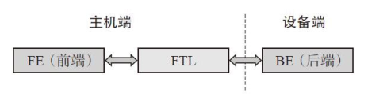
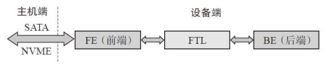
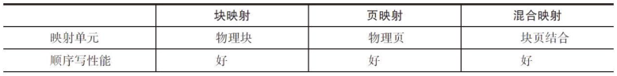
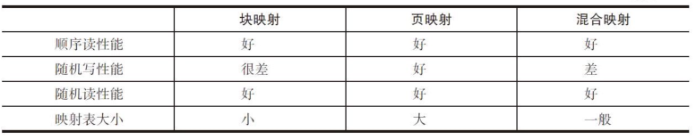

# 第4章：SSD核心技术--FTL
FTL是Flash Translation Layer（闪存转换层）的缩写，完成**主机（或者用户，Host）逻辑地址空间**到**闪存（Flash）物\*\*\*\*理地址空间**的**翻译（Translation）**，或者说**映射（Mapping）**。

完成逻辑地址空间到物理地址空间的映射，这是FTL最**原始**且**基本\*\*\*\*的功能**。

除了管理**地址空间映射**之外，FTL还需要完成**垃圾回收**、**磨损均衡**、**数据保持**、**坏块管理**、**读干扰处理**。

FTL分为**Host Based**（基于主机）和**Device Based**（基于设备）。Host Based表示的是，FTL是在**Host**（主机）端实现的，用的是你自己**计算机的CPU和内存资源**。

**FTL在主机端**

相反，Device Based表示的是，FTL是在**Device**（设备）端实现的，用的是**SSD**上的**控制器和RAM资源**。

**FTL在设备端**

***

**映射管理**

根据**映射粒度**的不同，FTL映射有基于块的映射，有基于**页的映\*\*\*\*射**，还有**混合映射（Hybrid Mapping）**。

**块映射**中，以闪存的块为映射粒度，一个用户逻辑块可以映射到任意一个闪存物理块，但是映射前后，每个页在块中的偏移保持不变。块映射有好的连续大尺寸的读写性能，但小尺寸数据的写性能是非常糟糕的。

**页映射**中，以闪存的页为映射粒度，一个逻辑页可以映射到任意一个物理页中，因此每一个页都有一个对应的映射关系。

**混合映射**是**块映射和页映射的结合**。一个逻辑块映射到任意一个物理块，但在块中，每个页的偏移并不是固定不动的，块内采用页映射的方式，一个逻辑块中的逻辑页可以映射到对应物理块中的任意页。因此，它的映射表所需空间以及性能都是介于块映射和页映射之间的。

**不同映射间的比较**

一张**映射表有多大**呢？

这里假设我们有一个**256GB**的SSD，以**4KB**大小的逻辑页为例，那么用户空间一共有**64M（256GB/4KB）**个逻辑页，也就意味着SSD需要有能容纳**64M**条映射关系的映射表。映射表中的每个单元（entry）存储的就是物理地址（Physical Page Address），假设其为**4字节\*\*\*\*（32bits）**，那么整个映射表的大小为**64M×4B=256MB**。一般来说，映射表大小为SSD容量大小的**千分之一**。

一些低端、入门级的SSD，它并不支持**板载DRAM**，那么它的映射表存在哪里呢？它采用**二级映射**。**一级映射**表常驻**SRAM**，**二级映\*\*\*\*射**表小部分缓存在**SRAM**，大部分都存放在闪存上。

二级表就是**L2P（Logical address To Physical address，逻辑地址到****物理地址转换）\*\*表，它被分成一块一块（Region）的，\*\*大部分存储在****闪存中**，**小部分缓存在RAM中**。**一级表**则存储这些**块在闪存中的物理\*\*\*\*地址**，由于它不是很大，一般都可以**完全放在RAM中**。

映射表除了可以放在板载**DRAM**、**SRAM**和闪存中，它还可以放到**主机的内存**中。

NVME1.2（及后续版本）有个重要的功能就是**HMB（Host Memory Buffer，主机高速缓冲存储器）**：**主机**在**内存**中专门划出**一部分空间给SSD用**，SSD可以把它当成自己的**DRAM使用**。因此，**映射表**完全可以放到**主机端的内存中**去。

**触发映射表的写入**一般有以下几种情况：

*   新产生的映射关系累积到一定的阈值
*   用户写入的数据量达到一定的阈值
*   闪存写完闪存块的数量达到一定的阈值
*   其他

写入策略一般有：

*   全部更新
*   增量更新

**全部更新**表示的是缓存中映射表（**干净的和不干净的**）全部写入到闪存，**增量更新**的意思是只把新产生的（**不干净的**）映射关系刷入到闪存中去。

***

**垃圾回收**

**垃圾回收**，就是把某个闪存块上的有效数据读出来，重写，然后把该闪存块擦除，就得到新的可用闪存块了。

**写放大**

由于GC的存在，就有一个问题，用户要**写入一定的数据**，SSD**为\*\*\*\*了腾出空间**写这些数据，需要额外的做一些**数据的搬移**，也就是**额外\*\*\*\*的写**，最后往往导致SSD往**闪存中写入的数据量**比**实际用户写入SSD的\*\*\*\*数据量多**。

因此，SSD中有个重要参数，就是写放大（WA，WriteAmpli?ication）：

**写放大 =  写入闪存的数据量 / 用户写的数据量**

OP（Over Provisioning，预留空间）

**OP比例=（闪存空间–用户空\*\*\*\*间）/用户空间**

WA越小越好，因为越小意味着对闪存的损耗越小，可以延长闪存使用寿命，从而支持更多的用户数据写入量；

OP越大越好，OP越大，意味着写放大越小，也意味着SSD写性能越好。

影响写放大的因素主要有：

*   OP：OP越大，WA越小。
*   用户写入的数据Pattern：如前文所见，如果数据都是**顺序写入**，GC做的量就少（最好的情况是整个闪存块都是无效数据，只需擦除，无需数据搬移），写放大小。
*   GC策略：在挑选源闪存块的时候，如果不挑选有**效数据最少**（垃圾数据最多）的块作为源闪存块，就会增加写放大；另外，控制后台GC产生空闲闪存块的数量，也能减小写放大。
*   磨损平衡：为平衡每个闪存块的擦除次数，需要数据的搬移。
*   读干扰（Read disturb）和数据保存处理（Data Retentionhandling）：数据搬移增加写放大。
*   主控：带压缩和不带压缩的控制器肯定会影响写放大。
*   Trim：有没有Trim，对写放大影响很大。

**垃圾回收实现**

垃圾回收可以简单地分为三步：

1）挑选源闪存块。

2）从源闪存块中找有效数据。

3）把有效数据写入到目标闪存块。

**挑选源闪存块**，一个常见的算法就是挑选**有效数据最小的块**，这样需要重写的**有效数据就越少**，**写放大自然最小**，回收一个块付出的代价也最小。这需要固件在写用户数据时做一些额外的工作，即**记录和维护每\*\*\*\*个用户闪存块的有效数据量**。

**从源闪存块中找有效数据：**固件不仅仅只**更新和维护闪存块的有效数据量**，还给闪存块一个**Bitmap表**，**标识哪个物理页**是否有效，那么在做GC的时候，固件\*\*只需根据Bitmap表的信息，\*\***把有效数据读出，然后重写即可。**

**垃圾回收的时机**

**当用户写入数据时**，如果可用的闪存块小于一定阈值，这时就需要做GC，**以腾出空间给用户写**。这时做的GC，叫作**Foreground GC（前台垃圾回收）**。这是**被动方式**，它是由于SSD没有多少可用的闪存块时，才去做的GC。

与之相对应的，就是**Background GC（后台垃圾回收）**，它是在**SSD空闲（Idle）的时候**，SSD**主动去做的GC**，这样在用户写入的时候就有充裕的可用闪存块，不需要临时抱佛脚（做Foreground GC），从而改善用户写入性能。

***

**Trim**

在**没有Trim**之前，**SSD无法知道**那些被删除的**数据页是否无效**，必须等到**系统要求在相同的地**方（用户空间、逻辑空间）**写入数据时才\*\*\*\*知道那些数据是无效的**，进而**放心删除**。由于SSD不知道这些删除的数据已经无效，在做垃圾回收的时候，仍把它当作有效数据进行数据的搬移，这不仅影响到GC的性能，还影响到SSD的寿命（写放大增大）。

**Trim**是一个新增的**ATA命令（Data Set Management）**，专为SSD而生。当用户**删除一个文件**时，**操作系统**（对Windows来说，它自Windows 7开始支持Trim）**会发Trim命令给SSD，告诉SSD该文件对应\*\*\*\*的数据无效了**。一旦SSD知道哪些数据无效之后，在做**垃圾回收的时候\*\*\*\*就可以把这些删除掉的数据抛弃掉**，不做无谓的数据搬移。这样不仅增强了SSD的性能，还延长了SSD寿命。

***

**磨损均衡**

磨损平衡，就是让SSD中的每个闪存块的磨损（擦除）都保持均衡。

做磨损平衡的**原因**是闪存都是有寿命的，即**闪存块有擦\*\*\*\*写次数限制**。一个闪存块，如果其擦写次数超过一定的值，那么该块就变得不那么可靠了，甚至变成坏块不能用了。

**冷数据**，就是用户**不经常更新**的数据，比如用户写入SSD的操作系统数据、只读文件数据、小电影等；

**热数据**，就是用户**更新\*\*\*\*频繁**的数据。数据的频繁更新，会在SSD内部产生很多垃圾数据（新的数据写入导致老数据失效）。

**年老的块**，就是**擦写次数比较多**的闪存块；

**年轻的块**，**擦写次数比较少**的闪存块，年纪相对小。

SSD很容易区分年老的块和年轻的块，看它们的\*\*EC（Erase Count，擦除次数）\*\*就可以了，大的就是老的，小的就是年轻的。

**动态磨损平衡算法**的基本思想是把**热数据**写到**年轻的\*\*\*\*块**上，即在拿一个新的闪存块用来写的时候，挑选擦写次数小的；

**静\*\*\*\*态磨损平衡算法**基本思想是把**冷数据**写到**年老的块**上，即把冷数据搬到擦写次数比较多的闪存块上。

***

**掉电恢复**

掉电分两种，一种是**正常掉电**，另一种是**异常掉电**。不管是哪种原因导致的掉电，重新上电后，SSD都需要能从掉电中恢复过来，继续正常工作。

**正常掉电前**，主机会通过命令通知SSD，比如SATA中的Idle Immediately，SSD收到该命令后，主要会做以下事情：

*   把buffer中缓存的用户数据刷入闪存。
*   把映射表刷入闪存。
*   把闪存的块信息写入闪存（比如当前写的是哪个闪存块，以及写到该闪存块的哪个位置，哪些闪存块已经写过，哪些闪存块又是无效的等）。
*   把SSD其他信息写入闪存。

SSD的**异常掉电**恢复主要就是**映射表的恢复重建**。

**坏块管理**

**坏块来源**主要包括：

·**出厂坏块**（Factory Bad Block）：闪存从工厂出来，就或多或少的有一些坏块。

·**增长坏块**（Grown Bad Block）：随着闪存的使用，一些初期好块也会变成坏块。变坏的原因，主要是擦写磨损。

**坏块管理策略**

一般有两种策略管理坏块，一是**略过（Skip）策略**，二是**替换\*\*\*\*（Replace）策略**。

**略过策略**

用户根据建立的坏块表，在写闪存的时候，一旦遇到坏块就**跨过\*\*\*\*它**，**写下一个Block**。

**替换机制**

与略过策略不同，当某个Die上发现坏块时，它会被该Die上的某个好块替换。

采用替换策略，SSD内部需维护一张重映射表（Remap Table）：坏块到替换块的映射。

略过策略的劣势在于性能不稳定。

替换策略有木桶效应，如果某个Die质量比较差，则整个SSD可用的闪存块则受限于那个坏的Die。

**SLC cache**

由于**SLC**有**速度优势**，因此有些SSD拿它来做**Cache**使用，让SSD具有更好的**突发性能**（Burst Performance）。

这里所说的**SLC Cache**，不是说单独拿SLC闪存来做Cache，而是把**MLC或者TLC里面的一些闪存块配置成SLC模式来访问**，而这个特性一般的MLC或者TLC都是支持的。

使用SLC Cache的出发点，主要有以下几点：

1）**性能考虑**： SLC性能好，用户数据写到SLC比直接写到MLC或者TLC上快很多。

2）**防止Lower Page数据被带坏**： 用户数据写到SLC，不存在写Upper Page或者Extra Page带坏Lower Page数据的可能。

3）**解决闪存的缺陷**： 比如有些MLC或者TLC的闪存块，如果没有写满，然后去读的话，可能会读到ECC错误，而对SLC模式下的闪存块，就没有这个问题。

4）**更多的数据写入量**： SLC更耐写。

**SLC Cache写入策略**有：

*   **强制SLC写入**：用户写入数据时，必须先写入到SLC闪存块，然后通过GC搬到MLC或者TLC闪存块；
*   **非强制SLC写入**：用户写入数据时，如果有SLC闪存块，则写入到SLC闪存块，否则直接写到MLC或者TLC闪存块。

**RD和DR**

**RD**指的是**Read Disturb**，**DR**指的是**Data Retention**。两者都能导致数据丢失，但原理和固件处理方式都不一样，下面分别介绍。

**RD原理**

对一个闪存块来说，每次读其中的一个闪存页，都需要在其他字线（Wordline）上加较高的电压以保证晶体管导通。对这些晶体管来说，有点像在做轻微的“写入（Program）”，长此以往，由于电子进入浮栅极过多，从而导致比特翻转：1→0。当出错比特数超出ECC的纠错能力时，数据就会丢失。

**RD解决方法**

由于每次都是很轻微的写入，要使存储单元数据发生变化，不是一朝一夕的事情，而是长期积累的结果。

因此，如果我们能**保证**某个**闪存块读的次数低于某个阈值**，在比特发生**翻转之前**（或者翻转的比特低于某个值时），就对这个闪存块上的**数据进行一次刷新**：把闪存块上的数据搬到别的闪存块上（或者先搬到别的闪存块上，然后擦除原闪存块后，再复制回来），**防患于未然**，这样就能解决RD导致数据丢失的问题。

关于闪存读的**次数阈值**可以**固定设置**，也可以**动态设置**。

关于**刷新**动作，有**Block（阻塞）**和**Non-block（非阻塞）**两种处理方式。所谓**阻塞方式**，就是固件把其他事情都放在一边，专门处理闪存块的刷新；所谓**非阻塞方式**，就是闪存块的刷新与其他操作同时进行（Interleave操作）。

**DR原理**

中国有句古话，就是天下没有不透风的墙。用到闪存上，就是没有电子穿越不了的绝缘材料。绝缘氧化层把存储在浮栅极的电子关在里面，但是，随着时间的推移，还是有电子从里面跑出来。当跑出来的电子达到一定数量时，就会使存储单元的比特发生翻转：0→1（注意，RD是使1翻转为0），当出错比特数超出ECC的纠错能力，数据就丢失。

**DR解决方法**

FTL在SSD上电或者平时运行时，每隔一段时间对闪存空间进行扫描，当发现比特翻转超出一定阈值时，跟RD处理一样，进行数据刷新，这样就能避免数据彻底丢失。

**Host Based FTL**

按照FTL放在哪里划分，SSD有**Host Based FTL**和**Device Based \*\*\*\*FTL**两种模式。

一个完整的**Device Based SSD**系统可以分为三块：

1）**主机驱动**：为应用程序提供读写接口；和板载控制器通过NVMe等协议进行交互，完成应用程序的读写命令。

2）**板载控制器**：

*   通过SATA、NVMe等协议，接收主机发送的命令并执行。
*   管理SSD，实现FTL垃圾回收、磨损平衡等算法。
*   控制和实现闪存时序。

3）**闪存阵列**：存储介质。

**Device Based存在以下缺点**：

*   FTL架构通用，不能针对具体应用做定制化。
*   控制器芯片功能复杂，设计难度大，研发成本高。
*   闪存更新很快，一般每年闪存厂商都会推出新一代产品，有新的使用特性，需要控制器芯片做出修改，但是芯片改版成本很高。
*   企业级应用需要高性能、大容量，通用控制器芯片支持的最大性能和容量有限制。
*   企业级市场需求多种多样，有些需求需要控制器提供特殊功能支持，这些是通用SSD主控芯片无法提供的。

**Host Based SSD**一般的模式是把闪存的**读写接口**直接**开放给驱动\*\*\*\*程序**，这样驱动程序就能自行管理闪存内部资源。**控制器**大都采用可编程逻辑器件**FPGA**，功能比较简单，主要实现**ECC纠错**和**闪存时序控\*\*\*\*制**。

**百度的软件定义闪存**

**软件定义闪存\*\*\*\*SDF（Software Defined Flash）特点：**

1）没有垃圾回收。数据整块写不会产生垃圾。

2）没有闪存级RAID。企业级SSD会用闪存组成RAID组，用一块或几块闪存保存RAID数据。但是互联网公司的数据一般都有3个备份，所以不担心SSD内部数据丢失，因此，RAID是没有必要的。

3）FPGA作为控制芯片，功能很少：ECC、坏块管理、地址转换、动态磨损平衡。Virtex-5FPGA实现了PCIe接口和DMA，SpartanFPGA则是闪存控制芯片。

4）SSD内部每个通道都向用户开放，由用户选择写哪个通道。

5）软件接口层非常简单，相比传统的Linux存储堆栈，省略了文件系统、块设备、IO调度、SATA协议等，用户直接通过IOCTRL（设备驱动程序中对设备的I/O通道进行管理的函数）来发同步的写命令到PCIe驱动。