# 第6章：NVMe总线
ACHI（Advance Host Controller Interface） ==> NVMe（Non-Volatile Memory Express）

**NVMe相对于ACHI的优势**

1.  低时延

*   存储介质：SSD较HDD速度快很多
*   控制器：PCIe与CPU直连，相对于SATA通过南桥连接CPU，基于PCIe的SSD时延更低
*   软件接口：NVMe缩短了CPU到SSD的指令路径，减少了寄存器访问次数

1.  高性能

*   理论上，IOPS=队列深度/IO延迟。
*   ACHI协议命令队列深度最大为32；
*   NVMe协议命令队列深度最大可达64K。

1.  低功耗

*   NVMe加入了自动功耗状态切换、动态能耗管理功能

***

**NVMe综述**

NVMe协议是一种主机（host）与SSD之间的通信协议，它在协议栈中隶属高层。

|        **NVMe**         | **PCIe** |
| ----------------------- | -------- |
| **事物层**               |          |
| **数据链路层**           |          |
| **物理层**               |          |

NVMe制定了主机和SSD之间的通信命令，以及命令如何执行。

**命令分为两种：**

*   Admin命令：用以主机管理和控制SSD
*   IO命令：用以主机和SSD之间的数据传输

**NVMe通过SQ、CQ、DB来发送命令。**

*   SQ：Submission Queue
*   CQ：Completion Queue
*   DB：Doorbell Register

***

**SQ、CQ、DB工作流程**

**NVMe处理命令有8个步骤**

1.  主机写命令到SQ；
2.  主机写SQ到DB，通知SSD取指；
3.  SSD收到通知，到SQ中取指；
4.  SSD执行指令；
5.  指令执行完成，SSD向CQ中写指令执行结果；
6.  然后SSD发中断通知主机指令完成；
7.  收到中断，主机处理CQ，查看指令完成状态；
8.  主机处理完CQ中的指令执行结果，通过DB回复SSD：指令执行结果已处理，辛苦您了！

**SQ、CQ特性：**

*   SQ用于主机发送命令，CQ用于SSD回命令完成状态；
*   SQ\\CQ可在主机中，也可在SSD中，但一般都在主机中；
*   系统中只能有一对Admin SQ\\CQ，但可有多对IO SQ\\CQ；
*   IO SQ与CQ可是一对一关系，也可是多对一关系；
*   IO SQ可以赋予不同的优先级；
*   IO SQ\\CQ深度可达64K，Admin SQ\\CQ深度可达4K；
*   IO SQ\\CQ深度、广度都可灵活配置；
*   每条命令大小是64B，每条命令完成状态是16B。

队列是一个生产者、消费者模型，生产者往队列尾部写入东西，消费者从队列头部取出东西。

每个SQ、CQ都有两个对于的DB：Head DB和Tail DB。

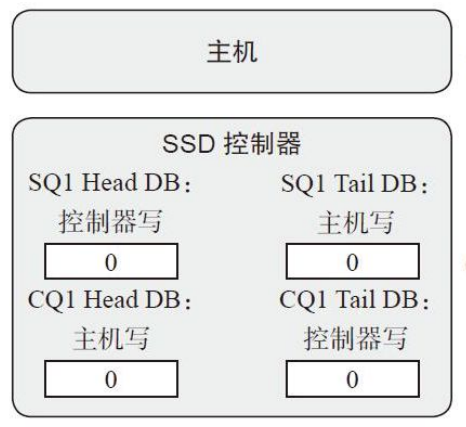

**DB的通知作用：**

*   主机更新SQ Tail DB时，也是告知SSD有新的命令需要处理；
*   主机更新CQ Head DB时，也是告诉SSD你返回的命令完成状态信息我已经处理。

**DB的特性：**

*   DB是在SSD端的寄存器；
*   DB记录SQ、CQ的头部和尾部的位置；
*   每个SQ、CQ有两个DB：Head DB和Tail DB；
*   主机只能写DB，不能读DB；
*   主机通过SSD向CQ中写入的命令完成状态获取其队列头部或者尾部。

***

**寻找双雄：PRP、SGL**

PRP（Physical Region Page，物理区域页）、SGL（Scatter\\Gather List，分散\\聚集列表）

PRP描述的是物理页，SGL可以描述任意大小的内存空间。

主机与SSD的数据传输过程中，主机是被动一方，SSD是主动一方；

*   主机需要数据，SSD主动把数据写入主机的内存中；
*   主机写数据，SSD主动去主机的内存中取数据。

PRP本质是一个64位的内存物理地址，分为页起始地址、页内偏移。最后两bit为0，说明物理地址只能4字节对齐访问。

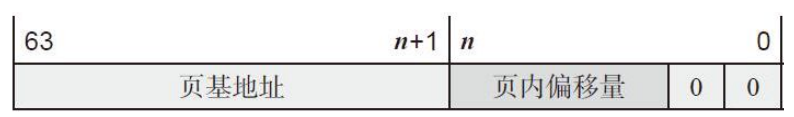

**PRP条目布局**

若干个PRP也可以连接起来构成PRP链表。链表的页偏移都必须为0。

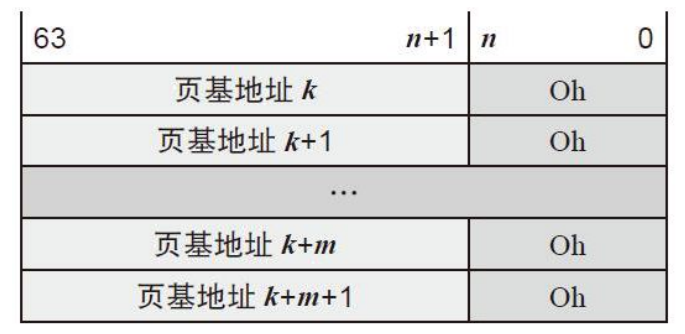

**PRP链表布局**

**NVNe命令中有两个域：PRP1和PRP2**

*   主机通过这两个域告诉SSD数据在内存中的位置、数据需要写入的地址；
*   PRP1和PRP2分别位于NVMe命令格式中的31:24、39:32字节处；
*   PRP1和PRP2可指向数据所在位置，也可指向PRP链表，这类似于C语言的指针；

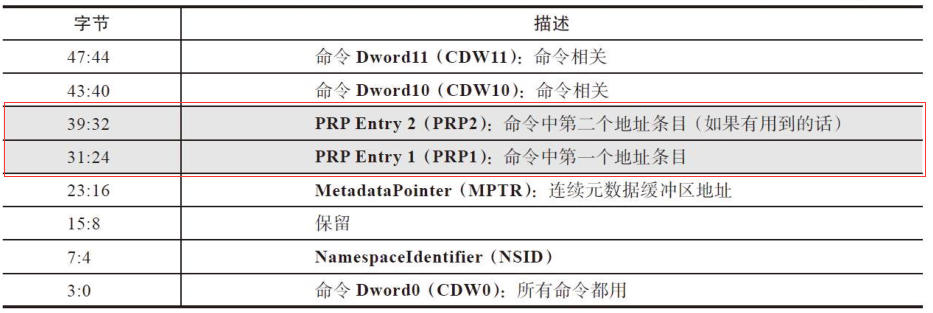

**NVMe命令格式中的PRP**

对Admin命令来说，他只用PRP告诉SSD内存物理地址；对于IO命令来说，除了PRP，还可以用SGL来告诉SSD数据在内存中写入或读取的物理地址。

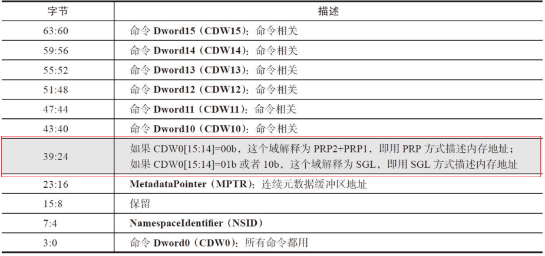

**NVMe命令格式中的SGL**

**SGL的特征：**

*   是一个数据结构，用以描述一段数据空间；
*   是一个链表，有一个或多个SGL段组成，每个SGL又由一个或多个SGL描述符组成；

**SGL描述符:**

*   是SGL最基本的单元，它描述了一段连续的物理内存空间：起始地址+空间大小；
*   SGL描述符大小是16 Byte;

由于一段内存空间既可以存放用户数据，也可以存放SGL段，SGL描述符可以分为以下几类：

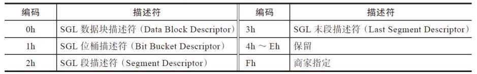

**SGL描述符类型**

1.  数据快描述符：描述的这段空间就是用户数据空间；
2.  段描述符：SGL是由SGL段组成的链表，前面一段就需要有个指针执行下一段，这个指针就是段描述符，它描述的是它下一段所在的空间；
3.  末段描述符：链表中导数第二个段，它的SGL段描述符称为SGL末段描述符，其本质仍是SGL段描述符；
4.  SGL位桶：它只对主机读有用，用于告诉SSD，你往这个内存写入的东西我是不要的。好吧，你不要，我也就不传了。

***

**端到端的数据保护**

一端是主机的内存空间，一端是SSD的闪存空间。

除了逻辑块数据本身，NVMe还允许每个逻辑块带一个**元数据**（mate data）。

元数据分为两种：

*   作为逻辑块数据的拓展，和逻辑块数据放在一起传输；
*   逻辑块和元数据分别传输。

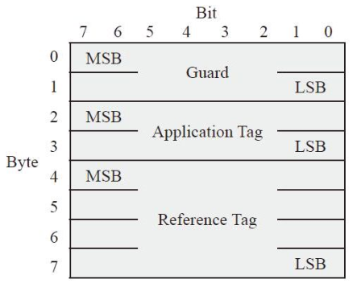

**数据保护信息格式**

**主机向SSD写入数据，不带保镖。**

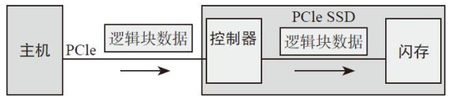

**不带数据保护信息**

**主机向SSD写入数据，全程带上保镖的情况。**

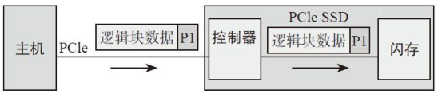

**带数据保护信息数据写流程**

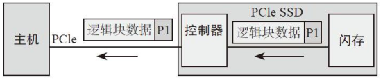

**带数据保护信息数据读流程**

**主机往SSD写入数据，半程带保镖的情况。**

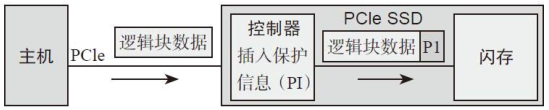

**SSD内部加入数据保护信息**

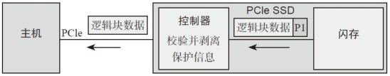

**SSD内部根据数据保护信息验证数据**

***

**Namespace（NS）**

把闪存空间划分成若干个独立的逻辑空间，每个空间逻辑块地址（LBA）范围是0到N-1（N是逻辑空间大小），这样划分出来的每一个逻辑空间我们就叫作NS。

NS特性：

*   每个NS都一个名称和ID；
*   每个NS都有一个4KB的数据结构来描述它；
*   每个NS都独立，逻辑块大小可以不同；

**SR-IOV（Single Root-IO Virtualization）单根IO虚拟化**

SR-IOV技术允许在虚拟机之间高效共享PCIe设备。

对一个NVMe子系统来说，除了包含若干个NS，还可以有若干个SSD控制器；

一个NVMe子系统，除了可以有若干个NS，除了可以有若干个控制器，还可以有若干个PCIe接口。