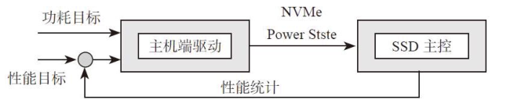
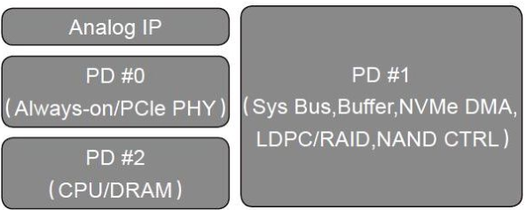

# 第8章：电源管理
**SATA省电模式Partial和Slumber**

SATA链路电源管理，可以让SATA链路的PHY进入低功耗模式，与硬盘或者SSD其他部分（CPU、DDR、后端）的电源管理是完全独立的。以硬盘为例，SATA链路的电源状态与盘片的转数快慢是相互独立的。

SATA提供了两种低功耗模式：Partial和Slumber。

*   Partial模式：PHY处于低功耗状态，退出时间要求＜10μs。
*   Slumber模式：PHY处于更低功耗状态，退出时间要求＜10ms。

在链路电源管理方面，SATA一视同仁，主机和设备都可以发起，分别称为：

*   HIPM（Host Initiated Power Management）。
*   DIPM（Device Initiated Power Management）。

发起归发起，还是需要对方配合，才能让链路进入Partial或者Slumber模式。

***

**SATA超级省电模式DevSlp**

从SATA 3.2开始，SATA有了一个新的功能DevSlp（Device Sleep，设备睡眠）。DevSlp是一个信号，通过发送这个信号让盘进入一个非常省电的状态。

进入Partial或Slumber后，SATA总线的发送模块和接收模块仍然处于工作状态，因为这个原因，盘睡得并不安稳，省电效果也不好。

DevSlp就是把这个传输电路完全关掉，然后专门加了一个低速的管脚来负责接收唤醒通知。

***

**SATA终极省电模式RTD3**

因为DevSlp虽然功耗小，恢复时间也还行，但是进入DevSlp的时候Vcc还在，这样还是会有功耗，进而得寸进尺地要求设备在长期Idle后要把Power完全关掉。

在主机也就是系统处于S0的情况下，如何让SATA SSD进入D3Cold状态，这个就是Runtime D3，简称RTD3。

**ACPI规定的Device Power State：**

*   D0：设备处于工作状态，所有功能可用，功耗最高，所有设备都必须支持；
*   D0active：设备完成配置，随时准备工作；
*   D1和D2是介于D3和D0之间的中间状态，D1比D2消耗更多的电能，保存更多的设备上下文，D1和D2是可选的，很多设备都没有实现这两个状态；
*   D3Hot：设备进入D3，Vcc还在，设备可被软件枚举；
*   D3Cold：设备完全切断电源，重新上电时系统需要重新初始化设备。

Partial和Slumber模式都是只针对SATA链路，而D State是针对整个SSD。

***

**PCIe省电模式ASPM**

ASPM（Active State Power Management，活动状态电源管理）

ASPM让PCIe SSD在某种情况下，能够从工作模式（D0状态）通过把自身PCIe链路切换到低功耗模式，并且通知对方也这么干，从而达到降低整条链路功耗的目的。

ASPM定义的低功耗模式有两种：L0s和L1。

**PCIe链路状态的定义如下：**

*   L0：正常工作状态；
*   L0s：低功耗模式，恢复时间短；
*   L1：更低功耗模式，恢复时间较长；
*   L2/L3Ready：断电前的过渡状态；
*   L2：链路处于辅助供电模式，极省电；
*   L3：链路完全没电，功耗为0；
*   LDn：刚上电，LTSSM还未完成前链路所处状态。

***

**PCIe其他省电模式**

PCIe链路L2状态下，所有的时钟和电源全部关闭，能够保证最大的省电效果，但同时，L2的退出时间相应也增加了很多，达到了毫秒级别。这样的时间在很多应用场景下是无法接受的。

要比L1更省电，比L2时间更短，PCI-SIG顺理成章地弄出了两个新的ASPM Sub状态：**L1.1和L1.2**。想要使用L1.1和L1.2，RC和EP都必须支持并打开这个功能，同时还必须支持CLKREQ#信号。

在L1.1和L1.2模式下，PCIe设备内部的PLL处于关闭状态，参考时钟也不保留，发送和接收模块同样关闭，不需要像L1状态下那样去侦测Electrical Idle。

L1.1和L1.2的区别在于，L1.1状态下Common Mode Voltage仍然打开，而L1.2下会将之关闭。因为Common Mode Voltage恢复需要时间，L1.2的退出时间相对比L1.1长一些。

使用L1.1/L1.2后，功耗从毫瓦级别降到了微瓦级别，相比之下时延的增加完全在可接受的范围内。

***

**NVMe动态电源管理**

PMC（MicroSemi）提出的Enterprise NVM Express dynamic power management interface

**NVMe动态电源管理逻辑图**

功耗目标和性能目标作为系统应用层面的输入，发送给主机端的NVMe驱动。

NVMe Power State：NVMe规定（Identify Controller DataStructure）最多支持32个Power State Descriptor（电源状态描述符）。

其中Power State Descriptor 0（0号电源状态描述符）是必须支持的，其他都是可选。当然，如果只支持一个，也别用什么动态管理了。

***

**Power Domain**

主控把芯片内部的模块划分成了几个部分，学名叫Power Domain，简称PD。

**SMI主控芯片模块划分**

**整个节能逻辑的大致演绎如下：**

1）主机一段时间没有读写，触发SSD的PCIe链路进入ASPM，退出延迟非常短；

2）主机继续Idle，PCIe链路进入ASPM Substate，SSD仍处于工作模式，退出延迟也很短；

3）主机继续Idle，主控操作PD#1（关闭NVMe模块、各级FIFO、ECC模块、闪存控制器等），SSD进入Idle Mode，退出延迟明显延长；

4）主机继续Idle，主控操作PD#2，将CPU进入睡眠模式，DRAM进入Self Refresh模式，进入最高节能模式，退出延迟最长；最后，为了更好地控制发热，主控会设置一个温度阈值，当芯片温度接近阈值时，主动降低时钟频率，使温度降低。等温度回到指定范围，再把时钟调回正常工作频率。