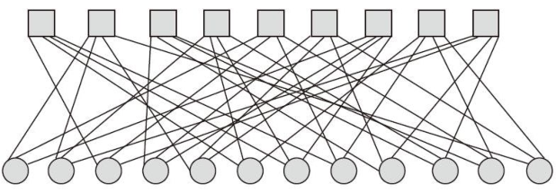
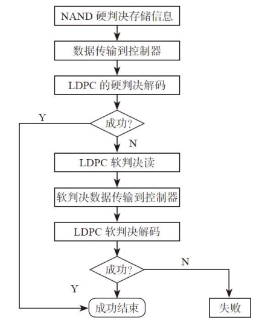

# 第9章：ECC原理
**信号和噪声**

编码率：**Code Rate = Information bits / Channel bits**

Code rate可以反映冗余程度。Code rate越高，冗余越小，反之冗余越大。

Shannon（香农）揭示了，每一种实际的信息传输通道都有一个参数C，如果Code rate ＜C，有效信息传递的错误率可以在理论上趋近于0。

但是如何趋近于0，就是纠错编码（Error correction code）要做的事情了。

***

**通信系统模型**

在二进制编码的系统中，有两种常见的Channel模型：

*   **BSC**（Binary Symmetric Channel，二进制对称信道）
*   **BEC**（Binary Erasure Channel，二进制擦除信道）。

一句话区分BSC和BEC：BSC出错；BEC丢bit。

**BSC模型**：二进制信号由0、1组成，由于Channel噪声的影响，0、1各有相同的概率p翻转，即0变1，1变0。信号仍然保持不变的概率为1-p。

例如：101001101010”变为“111001111000”。

**BEC模型**：认为在信号传输中，无论是0还是1都有一定概率变为一个无法识别的状态。

例如：101001101010变为1x10011x10x0（x表示未知状态）。

***

**纠错编码的基本思想**

编码距离：\*\*汉明距离：\*\*两个信号之间有多少bit不同。

比如信号（0，1，1）与（0，0，0）的距离为2，（1，1，1）与（0，0，0）的距离为3。

**LDPC码原理简介**

LDPC（Low Density Parity-Check Code，低密度奇偶校验码）

LDPC的特征是低密度，也就是说校验矩阵H里面的1的分布比较稀疏。

LDPC又分为正则LDPC（regular LDPC）和非正则LDPC（irregularLDPC）编码。

正则LDPC保证：校验矩阵每行有固定J个1，每列有固定K个1。

非正则LDPC没有上述限制。

**Tanner图**

节点有两种：一种叫b节点（bit node），一种叫c节点（checknode）。

假设信号编码长度为n，其中每一个bit用一个b节点表示。

校验方程个数为r，每一个校验方程用一个c节点表示。

现在连线，如果某个b节点b i 参与了某个c节点c j 的校验方程，则把b节点b i 和c节点c j 连起来。

注意b节点用圆形表示，c节点用方块表示。

如下图所示，每个b节点和3个c节点相连，每个c节点和4个b节点相连。

**tanner图**

***

**LDPC解码**

LDPC的解码方法有硬判决解码（hard decision decode）和软判决解码（soft decision decode）两种。

经典的**硬判决算法**——**Bit-flipping（位翻转）算法**和一种**软\*\*\*\*判决算法**——**和积信息传播算法**。

**Bit-flipping解码算法如下：**

给定一个n bit信号y（y 1 ，y 2 ，….y n ），校验矩阵H。画出H矩阵对应的Tanner图。n bit信号对应n个b节点，r个c节点。

1）每个b节点向自己连接的c节点发送自己是0还是1。初始是第i个bit发送初始值y i。

2）每个c节点收到很多b节点的信息，每个c节点代表一个校验方程。

*   如果方程满足，c节点将每个b节点的消息原封不动地发送回去。
*   如果校验失败，c节点将每个b节点发来的消息取反后，发送回去。

3）每个b节点跟好多c节点相连，b节点收到所有来自c节点的消息后，采用投票法来更新这一轮输出的消息。参加投票的包含每个bit的初始值。投票的原则是少数服从多数。

4）b节点更新好后，停止条件：所有的校验方程满足或者迭代次数超过上限。如果停止条件不满足，则需要转到步骤1继续迭代。

**和积信息传播算法**

它是在贝叶斯网络、马尔可夫随机场等概率图模型中用于推断的一种信息传递算法。

***

**LDPC编码**

LDPC是一种以解码为特点的编码，由于LDPC的性质主要由H矩阵决定，一般先确定H矩阵后，反推回生成矩阵G。

H矩阵构建时候，应当注意：

1）保持稀疏。每行每列里1的个数要固定，或者接近固定。

2）考虑到生成矩阵的计算复杂度。

3）保持随机性。减少H矩阵里小环的个数。

**LDPC纠错流程**

**LDPC纠错流程**