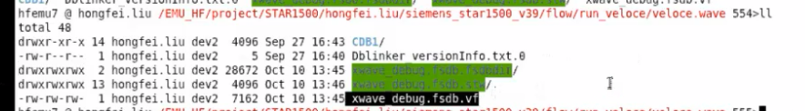
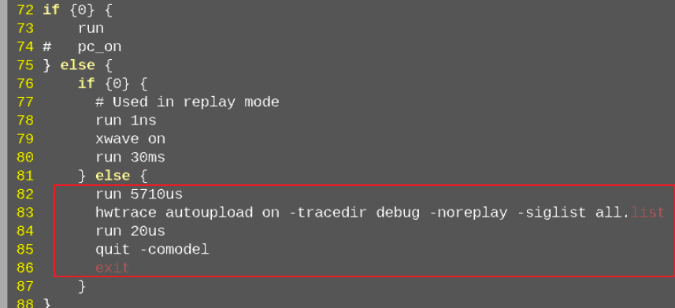

# 跑EMU

* 配置好hfemu5到各hfemu的ssh；
* 修改 emulator.cfg ，host端口为自己的工号:9300;
* source set_env.sh
* make show；查看有几个人在跑emu；最多不超过4个；
* <mark>make sim_fsdb_bak</mark>; 先用xwave看需要dump哪些时间段的波形；需要设置打快照间隔；
* stop；看到串口打印Admin main loop lock 0就可以操作了；
* xwave on；
* run;
* 打FIO(read/write...);
  * 打FIO需要fw 提供配套的code.hex、nor-flash.hex、bootrom.hex;
* stop;
* xwave off;
* quit -comodel;
* exit;
* <mark>make sim_replay</mark>; 恢复需要的时间段的波形；需要设置恢复点；
* make wave；到hfemu7/8转波形;
* make fsdb；

* 跑GC： seq write 1GB；串口敲 gc_all 启动要半小时；然后再跑几个小时；

# 其他命令、知识点
* cp database 要加 -rf;
* emu终端log在 veloce.log/velrun.transcript;
* 全波形抓us级，不要超100us；
* qemu vlab用到，qemu和协议分析仪需要和跑sim的在相同的服务器；
* cp qemu到自己的目录，source centos7/qemu_emu.sh开启；
* 跑DieLink和带upf的时候会占的板子比较多，5个、6个；
* run.do 设置跑emu的流程以及需要抓取哪些group的信号；
* xwave.list 设置xwave波形抓取的信号；
* all.list 设置全波形层次；
* nor_flash.hex --> nor_flash_emu.hex
* code.dis  --> star1500e.dis
* code.hex --> star1500e.hex
* 波形备份，需要将xwave_debug.fsdb.fsdbdir和xwave_debug.fsdb.vf拷走；
 
* run.do 的最后一个run分支，可以实现最小快照前的波形dump；

# Makefile参数
## 全波形
* sim: prepare -- 不抓波形，只看串口打印现象；
* sim_bak: prepare -- 全波形带快照；
* sim_replay: -- replay_time 必须是快照间隔的整倍数；run_replay.do设置快照前面需要抓取的时间；

## xwave
* sim_fsdb_bak: prepare -- xwave带快照，可以设置很长的快照间隔；
* sim_xwave_replay: -- replay_time 必须是快照间隔的整倍数；run_replay.do设置快照前面需要抓取的时间；

# fio

* 第2次 fio 128k seq write 100M性能结果；

* 第3次 fio 128k seq write 100M性能结果；

* 第1次 fio 128k seq read 100M性能结果；

* 第2次 fio 128k seq read 100M性能结果；

