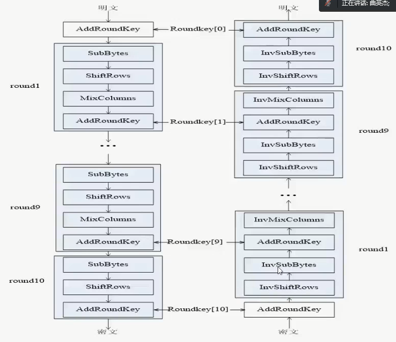
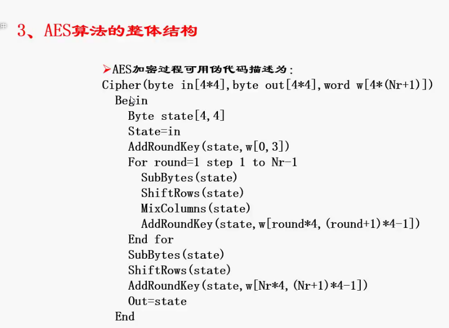
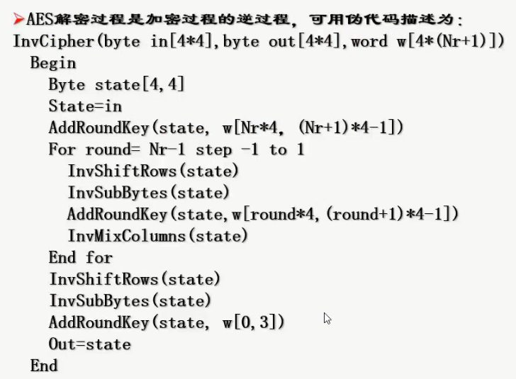
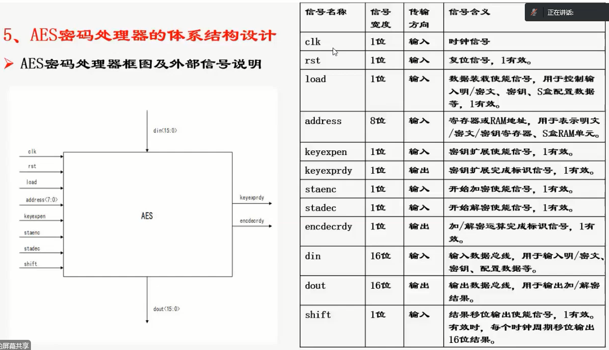
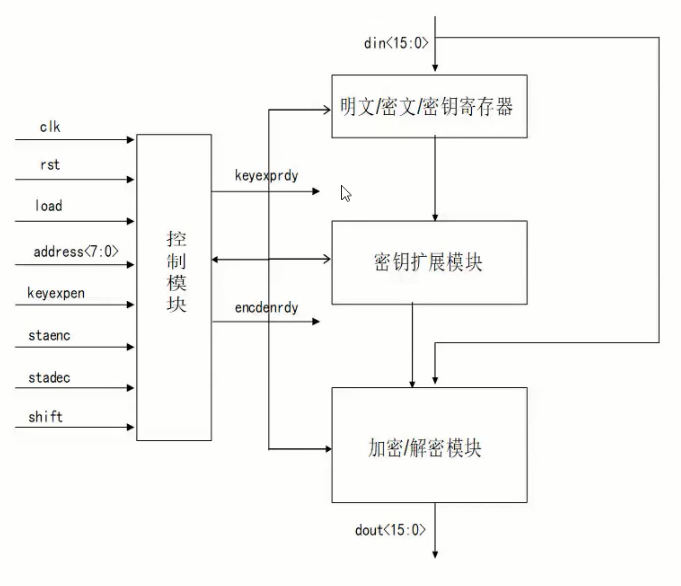
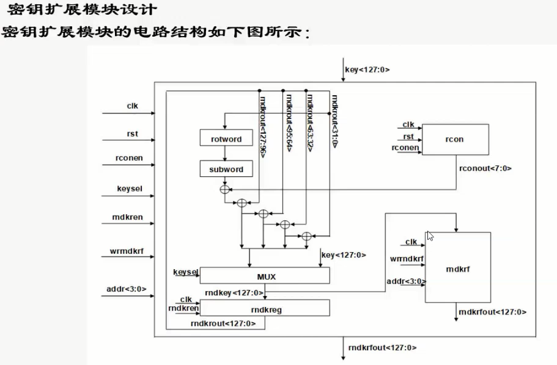
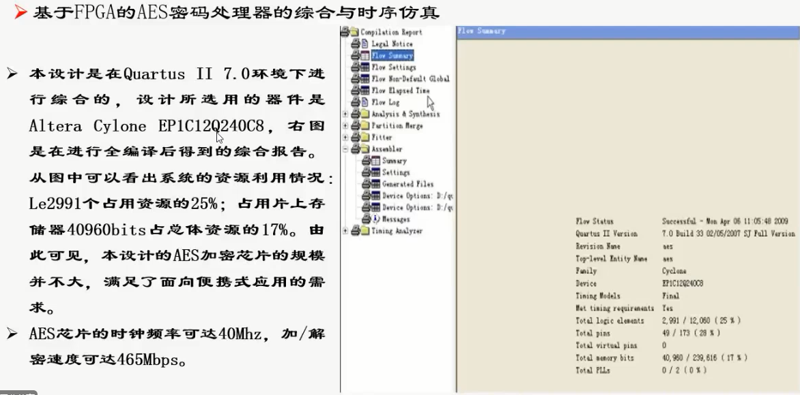

# AES案例设计分析-曲英杰
算法分析、体系结构介绍、rtl模型设计、功能仿真、综合优化、可测性设计、后端布局布线、时序仿真、静态时序分析、fpga验证；

aes分类：128,190,256 aes理论基础：群、域、基本运算：加\\乘

AES算法整体结构：subbytes、shiftrows、mixcolumns、addroundkeys

轮秘钥拓展

**AES体系结构设计**

**AES Verilog模型设计**

**AES功能仿真**

**FPGA测试**

综合\\时序仿真

40MHz-465Mbps

