# Conformal_LEC

**LEC：等效逻辑检查(Logic Equality Check)**

# LEC的重要性

ASIC在流片之前，要经历一系列设计步骤，如综合、布局布线、签核（sign-offs）、ECO（工程变更单）以及众多优化过程。在每个阶段，我们都需要确保逻辑功能完好无损，并且不会因为任何自动或手动更改而中断。如果功能在整个过程中的任何时刻发生变化，整个芯片就变得毫无用处。这就是为什么LEC是整个芯片设计过程中最重要的原因之一。随着制程技术节点的缩小和复杂性的增加，逻辑等效检查在确保功能的正确性方面起着重要作用。

有各种用于执行LEC的EDA工具，例如Synopsys Formality和Cadence Conformal。这里，我们将Conformal工具作为参考。LEC flow 分 **flat comparison flow** 和 **hierarchical comparision flow**。 通常**RTL2Gate **用**hierarchical flow**, **Gate2Gate **用**flat flow**。两种flow 除了compare 命令有差别之外，前面的设置跟后面的分析基本一致。

大多数数字实现流程都可以切分成三步：输入、执行、输出，LEC 同样不例外，就LEC 自身的模式而言， 又分为setup mode 跟 LEC mode, 通过命令set_system_mode lec/setup 进行模式切换。
* setup mode 读入输入文件，设置用户约束，设置modeling; 设置完成后，执行set_system_mode lec 切入到LEC 模式；
* 默认工具会在切到LEC 模式时自动做mapping; mapping 完之后，如果所有的key point 都被正确map 就可以进行compare；
 * Compare 后如果有NoN-Eq, Abort 的点，需要进行Diagnose, debug; 如果所有key point 都相等，则LEC 完成。

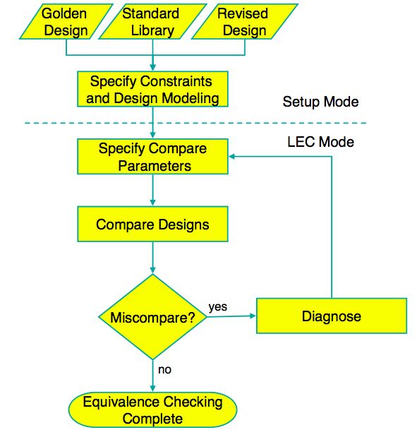


# 逻辑等效检查的步骤

## 设置

在设置模式下，Conformal工具读取两个设计。我们指定设计类型，即Golden Design（综合网表）和Revised Design修订版（通常，修改后的设计是Conformal工具与Golden设计相比的修改或后处理设计）。对于LEC的执行，Conformal工具需要三种类型的文件。  

* 1.<design_name> .lec 文件指导Conformal工具以系统方式执行不同的命令。
* 2.<design_name> .scan_const 文件提供与扫描相关的约束，例如我们是否要忽略此文件中定义的某些扫描连接、serdes输入、输出引脚。
* 3.<design_name> .stdlib 文件包含标准单元库的指针。

在从设置模式到LEC模式的过渡中，Conformal工具展平并模拟Golden和修改后的设计并自动映射关键点。关键点定义为：

*   主要输入
*   主要产出
*   D Flip-Flops
*   D锁存
*   TIE-E门（错误门，在修订设计中存在x赋值时创建）
*   TIE-Z门（高阻抗或浮动信号）
*   黑匣子

## 映射

在等效性检查的第二阶段，Conformal工具自动**映射关键点**并进行比较。比较完成后，它会确定差异。Conformal工具使用**两种基于名称的方法**和**一种无名方法**来映射关键点。

当对逻辑进行微小更改时，基于名称的映射对于gate-to-gate比较非常有用。相反，当Conformal工具必须使用完全不同的名称映射设计时，无名映射方法很有用。默认情况下，它会在退出设置模式时使用名称优先映射方法自动映射关键点。Conformal工具未映射的关键点被归类为未映射的点。

未映射的点分为三类：

* 额外未映射的点是仅在其中一个设计（Golden或Revised）中出现的关键点。
* 无法到达的未映射点是没有可观察点的关键点，例如主输出。
* 未映射的未映射点是可到达的关键点，但在相应设计的逻辑扇入锥中没有对应点。

## 比较

在Conformal工具映射关键点之后，验证的下一步是比较。比较检查关键点以确定它们是等效还是非等效。比较确定比较点是否：

* 等效(Equivalent)
* 非等效(Non-equivalent)
* 逆等效(Inverted-equivalent)
* 中止(Aborted)

在中止比较点的情况下，我们可以将比较工作更改为更高的设置。因此，Conformal工具可以仅在中止的比较点上继续比较。Conformal工具显示用于比较的完整运行时间和总内存。

LEC完成后会生成多个报告：

* 非等效报告
* 未映射的报告
* Blockbox报告
* Abort.rpt
* Unreachable.rpt
* Floating.rpt
* Mapped.rpt


# 脚本
hierarchical comparision flow 脚本如下：
` lec -do smartlec_hier_compare.tcl -SL4 -nogui`

``` tcl
# Filename: smartlec_hier_compare.tcl
# Default: vpxmode
set log file lec.flat.log.SLEC VERSION
-replace
usage -auto -elapse
read library -replace
-both
./lib/library.v
read design
-replace -golden
./rt1/top.v
./syn/top.gv
read design -replace -revised
report design data
report black box
// Specify user renaming rules if needed to help mapping
add renaming rule rulel "req d""regl@1]” -revised
// Specify user constraints for test
add pin constraint 0 scan en -both
add iqnore output
scan out -both
// Specify modeling directives for constant optimization 6 clock-gating
set flatten model
-seg constant -gated clock
// Enable parallel processing， 4 threads
set parallel option -threads 4
// Flattening,remodeling,mapping the design
set system mode lec
// Enable auto analysis to help resolving setup issues
analyze setup -verbose
// Run analyze datapath on aborts in a design with a lot of datapath components
analyze datapath -verbose
// Comparison
add compare point -all
compare
// Automatic attempt to resolve abort points if any
analvze abort -compare
```


# 实例分析
在签核或流片处理阶段，时间表太紧，无法处理具有一些严重逻辑故障的块。有时，在进行手动修复或定时ECO时会破坏逻辑连接。在流片阶段，逻辑故障的可能性很高，物理设计工程师没有太多时间来关闭块。此外，当您获得功能ECO并进行手动连接时，破坏逻辑连接的可能性很高。让我们看一个块中LEC失败的实际例子，看看它是如何被解决的。

首先，如果LEC在所有级别失败，请不要惊慌，如前所述。当LEC失败时，第一步是检查“**non-equivalent.rpt**”文件。由于连接断开，可能会在“non-equivalent.rpt”文件中报告更多的单元名称。这背后的原因是许多路径会经历一个失败/断开的连接 - 因此它的所有端点（比较点） - 被报告为“非等效”。

## 第1步：非等效报告

第一步是检查非等效文件。下面的示例非等效文件显示了LEC中失败的152个比较点。

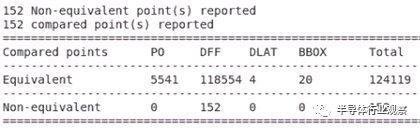

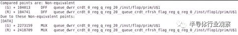

这152个非等效触发器是多位触发器。在多位触发器中，我们合并两个触发器以形成具有多个输入和输出引脚的单个触发器。例如，如果我们将两个单比特触发器合并为一个多比特触发器，它将以D0，D1作为输入引脚，Q0，Q1作为输出引脚。

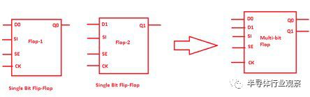

由于是多位触发器，报告显示152个触发器计数为非等效，但实际上只有72个是非等效的。由于这些是两位触发器，因此总计数为72x2 = 144个触发器。剩下的是单比特触发器。


## 第2步：未映射的报告

下一步是检查未映射的文件。此文件显示逻辑连接断开的未映射网络。我们需要跟踪网络并找出这些网络缺失的连接。

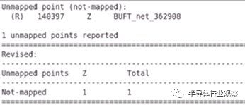

在上图中，我们可以看到在设计中没有映射一个网络（BUFT_net_362908）。从图2中可以看出，一旦我们检查LEC故障数据库中的这个网络（BUFT_net_362908）连接，我们看到它只连接到其他单元的输入引脚（*_364714 / A），但是另一个连接（由于无意的单元缺失，使得该网络缺失了。

下图中突出显示的网络为unmapped.rpt文件中报告的网络。

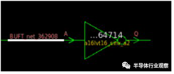


这里，我们可以看到LEC失败设计中报告网络的连接。


当我们在未映射的文件中报告网络扇出（BUFT_net_362908）时，它在LEC传递数据库中连接到152个触发器。

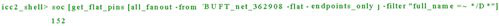

而LEC失败数据库中非等效文件中报告的152个触发器与LEC通过数据库中报告的网络扇出（BUFT_net_362908）相同。

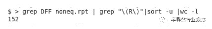

现在，我们需要在之前的LEC传递数据库中找到该网络的实际网络连接。在检查时，我们可以很容易地注意到报告的网络连接到LEC故障数据库中缺少的一个逆变器。

为了找到丢失的单元格，我们必须在之前的LEC传递数据库中回溯跟踪此网络并检查实际连接。

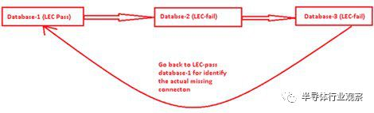

不要在未映射和非等效报告之间混淆。在**未映射的报告**中，我们只看到**未驱动输入引脚的浮动网络**，而在**非等效报告**中，我们看到所有单元格都是这个**丢失单元格的扇出**。

## 第3步：修复LEC问题

在找到LEC故障的原因后，我们必须插入一个丢失了的逆变器，并在LEC故障数据库中重做该逆变器的输入/输出逻辑连接。图3显示了新增的逆变器及其输入输出连接。现在，如果我们重新运行LEC，它将通过，非等效报告将显示零非等效点。

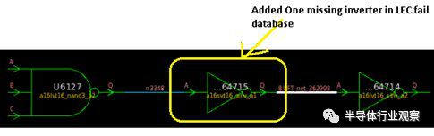

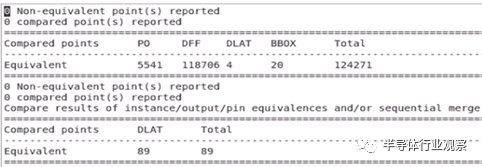

## LEC失败的常见区域

*   如果在设计中使用多位触发器，则将出现映射golden网表与修订网表的问题，因为触发器名称将在修订后的网表中更改。
*   在修订的网表中克隆后，时钟门控单元未被映射。
*   在定时修复期间或在执行手动ECO时，逻辑连接会中断。
*   功能ECO实施。
*   缺少DFT约束。

# LEC的益处

* 减少对门级仿真的依赖。
* 提高了对合成和布局布线的新工具修订的信心。
* 在不编写测试模式的情况下等效性几近完美。
* 降低后端进程丢失的漏洞风险。

# 参考文献

1. [原文-LEC在IC设计中的重要性](https://mp.weixin.qq.com/s/SIRIWXNAYOWhApLW1b9yrg)
2. [撸LEC flow](https://mp.weixin.qq.com/s?__biz=MzUzODczODg2NQ==&mid=2247484830&idx=1&sn=d42573ffb336442a6f4a9fa9d9df5baf&chksm=fad26c40cda5e5560d26ff288b53d95b0b35ace31d0f791e7b9209cdeb25d3da6f4591674617&cur_album_id=1341150491262255105&scene=190#rd)
