# Design Compiler总结（Synopsys）
#### 一、作用：RTL ------- > 优化过的netlist（logic Circuit）。

#### 二、synthesis flow:

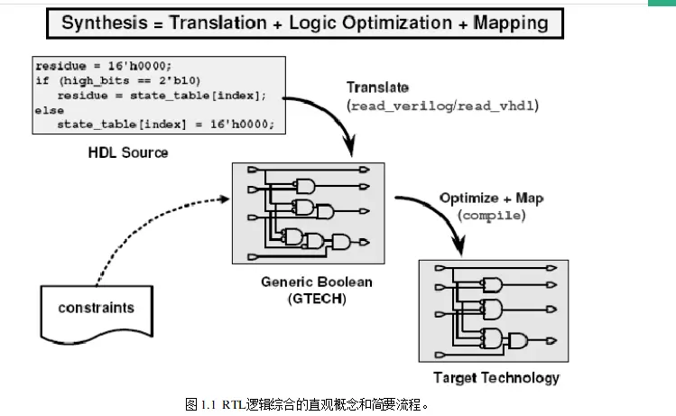

综合过程.png

#### 三、synthesis = translation + logic optimization + gate mapping

*   Translation:将RTL代码转化成GTECH库元件组成的逻辑电路。
*   gate mapping：将GTECH库元件组成的逻辑图转换到目标工艺库上，形成.dcc文件。
*   logic optimization：根据所需时延、功耗、面积等约束条件进行优化。

#### 四、lab流程--两种工作模式：脚本和图形化界面

#### 一、脚本内容设置：dc.tcl

#### 1.设置库链接：

```Tcl
set search_path  {/home/eda/eda/synopsys/dc/dc_2012/libraries/syn}
set target_library {class.db}     //供应商提供目标库
set link_library  {* class.db}    //指定压焊块工艺库名称和所有其他的宏单元,RAM、ROM等
set symbol_library {class.sdb}    //包含工艺库中的单元图形表示的库名称

```

#### 2.读入.v文件

```Tcl
read_file -format verilog {/home/eda/Desktop/test/sync_FIFO.v}  
```

#### 3.设置约束条件

```Tcl
set_max_area 0  //让综合后的面积越小越好
set_max_fanout 4 sync_FIFO   // 约束cell的最大扇出,扇出过大会使cell delay变慢
set_max_transition 0.5 sync_FIFO  
compile -exact_map //综合优化

```

#### 4.保存db和netlist:

```Tcl
sdc /home/eda/Desktop/test/sync_FIFO.sdc  [//保存.db文件](//xn--ruqt3z.xn--db-zg3cw96f)
write -format verilog -hierarchy -output /home/eda/Desktop/test/netlist.v
write_sdc /home/eda/Desktop/test/sync_FIFO.sdc //保存时序约束文件(.sdc文件)
write_sdf /home/eda/Desktop/test/sync_FIFO.sdf  //保存标准延时文件(.sdf文件)

```

#### 5.report PPA：

```Tcl
report_area > /home/eda/Desktop/test/area.area_rpt
report_constraint -all_violators > /home/eda/Desktop/test/cons.constraint_rpt
report_timing > /home/eda/Desktop/test/timing.timing_rpt

```

#### 6.运行脚本：

```Bash
dc_shell  //启动DC
source dc.tcl  //运行脚本

```

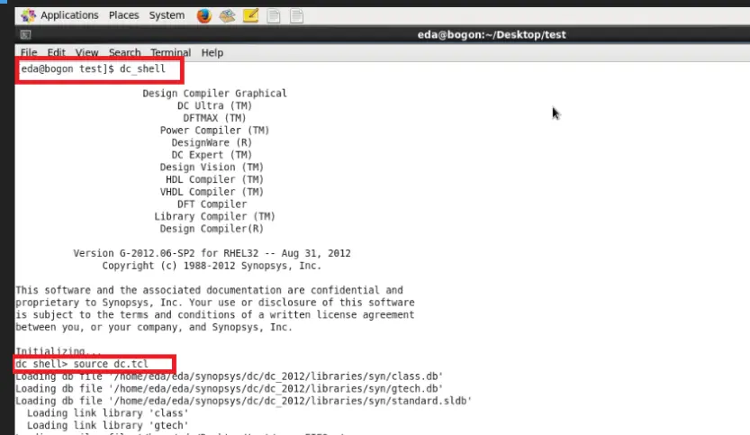

命令行操作.png

#### 二、图形化界面操作：

#### 1.进入gui界面

dc\_shell -gui //图形化界面打开窗口

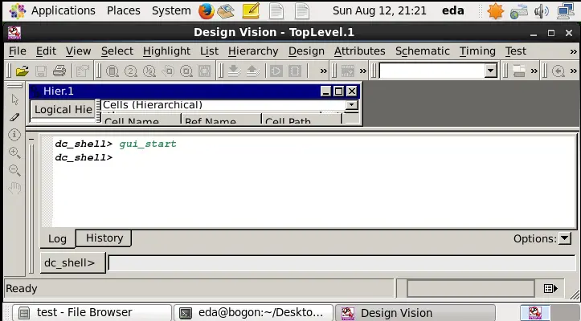

图形化界面操作.png

#### 2.设置库--打开File菜单栏下的Setup进行设置

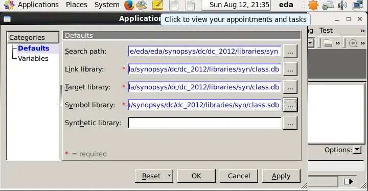

设置库.png

#### 3.读RTL文件

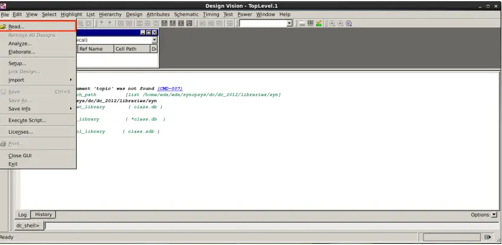

read RTL文件.png

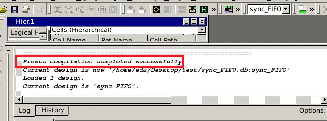

log窗口提示加载成功.png

#### 4.加载符号图形

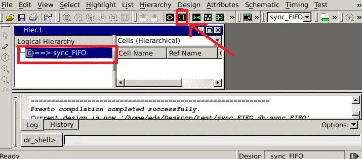

加载符号图形.png

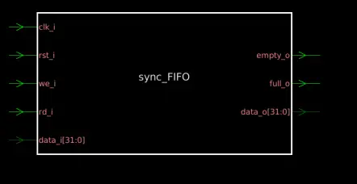

符号图.png

#### 5.设置约束条件 --此处可命令操作也可图形操作

```Tcl
create_clock -name "clock" -period 20 -waveform { 010 } { clk_i } //时钟约束条件
set_dont_touch_network { rst_i } //复位
set_input_delay 12 -clock clock {we_i rd_i data_i} //we_i， rd_i， data_i
set_output_delay 12 -clock clock { empty_o full_o data_o} //full_o等
set_max_area 0
set_max_fanout 4 sync_FIFO
set_max_transition 0.5 sync_FIFO

```

#### 6.优化综合

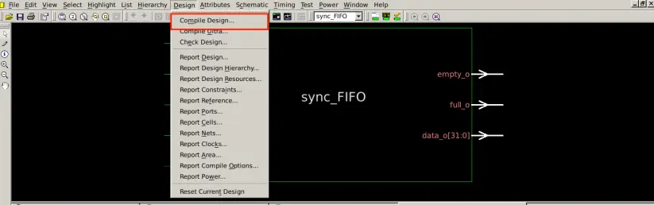

优化综合.png

#### 7.查看报告

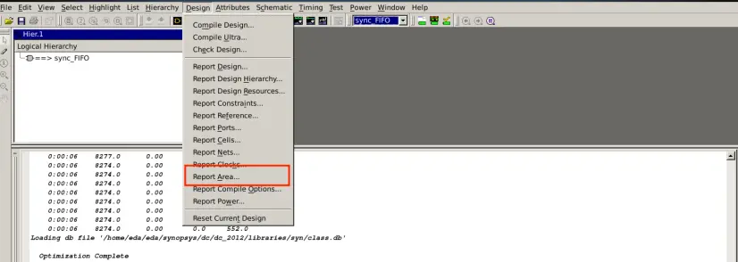

查看报告.png

#### 五、report分析

*   vi编辑器进入生成的netlist
    
    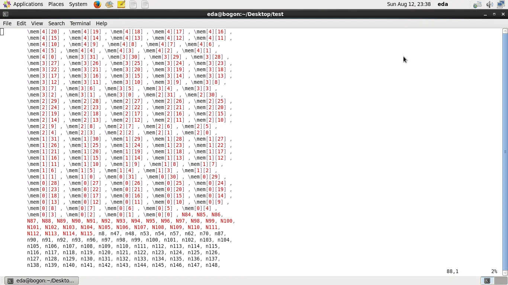
    
    netlist.png
    
*   最后进行时序分析+面积报告分析
    

#### end

作者：打着石膏脚的火星人

链接：[https://www.jianshu.com/p/858079948adb](https://www.jianshu.com/p/858079948adb)