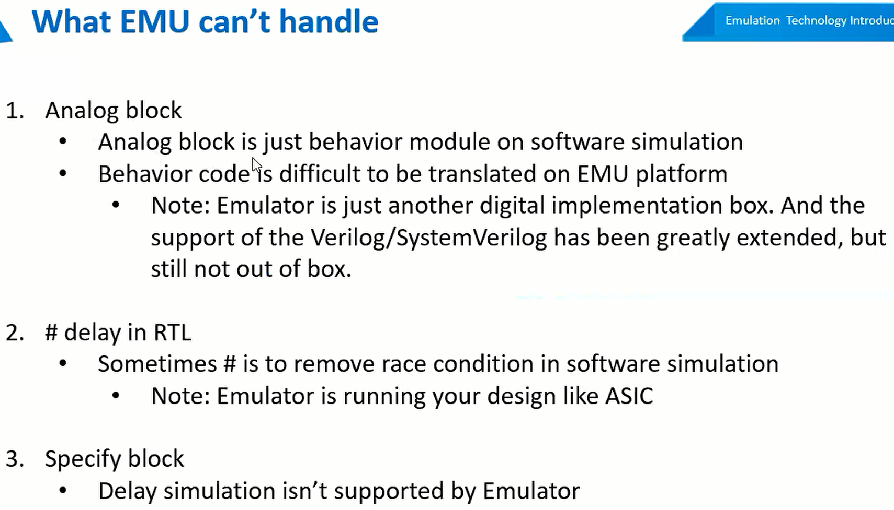
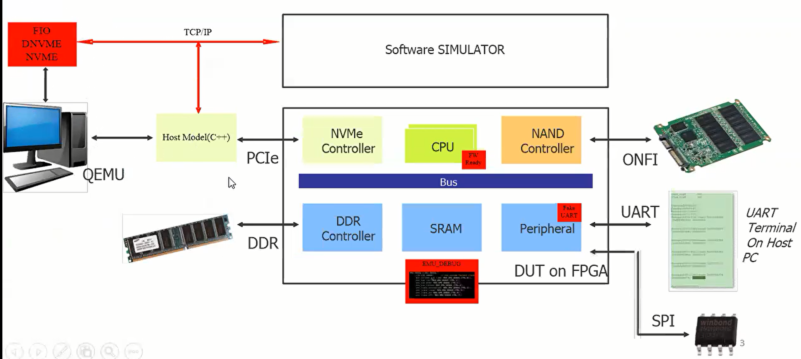
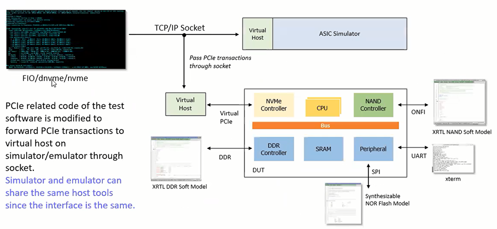

# EMU
不能下载到emu中的一些东西：

模拟逻辑：PCIe PHY、DDR PHY；

#延时逻辑；

specific逻辑：ONFI interface、SRAM model

在emu中会有PHY相关的modulelib，我们可以在top中将其例化进去。ONFI也会写一些专门的model用来仿真。

EMU整体框架

集成主机工具的Emulator\\Simulator

make show 展示谁在跑emu