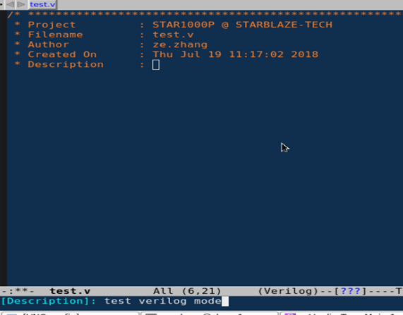
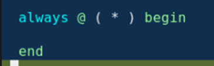
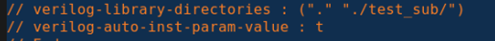

# Emacs Verilog-mode安装
在emacs的配置文件.emacs中增加如下语句：

# insert file header
Ctrl+C + Ctrl+t+h

# AUTO*
AUTOARG：自动生成信号列表
AUTOREG：自动声明reg变量
AUTOWIRE：自动声明wire变量
Ctrl + c + Ctrl + a auto展开
Ctrl + c + Ctrl + k auto关闭

## AUTOINPUT/OUPUT
AUTOINPUT:  在底层模块的input（需要使用AUTOINST）在上层模块没有drive的时候就是自动生成input信号
AUTOOUTPUT: 在底层模块的output在上层没有loading的时候会自动在顶层模块output出去

## AUTO always
Ctrl + c + Ctrl + t + q

Ctrl + c + Ctrl + t + a

## AUTOINST
AUTOINST：自动例化，生成sub module的信号例化

UTOINST例化的模块的位置需要在verilog-library-directories中指明Verilog-auto-inst-param-value : t 表示在信号例化的时候如果submodule的input/output的信号位宽如果是由parameter定义的话，AUTOINST会自动将parameter转化成对应的数值

verilog-mode 如果有很多个目录，很多文件都要引用，经常写错的话。可以用一个file汇聚起来，在 .v 文件中调用这个file文件就可以全部引用进去,就不需要每个 .v 文件都写一大堆的目录了。

## AUTOTEMPLATE
AUTOTEMPLATE: 帮助在例化模块的时候修改信号的连接, 通配符替换。

@代表regexp

@后面代表运算

# Emacs Lint check
Ctrl + c + Ctrl + s emacs自动调用Lint进行Lint check

# 常用快捷键
## 刷新文件
C-x C-v

# Reference
* [Verilog-mode-Help](https://www.veripool.org/wiki/verilog-mode/Verilog-mode-Help)
