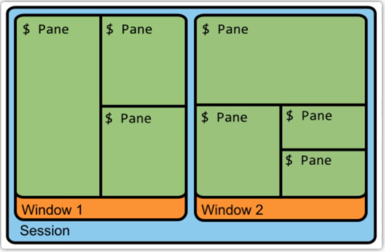

# Tmux
在开始使用 tmux 之前我们需要先了解关于 tmux 的几个名词：
**session**, **window** , **pane**在这里我们就把他们分别叫做**会话，窗口，窗格** 。
关于session 很多人都叫**会话**，个人感觉叫任务更贴切，更形象。

通常我们在终端中操作一个任务的时候，一旦终端关闭，任务也就结束了，被强制关闭了；在 tmux 中 使用 session 就可以解决这个问题，我们可以把当前操作的任务隐藏起来，在视觉上让它消失，任务继续执行着，当我们想返回任务做一些操作的时候，它可以很方便的回来；我们通常把上面的操作就做 session 操作，我们可以把 session 给隐藏起来，我们也可以把 session 给真的关掉。

在 tmux 中有一个窗口的概念，我们可以这样要去理解窗口：当前呈现在我们面前的这一个工作区域就是一个窗口（当前的终端界面），窗口可以被不断切割，切割成一个个小块，这一个个小块我们叫做窗格（pane）,这就是窗口和窗格的概念，我们把它想象成一块大蛋糕可以切成很多小块蛋糕，窗口可以被分割成很多小的窗格。

**总结**： 一个 **session**通常指一个任务里面可以有很多**窗口**，一个窗口又可以有很多的**窗格**。


## tmux常用快捷键
### tmux 的前缀键
如果想使用 tmux 中的快捷键，我们必须使用 tmux 的前缀按键 ctrl + b , 在 tmux中所有的快捷键都需要通过前缀按键去唤起的。
在 tmux 当中默认的前缀按键是 ctrl + b , 这个前缀按键不是很友好，ctrl 和 b 的距离真的是太长了，操作起来不是很舒心，当然这个前缀按键是可以通过 tmux 的配置文件 .tmux.conf 进行修改的，文末会提到 .tmux.conf 的一点简单配置。
### 新建session
在linux终端中输入如下内容，开启一个会话
```csharp
tmux new -s mysession  # 创建一个名字为mysession的会话
```

### 新建窗格
创建完会话以后，默认开启一个窗口，然后我们就可在窗口里面创建窗格或者创建新的窗口：
```css
ctrl+b %  # 在水平方向创建一个窗格
# 说明：ctrl+b %：不是同时按这些键，而是先按ctrl+b，然后松开，然后再按shift+5。shift+5就是%的意思。
ctrl+b "  # 在垂直方向创建一个窗格
ctrl+b 方向键  # 窗格间进行切换  
```

### 新建窗口
```css
Ctrl+b c  # 创建一个新的窗口
ctrl+b +n：切换到下一个窗口
ctrl+b +p：切换到上一个窗口
```

## tmux 的 session 常用操作

### 新建 session
新建一个 session ,在终端输入一个 tmux 命令即可：
```text
tmux
```
上面的命令会创建一个 session ，默认是**通过数字编号**来命令的，有时候我们需要明确的知道我们的 session 的名字，方便我们快速进入该 session ,我们可以使用如下的命令：
```text
tmux new -s  <session-name> 
```
例如新建一个名称是 zempty 的session : tmux new -s zempty
### 离开 session
有时候我们需要离开终端，操作其他的任务，需要离开该任务，但是又想该任务**继续在后台执行**，这时候我们需要在 tmux 的任何一个窗格中输入如下命令：
```text
tmux detach
```
也可以使用快捷键 **<mark>ctrl + b d</mark>** ,这里解释一下该快捷键， tmux 离开 session 的快捷键是 d ,但是在 tmux 当中任何快捷键都需要搭配 tmux 的前缀按键 ctrl + b 来唤醒，所以改快捷键的操作是先按 ctrl +b ,紧接着按下按键 d ,这样我们便顺利的离开当前 session 了。

### 查看 session 列表
有时候我们可能同时操作了好几个 session， 我们可以通过如下的命令来查看我们目前操作了几个session：
```text
tmux  ls  
```
也可以通过快捷键操作 **<mark>ctrl + b s</mark>** 列出所有的 session。

### 进入 session
离开 session 之后，有时候我们还需要对某个 session 进行操作，这时候可以通过如下的操作：
```text
tmux attach -t  <session-name>
```
例如我的 session 名称是 zempty , 就可以通过 tmux attach -t zempty 顺利进入 session, 也可以通过 **tmux a -t zempty** ，该命令中的 a 是 attach 的简写形式

### 关闭 session
如果需要关闭 session, 可以通过执行如下的命令即可：
```text
tmux kill-session -t <session-name>
```
例如关闭zempty 这个session : tmux kill-session -t zempty
也可以使用快捷键 **<mark>ctrl + d</mark>** 来关闭当前的 session。

### 切换 session
执行命令,可以从当前的 session 快速切换到另一个 session：
```text
tmux switch -t <session-name>
```

### 重命名 session
```text
 tmux rename-session -t <old-session-name> <new-session-name>
```
例如： tmux rename-session -t zempty handsome 该命令会把 zempty 这个 session 重新命名为 handsome.
也可以通过快捷键 **<mark>ctrl +b $</mark>** 来重命名当前的session 。

### session 总结
session 在 tmux 操作当中非常重要，希望你可以熟练的使用以上操作：
新建 session -> 离开 session -> 查看 session 列表 -> 进入 session -> 关闭 session -> 不同 session 之间的切换 -> 重命名 session 。

## tmux 的窗格常用操作
当前我们的工作区域，一块工作屏幕我们叫做窗口，窗口是可以被分割的，当前的工作区域被分割的一块块区域就是窗格。

每一个窗格我们可以用来干不同的事情，窗格同窗格之间是相互独立的，可以想象我们使用 vim 来搭配 tmux 的窗格功能是不是很酷呢？
### 切割窗格
切割窗格的命令是：
```text
tmux split-window 
```
该命令会把当前工作区域分成上下两个小窗格
```text
tmux split-window -h
```
该命令会把当前工作区域分成左右两个窗格
切割窗格的快捷键 **<mark>ctrl + b %</mark>** 可以快速的左右切割，**<mark>ctrl + b “</mark>** 可以快速的上下进行切割。

### 不同窗格间移动光标
```text
tmux select-pane  -U
```
把当前光标移动到上方的窗格
```text
tmux select-pane -D
```
把当前的光标移动的下方的窗格
```text
tmux select-pane -L
```
把当前的光标移动到左边的窗格
```text
tmux select-pane -R
```
把当前的光标移动到右边的窗格
移动窗格光标的快捷键：
* **<mark>ctrl +b 方向键</mark>** 例如 ctrl +b ⬆ 会把光标移动到上方的窗格；
* **<mark>ctrl +b ;</mark>** 光标切换到上一个窗格；
* **<mark>ctrl +b o</mark>** 光标切换到下一个窗格；


### 交换窗格的位置
```text
tmux swap-pane -U
```
当前窗格向上移动
```text
tmux swap-pane -D
```
当前窗格向下移动

### 关闭当前的窗格
关闭窗格通常使用快捷键 **<mark>ctrl + b x</mark>**

### 放大窗格
快捷键 **<mark>ctrl + b z</mark>** ,将会放大当前操作的窗格，继续触发该快捷键将会还原当前的窗格。

### 窗格显示时间
快捷键 **<mark>ctrl +b t</mark>** 将会把在当前的窗格当中显示时钟，非常酷炫的一个功能，点击 enter (回车键将会复原)。

### 窗格总结
关于窗格的操作我们经常操作的就是分割，移动光标，放大窗格，关闭窗格，可以熟练以上提到的操作，关于移动光标的快捷键操作，下文在 .tmux.conf 中也会处理成快捷键进行操作。

## tmux 的窗口常用操作
### 创建窗口
有时候一个窗口不够用，这样我们就需要重新创建一个窗口：
```text
tmux new-window -n <window-name>
```
例如： tmux new-window -n zempty 就是重新创建一个名字是 zempty 的window
创建窗口的快捷键 **<mark>ctrl + b c</mark>**, 可以通过快捷键快速的创建一个窗口出来。

### 切换窗口
```text
tmux select-window -t <window-name>
```
在已经有多个窗口的条件下，可以通过上名的命令快速进入指定的窗口当中，例如：tmux select-window -t zempty 会快速跳到 zempty 这个窗口当中。
关于切换窗口的快捷键 :
* **<mark>ctrl + b w</mark>** 显示窗口列表可以通过 j ,k 上下进行选择窗口，然后回车进入指定的窗口。
* **<mark>ctrl + b n</mark>** 快速切换到下一个窗口。
* **<mark>ctrl +b p</mark>** 快速切换到上一个窗口。

### 重命名窗口
```text
tmux rename-window <new-window-name>
```
例如 tmux rename-window zempty 把当前窗口名为 zempty
窗口命名快捷键：
**<mark>ctrl + b ,</mark>** 该快捷键可以重新命名窗口

### 关闭窗口
```text
tmux kill-window -t <window-name>
```
例如： tmux kill-window -t zempty 删除名称为zempty 的窗口。
关闭窗口的快捷键：
**<mark>ctrl + b &</mark>** 可以关闭当前的的窗口

### 窗口的总结
窗口的日常使用多是通过快捷键去操作，熟练掌握上面提到操作窗口的快捷键即可。

## tmux 的配置文件 .tmux.conf
tmux 中的很多操作都是通过快捷键去实现的 ，在 tmux 中我们可以通过 **<mark>ctrl + b ?</mark>** 来查找 tmux 的帮助文档，可以查询一些功能键的快捷键信息 ，在帮助文档中按下键盘上的 ESC 或者 q 键就可以退出帮助文档。

在 tmux中有一个配置文件 **.tmux.conf** ,在其中可以配置一些方便自己的 tmux 快捷键信息等，该文件 .tmux.conf 默认放在 ～（家目录） 目录下面，如果没有可以在 ～ 目录下面创建一个 .tmux.conf 文件即可。

在tmux 中默认的前缀键是 ctrl + b ,这个前缀键对我是十分不友好的，我通常会通过配置文件改成 ctrl + x, 因为我的手很容易触到 x 按键。

下面列出一份简单的 .tmux.conf 的配置文件，算是做为一个入门配置，如下所示
```shell
#below reset tmux prefix command key
set -g prefix C-x
unbind C-b
bind C-x send-prefix
#set swap pane key
bind-key k select-pane -U
bind-key j select-pane -D
bind-key h select-pane -L
bind-key l select-pane -R
```
该配置文件把 ctrl + b 改成了 ctrl + x , 还有多个窗格之间切换光标可以通过 ctrl + x k 切换到上一个窗格， ctrl + x j 切换到下一个窗格， ctrl +x h 切换到左边的窗格，ctrl + x l 切换到右边的窗格。

### 配置文件总结
关于 tmux 的配置文件的配置可以根据个人的习惯进行配置，配置的具体细节可以查询 google 或者 github。

```shell
# 以下内容参考：https://xpgeng.gitbooks.io/omooc2py/content/guide/Tmux-Guide.html
# 更改启动快捷键前缀C+b为C+a
# remap prefix from 'C-b' to 'C-a'
# 原本的ctrl a是跳转到命令开头，现在需要点击两次ctrl a才能跳转到开头。
unbind C-b
set -g prefix C-a
bind-key C-a send-prefix

# 更改分屏快捷键
# split panes using | and -
bind | split-window -h
bind - split-window -v
unbind '"'
unbind %

# 不同窗口间移动改成Alt+ 箭头
# switch panes using Alt-arrow without prefix
bind -n M-Left select-pane -L
bind -n M-Right select-pane -R
bind -n M-Up select-pane -U
bind -n M-Down select-pane -D

# 使用鼠标切换窗口
set -g mouse on

# 以下内容参考：https://gist.github.com/Godsing/c817baaeb44ceaaf57c91f047eaf5501
# 自定义状态栏
# set -g status-utf8 on # 状态栏支持utf8，这个有问题
set -g status-interval 1 # 状态栏刷新时间
set -g status-justify left # 状态栏列表左对齐
setw -g monitor-activity on # 非当前窗口有内容更新时在状态栏通知

#set -g status-bg black # 设置状态栏背景黑色
#set -g status-fg yellow # 设置状态栏前景黄色
#set -g status-style "bg=black, fg=yellow" # 状态栏前景背景色
set -g status-left "#[bg=#88cc44] Sess: #S " # 状态栏-左侧内容 (#S: 会话(session)名称)
#set -g status-right 'Continuum status: #{continuum_status}' # 状态栏右侧内容
set -g status-left-length 300 # 状态栏-左边长度300
set -g status-right-length 500 # 状态栏-左边长度500

set -wg window-status-format " #I:#W " # 状态栏-(当前窗口除外的其他)窗口名称格式
set -wg window-status-separator "" # 状态栏-窗口名称之间的间隔
set -wg window-status-current-format " #I:#W #F " # 状态栏-当前窗口名称格式(#I：序号，#w：窗口名称，#F：间隔符)
set -wg window-status-current-style "bg=black, fg=yellow" # 状态栏-当前窗口名称的背景色
#set -wg window-status-last-style "fg=black" # 状态栏最后一个窗口名称的样式
set -g message-style "bg=#202529, fg=#91A8BA" # 指定消息通知的前景、后景色
```