# 1.2 VCS+Verdi 环境搭建
**数字IC与硬件设计的两居室**

本次安装教程中，VCS 与 Verdi 软件安装在 Win10 系统下虚拟机的 Linux (Ubuntu) 系统中。虚拟机版本为 VMware-workstation-full-12.5.6，Linux 系统版本为 ubuntu-14.04-desktop-amd64。建议大家选择新版本的 Ubuntu 系统，库文件会比较完整，安装步骤类似，但安装过程会更加顺利。本人比较怀（懒）旧（惰），所以选择此版本。

***

安装流程

Synopsys 工具的安装流程一般为：

◆ 安装 Linux 系统

◆ 安装 installer 工具，用于启动安装 Synopsys 工具

◆ 安装具体的 IC 工具，例如 VCS、Verdi、DC 等工具

◆ 安装 SCL 工具， 用于统一管理 License

◆ 修改环境设置，激活工具

本次 VCS+Verdi 安装过程与 《DC 综合教程》的《1.2 DC 环境搭建》一节中 DC 安装过程基本一致，只有工具安装包和环境设置有所不同。

当 Linux 系统已经安装破解好 DC 综合环境时，只需要再安装 VCS 和 Verdi 工具、并修改环境变量即可，无需再安装 installer 和 SCL 工具。所以建议首先参考 DC 安装教程。

本次 VCS/Verdi 安装时，DC 环境已经安装完毕。但为了照顾更多的学者，这里剪辑式的给出 Synopsys 工具 VCS 与 Verdi 安装的完整流程。

***

安装包下载

本次环境搭建大概需要 6 个安装包，公众号内回复：synopsys pkg 获取相关资源。

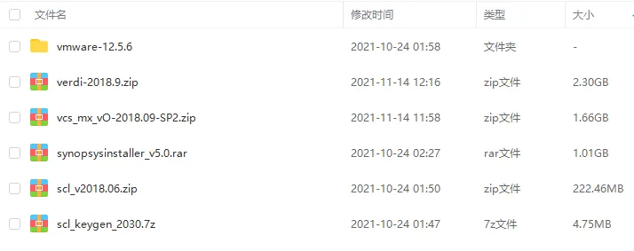

***

虚拟机-Linux 系统安装

如果系统已经安装 Linux 环境，此步骤可以忽略。

虚拟机安装路径 vmware-12.5.6 下有 4 个文件，如下图所示。

首先在 Win10 下安装 Vmware，然后解压 vm10keygen.rar 运行里面的 exe 文件进行破解，最后在虚拟机中指定 Ubuntu 镜像文件 (iso 文件) 安装 Linux 系统。

Ubuntun 系统内存建议 8G+，硬盘空间建议 200G+ 。

本教程着重讲述 VCS/Verdi 安装过程，虚拟机与 Linux 的系统安装不再详细展开。

***

installer 安装

如果系统已经安装 installer 环境，此步骤可以忽略。

Synopsys 的相关工具都是通过 Synopsys Installer 工具安装的，所以在安装 VCS/Verdi 之前，首先需要安装 Installer 工具。

◆ 在 Linux 下创建如下路径，用于存放安装包（注意和自己环境匹配）：

/home/will/synopsys\_tools/install\_pkg

◆ 将 Win10 下解压的 synopsysinstaller\_v5.0 文件夹复制到上述 Linux 安装包路径下，并切换到 synopsysinstaller\_v5.0 目录，超级权限运行：

sudo ./SynopsysInstaller\_v5.0.run

此过程比较顺利，大概如下所示。如果提示缺少相关库，可自行查阅对应库的安装方法，比较简单。

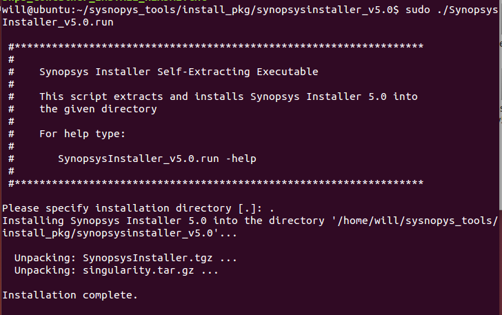

◆ Installer 安装完成后，当前路径下会生成一个脚本文件 [setup.sh](http://setup.sh)，直接运行，出现以下 Synopsys Installer 的启动界面，则表示安装成功。

./setup.sh

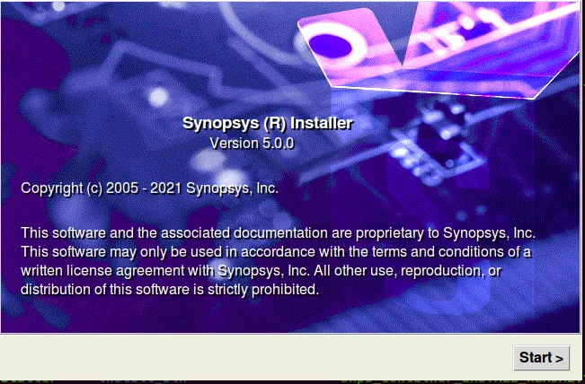

***

VCS 安装

不同 IC 工具安装时，选择不同的安装包。

◆ 安装包复制与安装路径创建：

将 Win10 下解压的 vcs\_mx\_vO-2018.09-SP2 文件夹复制到 Linux 安装包路径下：

/home/will/synopsys\_tools/install\_pkg

创建 VCS 安装路径为：

/home/will/synopsys\_tools/VCS\_2018\_SP2

相关文件复制时，在 Win10 与 Vmware 间使用 Ctrl+C 、Ctrl+V 的方式即可。

安装包路径和 DC 安装路径可任意创建。为避免安装过程中的权限问题，将 synopsys\_tools 文件夹权限全部打开：

sudo chmod 777 /home/will/synopsys\_tools

◆ 切换到 synopsysinstaller\_v5.0 路径，运行 [setup.sh](http://setup.sh)，点击 Start 按钮：

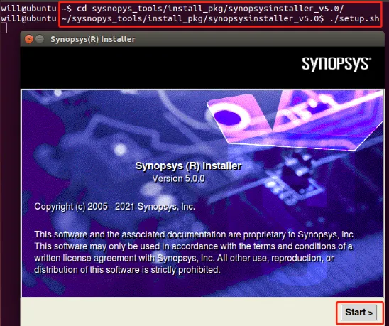

◆ 设置下 Site Administrator 即可，其他保持默认值，点击 Next:

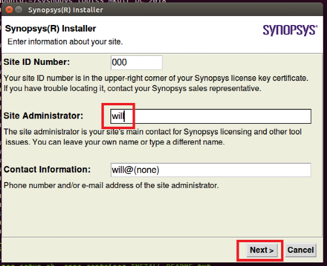

◆ 设置 VCS 安装包路径，点击 Next:

◆ 设置 VCS 环境安装路径，点击 Next:

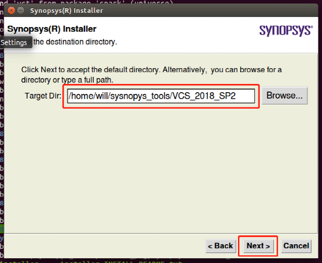

◆ 选择安装 VCS 软件，点击 Next:

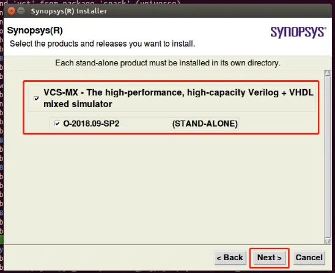

◆ 确认没有问题，点击 Next:

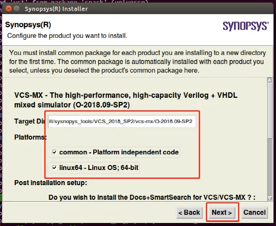

◆ 点击授权开始安装 VCS 工具：

◆ 下图为安装完成的界面，点击 Finish 即可：

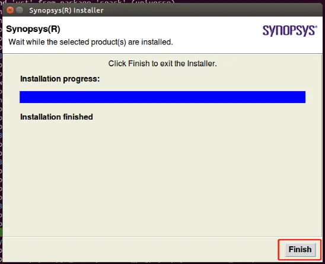

◆ 因为 VCS 安装完成后还没有破解，会出现以下界面，直接点击 Dismiss 即可。

***

Verdi 安装

◆ 除了不同的安装包和安装路径，Verdi 安装与 VCS 几乎完全一致，这里不再赘述。

***

破解步骤 1: SCL 安装

如果系统已经安装 SCL 环境，此步骤可以忽略。

SCL (Synopsys Common License) 软件为 Synopsys License 统一管理工具。当该软件破解完成后，Synopsys 相关工具安装后，指定下相关 PATH 变量就可以直接使用。此过程虽然有些麻烦，但可谓是一劳永逸。

◆ 安装包复制与安装路径创建：

将 Win10 下解压的 scl\_v2018.06 文件夹复制到 Linux 安装包路径下：

/home/will/synopsys\_tools/install\_pkg

创建 SCL 安装路径为：

/home/will/synopsys\_tools/SCL

◆ SCL 工具的安装，和 VCS 安装过程基本类似，这里不再赘述。

***

破解步骤 2: License 生成

如果系统生成过 license，此步骤可以忽略。

◆ Linux 系统下输入以下命令，获取 hostname 与 HWaddr 信息。

hostname

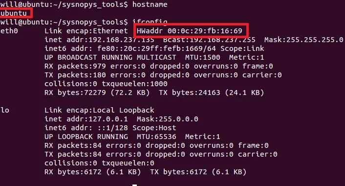

◆ Win10 下解压 scl\_v2018.06 文件夹，并双击打开 scl\_keygen.exe 程序。如果此程序被杀毒软件或防火墙报警或删除，需要关闭杀毒软件或添加信任。

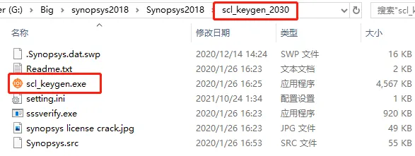

◆ 将下图中的 HOST Name 改为 Ubuntu 中的 hostname 值，将 Host ID Daemon 与 HOST ID Feature 改为 Ubuntu 中的 HWaddr 值，Port 端口保持默认。点击 Generate ：

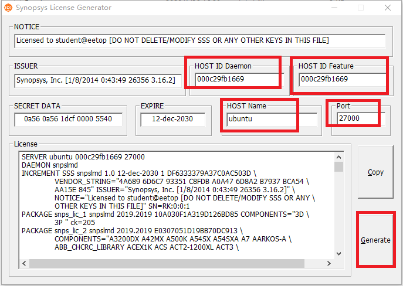

◆ Generate 完成后，该路径下会产生一个 Synopsys.data 的文件。文本文档方式打开，修改第二行数据如下所示，注意和 Linux 下 SCL 的安装路径匹配。

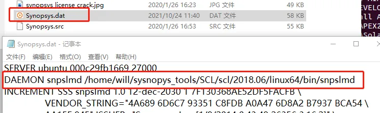

***

破解步骤 3: 激活

◆ 在 Linux 系统的 /home/will (对应系统路径 ~) 路径下打开 .bashrc 文件，在末尾增加以下内容，注意安装路径、hostname 以及端口号的对应。之后安装其他 Synopsys 的工具时，仿照 VCS 相关设置语句即可。

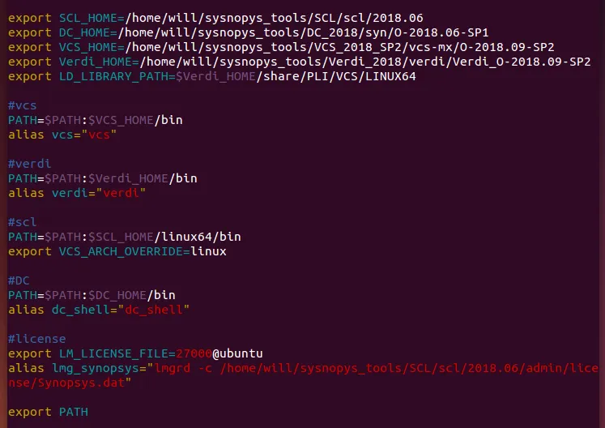

◆ source 脚本 .bashrc，并输出 PATH 变量，可见 PATH 中增加了工具安装的路径信息。

source .bashrc

◆ 使用以下命令，确认当前 shell 环境是否为 bash，如果是 dash，需要进行以下设置。

# 确认当前 shell 环境

◆ 使用以下命令，设置对应的端口，端口号需要与上述步骤中保持一致。

firewall-cmd --zone=public --add-port=27000/tcp --permanent

◆ 使用 lmg\_synopsys 命令进行激活，出现以下不能识别 Synopsys 环境的 lmgrd 命令。使用 ls 命令也能确认此文件存在。

sudo lmg\_synopsys

◆ 安装 Linux LSB (Linux Standards Base)，便可解决以上问题。LSB 是 Linux 标准化领域中事实上的标准，制定了应用程序与运行环境之间的二进制接口。

apt-get install lsb

***

破解步骤 4: 补丁

因为此次安装之前已经安装好 DC 环境，所以过程中没有出现过缺少相关文件的提示。但是以防万一，也将 DC 安装时缺少的文件提示及处理方法内容保留如下，欢迎参考。

◆ 启动时缺少 csh 环境，直接安装即可：

sudo apt-get install csh

◆ 启动时还缺少 libtiff.so.3 库文件，这是因为工具调用的库文件版本相对较老。找到最新版本的库文件，并切换到对应目录下，直接复制或链接到当前 Linux 的对应版本并修改名字即可。

sudo ln -sf libtiff.so.5 libtiff.so.3

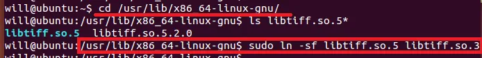

◆ 启动时还缺少 libmng.so.1 库文件，采用直接链接的方式：

sudo ln -sf libmng.so.2 libmng.so.1

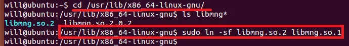

***

VCS 启动

◆ 创建一个简单的 Verilog 设计，文件名为 and12.v：

module and12(

◆ 查看 g++/gcc 版本：

ll /usr/bin/g++ /usr/bin/gcc

◆ VCS 对应 g++/gcc 版本一般为 4.4，当 Linux 系统下 g++/gcc 版本与 VCS 不匹配时，会出现以下多个相似的错误：

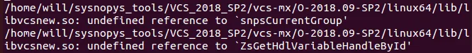

◆ Linux 系统安装 4.4 版本的 g++/gcc：

sudo apt-get install gcc-4.4 g++-4.4

◆ 使用以下简单的 vcs 命令对单个文件 and12.v 进行编译：

vcs -full64 \\

◆ 编译结果如下，没有 Error，初步确认 VCS 安装正确。

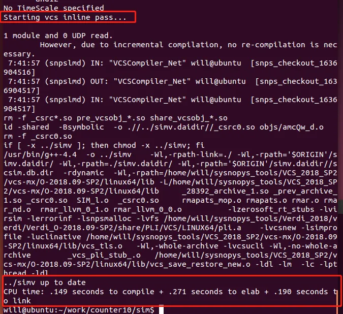

***

Verdi 启动

◆ 直接使用 verdi 命令，查看文件 and12.v 的 Verilog 代码：

verdi and12.v &

◆ Verdi 启动界面如下，初步确认 Verdi 安装正确。

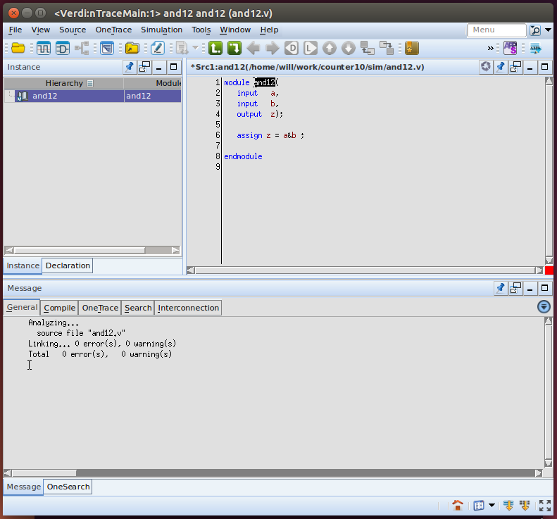