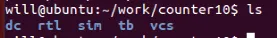
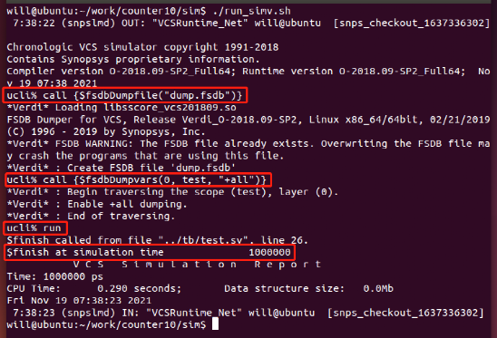
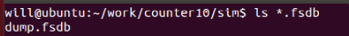
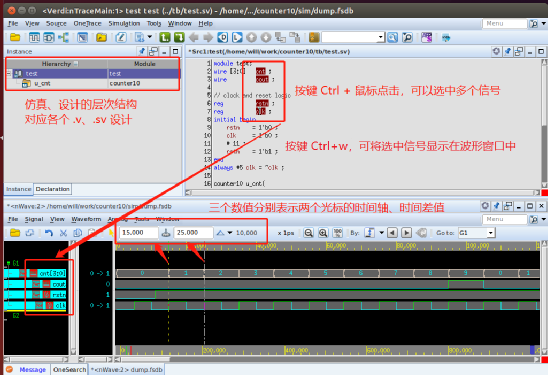

# 1.3 VCS+Verdi 仿真流程
**数字IC与硬件设计的两居室**

本教程不再介绍 VCS 或 Verdi 的工作原理（因为也不会），重点介绍工具的使用。

所以，本节先不负责任、不给解释的给出 VCS+Verdi 的仿真流程，使用到的脚本文件可以供学者直接调用，进行快速仿真。

各种参数的具体说明，后面章节慢慢讲解。

***

工程目录结构

为了让工程项目的文件层次更加分明、便于修改，建议使用多个文件夹，便于对设计中不同阶段的文件进行分类。

例如，设计一个简单的计数器，建立工程文件夹 counter10，并创建如下子文件夹：

◆ rtl 文件夹存放所有 RTL 设计文件，不包括 testbench (后面称 tb) 文件。

◆ tb 文件夹存放所有的 testbench 文件，和 RTL 设计文件区分开来。

◆ vcs 文件夹表示 VCS 编译环境，每次 RTL 或 testbench 有修改时，需要进入此路径重新编译 RTL 设计文件和 tb 文件。

◆ sim 文件夹表示 VCS 仿真环境。和编译环境区分开，能更好的显示仿真的 log，修改仿真环境，便于调试。

◆ dc 文件夹表示 DC 综合环境，DC 综合读取 RTL 文件时，只需读取 rtl 文件夹下的全部文件即可。但本教程暂时不涉及 DC 的使用，若有兴趣欢迎翻阅 《DC 综合教程》。

***

VCS 编译

◆ rtl 文件夹下创建设计文件 counter10.v，Verilog 代码描述如下：

module counter10(

◆ tb 文件夹下创建 testbench 文件 [test.sv](http://test.sv)，代码描述如下：

module test;

◆ 切换到 vcs 文件夹下，新建 3 个文件：file.list、macro.list 和 run\_vcs.sh。

◆ file.list 中要罗列出仿真使用到的所有文件列表，包括所有的 RTL 与 testbench 文件，内容如下。其中，两个斜杠符号 “//” 表示注释。

//rtl files

◆ macro.list 主要内容为宏定义、库文件的 Verilog 模型路径、以及文件搜索路径信息等。这些参数信息可以直接在 VCS 编译命令中指定，但是单独存放在一个文件中，有利于其他 IC 工具的直接使用。

macro.list 简单内容如下。两个斜杠符号 “//” 表示注释。

//宏定义

◆ run\_vcs.sh 表示启动 VCS 编译的脚本，个人比较喜好的参数设置描述如下，注意需要将上述创建的两个文件名 flie.list、macro.list 添加进去：

vcs -full64 -notice -debug\_all -j8 -timescale=1ns/1ps \\

◆ 修改 run\_vcs.sh 的可执行权限 (chmod a+x run\_vcs.sh)，直接运行 run\_vcs.sh 脚本，即可启动 VCS 编译 RTL 文件和 testbench 文件的过程。

./run\_vcs.sh

◆ 当编译 log 没有出现 Error 时，则表示编译成功，如下所示。

◆ 编译成功后，vcs 路径下默认会生成一个文件 simv 和一个文件夹 simv.daidir。后续 VCS 仿真就需要使用这两个文件(夹)。

***

VCS 仿真

◆ 使用 UCLI (Unified Command Line Interface, 统一命令行接口) 标准创建波形打印控制文件 wave\_gen.tcl。

当然波形打印语句也可以在 tb 中编写，但有时候仅仅修改打印波形等调试过程的相关设置时，使用 UCLI 标准就不需要重新编译 RTL 文件，而在 tb 中编写打印波形的命令语句就需要重新编译。

切换到 sim 路径，创建 wave\_gen.tcl 文件内容如下：

call {$fsdbDumpfile("dump.fsdb")}

◆ 创建仿真执行命令的脚本 run\_simv.sh，内容如下：

ln -sf ../vcs/simv\* .

◆ 修改 run\_simv.sh 的可执行权限 (chmod a+x run\_simv.sh)，直接运行 run\_simv.sh 脚本，即可启动仿真过程。

没有错误的仿真 log 如下图所示。

◆ 仿真完成后，会在当前路径 sim 下生成 Verdi 可识别的波形文件 dump.fsdb，如下所示：

***

Verdi 查看波形

◆ 仍然在 sim 路径下，直接运行以下命令。或将以下命令输入到脚本文件 run\_verdi.sh 中，并修改权限直接执行，则可完成 Verdi 打开波形文件 dump.fsdb 的过程。

verdi -f ../vcs/file.list -f ../vcs/macro.list -top test -ssf dump.fsdb -nologo &

◆ Verdi 界面如下所示，现在可观察仿真过程中所有信号的状态值。鼠标点击信号，键盘按键 Ctrl+w，即可将对应信号添加到波形图中。

VCS、Verdi 的各个参数的具体含义以及操作方法，详见后面章节的教程。