# cdc
## 熟悉界面
在Terminal中输入 **spyglass -project test.prj &** 新建或打开一个spyglass工程。  
GUI界面最上面为工具栏，
*   点击help可以查看spyglass manual。多看看spyglass manual是学习spyglass的最好方法。
*   点击Design setup进入读入设计界面
*   点击Goal Setup进入目标选择界面
*   点击Analysis results查看检查结果


### （1）读入设计
需要提供以下文件
*   RTL code / Flist
*   SGDC 约束文件
*   lib 库 // 如果设计模块中有库单元，如SRAM，时钟门控等（1）提供lib；（2）或者提供该库单元的RTL文件，并将该库单元设成BlackBox
*   Waiver file //过滤检查结果的文件， 非必要，尽量不使用
*  在**set_option**过程中，设置模块顶层（必须），blackbox，搜索路径等参数。


### （2）选择检查目标
spyglass功能非常强大， 可以做代码检查，CDC检查，功耗检查等。本篇文章只介绍CDC检查。


### （3）分析检查结果
一定要将每个结果都检查一遍。如有报错，先在最左边的help viewer中查看报错原因。如果是RTL代码问题，则优化代码，如果确定没有问题，则修改约束脚本，增加约束，直到每一项结果都是绿色。


## 约束文件

约束文件要在**读入设计**步骤之前准备好，也可以在检查过程中逐渐完善。最基本的约束包括时钟，复位，输入以及输出端口约束。
clock 和 generated\_clock命令都可以约束时钟。
*   clock约束**模块端口**输入的时钟引脚。
*   generated\_clock约束**模块内部**时序逻辑产生的时钟，如分频器。类似SDC中的create\_generated\_clock。


``` tcl
//指定模块顶层
current_design training 
//约束时钟, 模块顶层所有的时钟都要约束
clock -name CLKA -period 10 -edge {0 5}
clock -name CLKB -period 100 -edge {0 50}
//约束复位
reset -name reset_a -value 0
reset -name reset_b -value 0
//约束输入端口
input -name {in_a in_b reset_a} -clock CLKA
input -name {resetn_b} -clock CLKB
//约束输出端口
output -name {dout} -clock CLKB
//如果有SDC约束文件
sdc_data -file ../my_file.sdc
```

## CDC流程

**Goal**: 是一系列相关Rule的集合,组合起来完成RTL分析的某个特定任务.  
**Rule**: 是SpyGlass 进行RTL分析的最小单位.

*   **cdc_setup**和**cdc_setup_check**过程主要检查**约束文件**是否完整。要保证所有的输入输出端口100%约束。
*   **cdc_verify_struct**过程主要检查信号是否同步
*   **cdc_verify**过程主要检查数据丢失，聚合问题，以及报告识别出的握手，FIFO模块

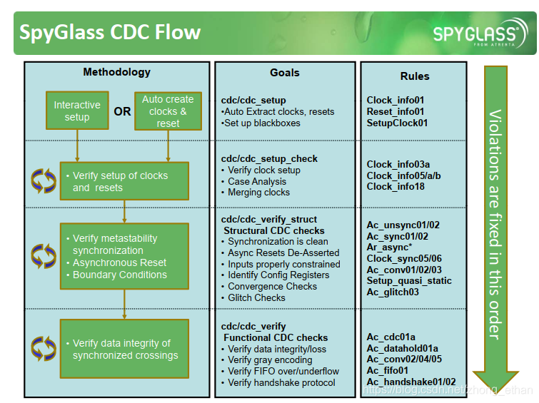

## cdc_setup
### Clock_info01

报告设计中的时钟信号。spyglass可以识别出以下类型clock

|                       描述                        |     时钟类型      |
| ------------------------------------------------- | ---------------- |
| 普通输入时钟                                       | Primary Clocks   |
| 黑盒（blackbox）或工艺库单元输出的时钟              | Black box clocks |
| 寄存器或工艺库单元输出的时钟                        | Derived Clocks   |
| 悬空的线或门控锁存器（门控未打开）输出的时钟         | Undrived Clocks  |
| 除去以上情况，锁存器，三态器件或者组合逻辑输出的时钟 | Gated Clocks     |

### Reset_info1

报告设计中的同步复位，异步复位和清除信号

|                 描述                  |         复位类型          |
| ------------------------------------- | ------------------------ |
| 普通复位                              | Primary Presets/Clears   |
| 黑盒（blackbox）或工艺库单元产生的复位 | Black box Presets/Clears |
| 寄存器产生的复位                       | Derived Presets/Clears   |
| 悬空的线产生的复位                     | Undrived Presets/Clears  |
| 锁存器，三态器件产生的复位             | Gated Presets/Clears     |

### Setup_clock01

报告时钟源，时钟使能信号以及clock cone（不知道翻译成啥）。  
设计中多个输入时钟通过选择器后只输出一个时钟，输出的时钟称为clock cone。


## cdc_setup_check

### Clock_info03a

报告设计中未被约束的时钟引脚，以下几种情况会报违例。

*   时钟经过组合逻辑后被disable  
    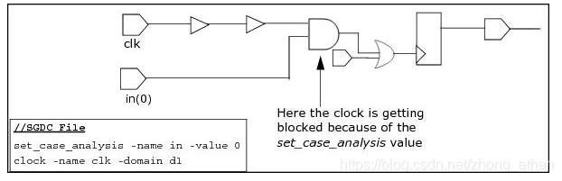


*   约束文件中没有约束时钟引脚，且use_inferred_clocks参数被设置为No  
    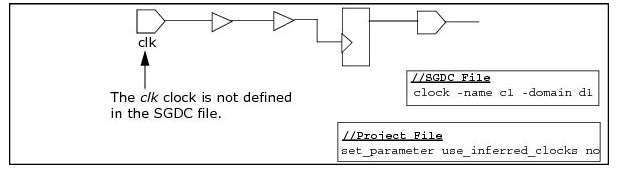
    
*   时钟路径上有Blackbox，且Blackbox输出的时钟未约束  
    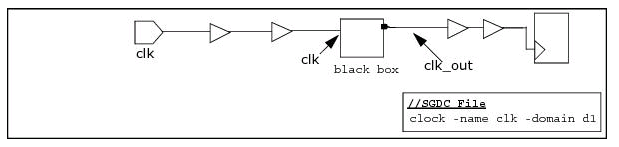
    
时钟在设计中没有传输  
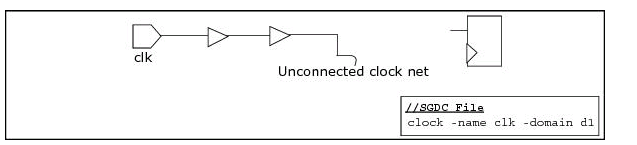

### Clock_info05a/b

如果设计中有多个时钟经过选择器，则需要通过**set_case_analysis**命令来约束。  
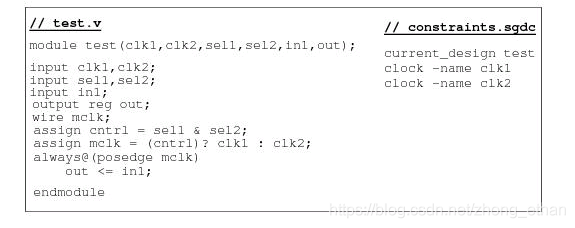  
在上面的例子中，有clk1和clk2两个输入时钟，经过选择器后输出一个时钟。如果不对选择器进行约束，就会报违例，可将约束文件修改为：

``` tcl
clock -name clk1
clock -name clk2
set_case_analysis -name sel1 -value 0
set_case_analysis -name sel0 -value 0
```
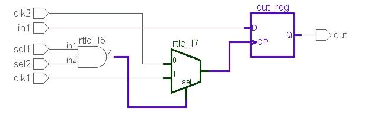

### Clock_info18
报告设计中未约束的引脚。
约束文件中一定要约束以下引脚：输入引脚（包括时钟，复位信号），输出引脚以及BLACKBOX的引脚。

* 对于顶层的输入输出引脚，可在约束文件中通过以下命令约束：input，output，clock，reset，set_case_analysis，abstract_port。
* 对于BLACKBOX的引脚可通过以下命令约束：clock，reset，abstract_port，assume_path以及signal_in_domain。
以上命令如何使用，可查阅spyglass help文档仔细阅读。


## cdc_verify_struct
主要检查设计中是否有未同步的信号，是否有毛刺。
在多时钟设计中，要考虑哪些信号需要同步？用什么同步方法？如果处理不当，则会在设计中引入亚稳态或者数据丢失。亚稳态产生的根本原因是建立时间或保持时间不够。
本文先简单介绍CDC常用同步方法，再介绍CDC_verify_struct中的rules。

### 哪些信号需要同步

时钟有效跳变沿的相位差是固定的，称为**同步时钟**。如下图clk1和clk2，虽然两者频率不一样，但有效边沿（上升沿）之间的相位差固定为T, 2T, 3T，因此可称为同步时钟。  
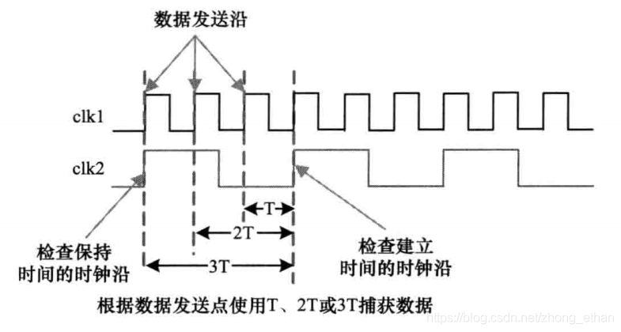

无法判定两个时钟有效边沿相位差，称为**异步时钟**。不同DPLL或晶振的时钟一定是异步时钟。信号跨异步时钟传输时如果不做同步处理，很容易引起亚稳态和数据丢失。如下图所示。  


同一个DPLL或晶振的时钟称为**同源时钟**。同源时钟根据频率和相位可以分为：

*   同频零相位差时钟
*   同频恒定相位差时钟
*   非同频可变相位差时钟，包括整数倍时钟和分数倍时钟。

**只要设计中的时钟不都是同频零相位差，就要考虑信号传输时是否会引入亚稳态，是否有数据丢失。**

### 常用同步方法

跨时钟域传输的信号可以分为两类：

*   **控制信号**的传输（通常为单bit），常用二级同步器。
*   **数据信号**的传输（通常为多bit），常用握手信号，异步FIFO方法。  
    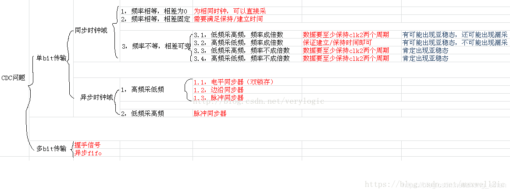


### AC_unsync01/02

报告跨时钟传输中未同步的信号。如果此项违例，应检查：

*   如果源寄存器和目的寄存器都在同一个IP模块中，使用ip_block约束此模块；
*   如果源寄存器或目的寄存器在black_box中，使用abstract_port或assume_path约束black_box端口；
*   如果源寄存器是个静态信号，使用quasi_static对源寄存器进行约束；
*   如果源寄存器是控制信号，检查信号是否通过一个有效同步器（qualifier）；
*   如果源寄存器是数据信号，检查是否使用异步FIFO或握手信号；

### AC_sync01/02
报告设计中已经同步的信号。这项规则只是报告信息，不会报告违例。

### AC_conv01/02/03
报告设计中的聚合问题。聚合问题有可能会引起数据一致性（data coherency）问题，即同步前的数据与同步后的数据不一致。

#### AC_conv01
AC_conv01规则报告信号经过同步器+寄存器后聚合违例：

*  不同信号经过同步器后又经过不同数量的寄存器，最终在同一个逻辑门处聚合  
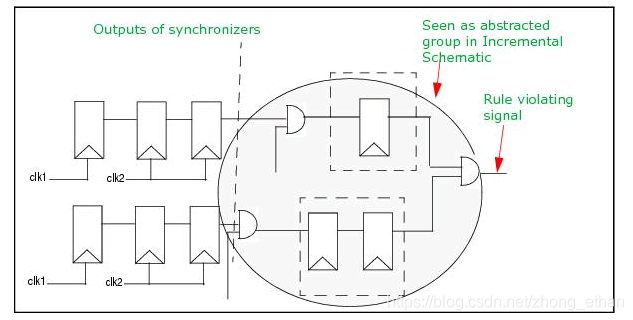

在上面例子中，第一根信号经过二级同步器后经过一个寄存器，第二个信号经过二级同步器后经过两个寄存器。这两个信号最终在同一个逻辑门处聚合。为什么这样会有问题？
*  假设两个信号在clk1时钟域有00->11的跳变，那么经过clk2时钟域的一堆寄存器后，在逻辑门处看到信号会有00->10->11的跳变，显然这样是不行的。
*  如果确保两根信号不会同时跳变，就没有问题，例如00->01或00->10的跳变就不会有问题。

*  同一个信号经过多个同步器后又经过不同数量的寄存器，最终在同一个逻辑门处聚合。这种情况与上述情况类似。  
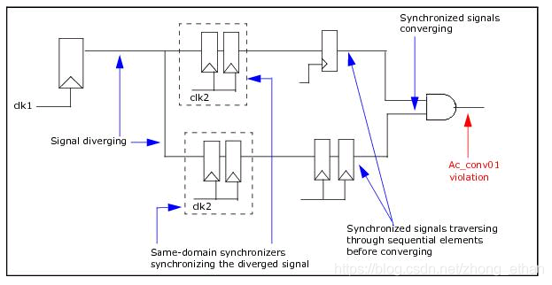

*   特殊情况下**不会**报违例：两个信号由同一个控制信号控制  
    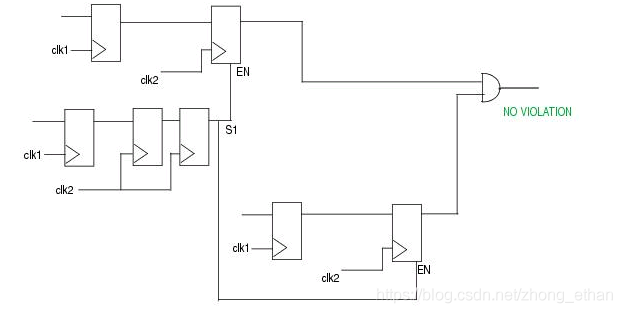
    

> 如果spyglass报出违例，但通过检查发现设计没有问题，可使用 cdc_false_path , quasi_static, cdc_filter_conherency等命令约束。

#### AC_conv02
AC_conv02规则报告信号经过同步器后聚合违例，且聚合后又通过寄存器：

*   报告不同信号经过同步器后在同一个逻辑门处聚合问题  
    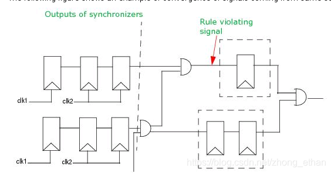

注意这里报告违例的地方与AC_conv01不同，仔细看两张图。一个是在寄存器之后聚合，一个是在寄存器之前聚合。这里为什么会出问题？
* 假设clk1时钟与信号有011->100跳变，由于各个路径延时不同，经过同步器后可能会产生011->110->100等奇怪的跳变。如果这个信号是个计数器，那么这样同步肯定有问题。
* 解决办法就是使用格雷码编码，在同步之前，先将二进制编码转换成格雷码，再经过同步器。可以参考异步FIFO中的格雷码指针同步。

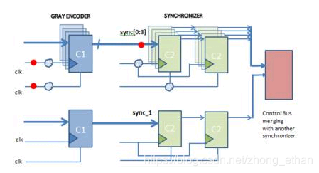
上述例子中，sync[0:3]是使用格雷码同步的信号，sync_1是经过二级同步器同步的信号，它们在同一个逻辑门处聚合，spyglass会报出这里违例。如果确定sync_1与sync[0:3]信号没有关系，即这样的设计没有问题，可使用如下约束脚本:

``` tcl
cdc_filter_coherenct -unrelated sync[0:3] sync_1
gray_signals -nam sync[0:3]
```
  

#### AC_conv03
AC_conv03规则检查不同时钟域信号经过同一个时钟域同步器后聚合问题。  
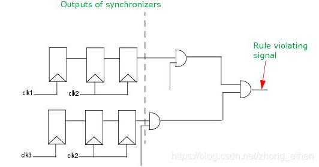


### AC_glitch03

报告设计中的**毛刺**。

> **竞争**： 组合逻辑电路中，同一信号经不同的路径传输后，到达电路中某一会合点的时间有先有后（每条途径的组合逻辑污染延时不同），这种现象称为逻辑竞争，而因此产生输出干扰脉冲的现象称为冒险。
**冒险**： 信号在器件内部通过连线和逻辑单元时，都有一定的延时。延时的大小与连线的长短和逻辑单元的数目有关，同时还受器件的制造工艺、工作电压、温度等条件的影响。信号的高低电平转换也需要一定的过渡时间。由于存在这两方面因素，多路信号的电平值发生变化时，在信号变化的瞬间，组合逻辑的输出有先后顺序，并不是同时变化，往往会出现一些不正确的尖峰信号，这些尖峰信号称为"毛刺"。如果一个组合逻辑电路中有"毛刺"出现，就说明该电路存在冒险。
**毛刺**： 数字电路中常将毛刺定义为采样间越过逻辑门限一次以上的任何跳变，主要是指电路输出波形中含有时间很短有规律或没有规律的脉冲而又对设计没有用处或产生其他影响，一般都要考虑去除毛刺。
**脉冲**： 在电子技术中，脉冲信号是一个按一定电压幅度，一定时间间隔连续发出的脉冲信号，在单位时间内所产生的脉冲个数就称为频率。例如手电筒打开灯亮，这是直流，不停的开关灯亮、熄，就形成了脉冲，开关速度的快慢也就是脉冲频率的高低。
**The reason for 竞争冒险**： 数字电路中的竞争与冒险出现在组合逻辑电路中。由于延迟时间的存在，当一个输入信号经过多条路径传送后又重新会合到某个门上，由于不同路径上门的级数不同，或者门电路延迟时间的差异，导致到达会合点的时间有先有后，从而产生瞬间的错误输出。
**The judgement for 竞争冒险**： 只要输出端的逻辑函数在一定的条件下能简化成 Y = A + A’ 或者 Y = A·A’，那么就可以判断存在竞争-冒险现象。
**The resolve of 竞争冒险**： 接入滤波电容、引入选通脉冲、修改逻辑设计等等。


### Clock_sync05/06
#### Clock_sync05
**Clock_sync05**报告输入信号被多个时钟域下寄存器采样，如下图中，输入信号在clka和clkb中被采样。  
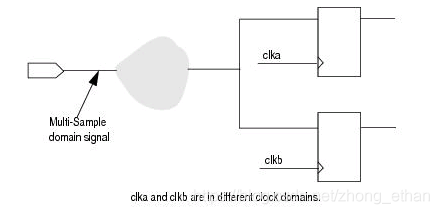


#### Clock_sync06
Clock_sync06报告输出信号由多个时钟域信号组合而成。
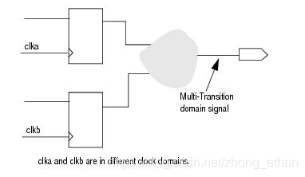
若确保设计没有问题，可使用**set_case_analysis**或**quasi_static**命令加强对输入信号的约束。

#### setup_quasi_static
准静态寄存器是指设计中的输入信号、寄存器、线网在芯片工作开始时改变，但在接下来的工作中保持为0或1。
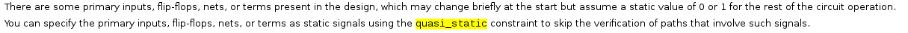
setup_quasi_static报告设计中spyglass推断出的准静态寄存器和约束脚本约束的静态寄存器。应仔细检查信号是否满足准静态寄存器的定义。如果信号被spyglass错误推断为准静态寄存器，那么当芯片工作时，该信号变化可能会引起功能出错。


## CDC_verify

CDC_verify(functional cdc checks)。主要检查：a）数据完整性；b) 格雷码编码；c) FIFO上溢或下溢；d) 握手协议。

### AC_cdc01a

检查快时钟到慢时钟同步数据传输是否丢失。  
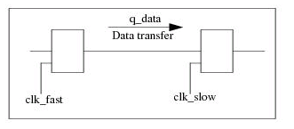  
如下图所示，快时钟域信号只维持一个时钟周期，很难被慢时钟域采到，造成数据丢失。  
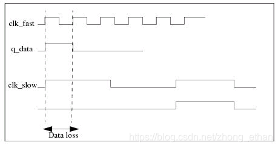

解决办法是在快时钟域添加extender，使信号至少维持一个慢时钟周期  
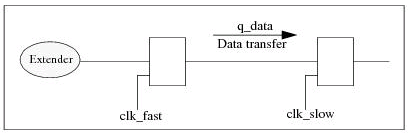

### AC_datahold01a

检查数据被另一个时钟域采样时是否稳定。与ac\_cdc01a规则相似，区别ac\_cdc01a检查单bit，ac\_datahold01a检查多bit数据。FIFO，握手以及门控同步模块不会检查。

### AC_conv02/04/05
检查跨时钟传输中没有聚合也没有格雷码编码的多bit控制信号  
（1）检查是否使用格雷码编码。下图中q[1:0]信号源没有采用格雷码编码。  
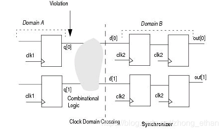  
（2）检查不同bit信号是否使用不同的同步方式。如下图src_bus[0]采用多级同步器方式同步，src_bus[1]采用同步控制信号方式  
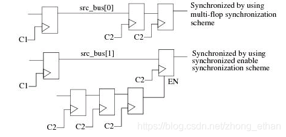

（3）检查不同bit信号是否使用同一个同步控制信号。如下图src_bus[0]与src_bus[1]采用不同的同步控制信号。  
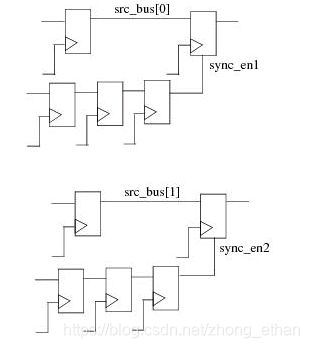

### AC_fifo01

检查设计中的FIFO是否会上溢或下溢

### AC_handshake01/02

（1）检查REQ-ACK信号是否满足四相握手协议：  
REQ拉高->ACK拉高->REQ拉低->ACK拉低  
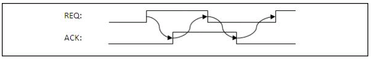  
（2）检查是否会有数据丢失


