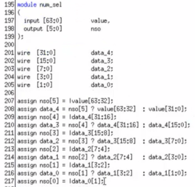

# 日常工作

hash coverage检查；
interconnect 18w面积看如何优化；
Memory 报warning问题；

~~会议纪要更新；~~
~~Memory新增50k：由于nfc软件功能越来越多需要跟大的空间存放指令；~~
~~NFI、NFC、CPU Memory 生成；~~

## V51之后的改动：
~~lba_lock 清DC error修改；~~
~~hpi_pwr_cg parameter改成1；~~

## 任务：
### Memory
ROM最后的时候要拿最新的hex重新生成；
intergrator+ memory 都弄到最新，重新搞一遍
mc更新后注意auto_split中的compiler范围也需要更新；

TPS和SP的区别？TPS可以同时不同地址读写，SP只能要么读，要么写；

~~synopsys 账号注册；~~
~~cfg 默认值如何确定的？RM4~~
~~sdc review一下；~~
~~LPU compiler 新增；~~
~~Memory之前脚本review视频；~~
~~Memory default值文档：~~

### pin_mux/Digital_io
**review视频：**
\\cdfile\Projects\STAR1500\2.ProjectTeam\1.SOC\Top\2024-04-17 15.25.03 任慧杰的digital_io pin_mux review 171472618\

mb_clk_buf是干啥的?
这是插了dont touch cell.也是为了防止被dc优化掉了,让后端好找这些逻辑。
ss_gpio_ds powerdomain设计？ 1.8 3.3 评估，没有用了
gpio相关寄存器？

PBFS_18_V\H 的区别？

### sms
LLD上传；
跨die数据长度不能超过16DW；
buf_ia、dbg_ia、ptr_sync没用了；
两个agent之间不直接通信，通msg网络通信；
config address map 和 device address的区别；

sms是因为总线不方便跨harden传输数据，方便master直接通信，不需要借助slave进行通信，queue的概念支持outstanding；
弄清楚des和tag概念；

SCA:
之前是cpu直接通过buf_ia发数据到msg总线；现在cpu把数据放到sram，给sca一个指针，sca根据指针的变化去捞数据；
buf_ia和ptr_sync可以联合起来实现msgqtx功能；
cfg_ia用来其他agent下发配置信息；
dbg_ia可以实现cfg_ia、buf_ia的功能；
hsa是cpu读的寄存器；
axi2lb(u_dmp):
axi协议解析读写，及地址计算(不用了)；
sm_ecl：（不用了）
锁一个地址，read锁地址，write释放地址；
二分法找bit1；

sca_lb_dec：
一分七分发

ptr_sync:
命令解析为ptr cfg\ptr send\cnt enb等操作；
支持指针发送，空满判断、指针收发计数；

buf_ia:（buf master）
用来数据传输；命令解析为dwbuf\bufcmd\cnt enb等操作；

buf_ta:
msg2axi数据桥接；

dgb_ia:
可以模仿其他模块的功能；需要先配置模仿哪个模块；

hsr：
高速的寄存器模块；

msgq_tx\tx_cfg:
改写写指针唤醒tx；
cpu先往sram写数据，然后更新tx写指针，读指针由其他agent回了response之后更新；

msgq_rx\rx_cfg:
收到数据之后更新读指针；
将其他agent发给cpu agent的数据通过buf_ta写到sram；

DLA：
tx里面怎么既又maseterr，又有masterw；
masterw用于向远端发送数据，masterr用于向远端请求credit；

smb_dec_0 发送cmd，及retry等命令，retry的命令会给到msg_relay_tx_send进行处理；

### nand_controller_interconnect

位宽转换模块里也插了pipe；

三四种逻辑：
位宽转换，插pipe；flooplan NFC 排布在NFI边上，走线较长，为了保证Timing 才插pipeline，后端建议插2级；
nic连接内部、外部的CPU及指令Memory； 
每个cell idle之后还要等一些逻辑执行完，才会产生总IDLE；

user_prog_coming_id\vld预发信号，可以提前准备；
c2i：cluster to interconnect
cad：cmd and data

address_remap：
将nic输出的32bit地址，转换成40bit总线宽度；将特定的地址区域的高8bit改成16bit；

common_peripheral：
nfc 外设控制，有相关寄存器；

cpu_iram：
后台加载Memory，主要是读操作；将axi读写放到各个queue里面，queue主要是增加性能，pipe起来；
 
soft_bit_manager：
decoder 和 nfc cell交互的逻辑，里面有个fifo存的数softbit_buffer的编号，cell需要softbit read时就去读fifo，fifo空就会req fail，否则就可以req success，req的id也会发到decoder，decoder处理完，会把id再还给manager；一个Buffer id可以存最大容量（20KB=4*5KB）；
之前设计是考虑到可能有8个Channel一起申请，就需要加入仲裁，但实际上只有一个，仲裁已经由nic帮忙做好了；

common_ch：
一些不做处理的信号，插pipeline，nfi来的插pipeline给cluster，cluster来的插pipeline给nfi；
cmd除了插pipeline，还要做位宽变换；
