# 成都小学三类是什么意思？
1、一类小学”、“二类小学”、“三类小学”划分依据为：教学质量，学生和教师的素质，学校的环境和标准等相关院校的软实力和硬实力。
2、一类小学相对教育资源丰富，在教师和教学设备上都有绝对的优势，对考生要求也会高些。
3、二类小学相比较一类小学在各个方面相对弱一些。
4、三类小学相比较二类小学在各个方面相对弱一些。

# 武侯区——1片区、2片区和12片区

## 学校情况

**1片区和2片区**
这两个片区，基本上把武侯区内的热门小学占完了，既有五朵金花之一的龙江路小学，也有区内比较知名的棕北小学、玉林小学、川大附小、锦官新城（私立）等。初中对口的也是区内的第一梯队，老牌的棕北中学，以及有名的高完中成都十二中。

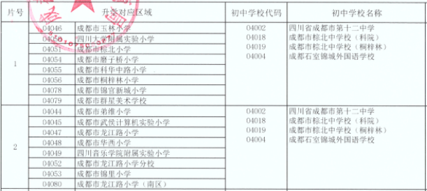

1片和2片对口初中一样，基本上把武侯区内的热门小学占完了，既有五朵金花之一的龙江路小学，也有区内比较知名的棕北小学、玉林小学、川大附小、锦官新城等  ；

**12片区**
12片是单校划片，北二外成都附小直升北二外成都附中，对那些不想摇号，想直接100%直升的家长来说，12片是最好的选择。 武侯区内的高中以川大附中、北二外为首，虽然没有高新区那么强，不过也是成都排名前列的高中。

## 对口楼盘

1片区和2片区保利中心、棕北国际、临江路60号、大学路10、川大新南村、府河竹苑、海德花苑等

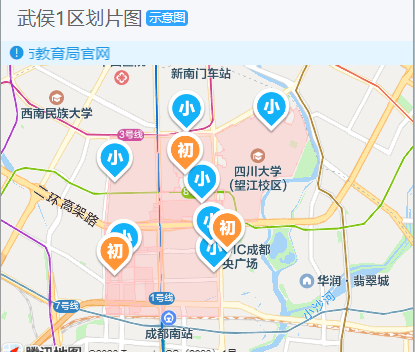

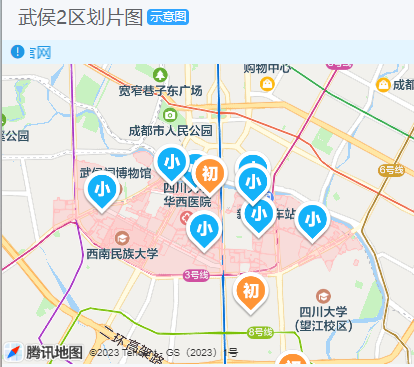

12片区金科博翠府、华宇静苑、置信丽都花园城、阳光城檀府等；

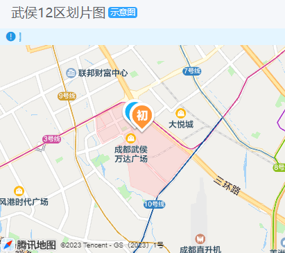

  
# 锦江区——2片区、4片区
## 学校情况
**2片区**
小学有两所“金花”——成师附小和盐道街小学，片区内的天涯石和龙王庙正街也是热门名校，小学整体质量放眼全成都都十分优质。  
初中有七中育才水井坊，成都公办初中第一梯队，其他初中虽然没七水这样强，但也算中等偏上，唯有短板十七中，让锦2的家长无法释怀。  

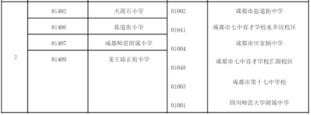

## 对口楼盘

世代锦江、蓝光皇后国际、锦江明珠、靓碧天苑、弘邦领邸、财富中心、城市理想等；

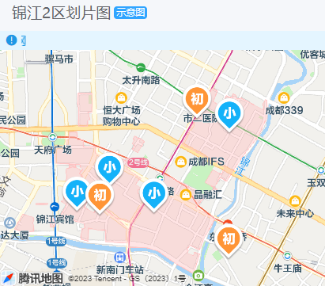

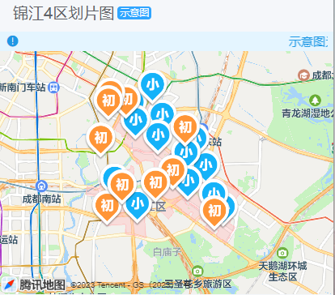

  
# 青羊区——2片区和5片区

## 学校情况
**2片区**
青羊2片，有五朵金花小学——实验小学和泡桐树小学，此外东城根街小学、胜西小学也都是优质名校。  
初中对口，最让人羡慕的是三小联中的两所——树德实验本部和石室联中本部；

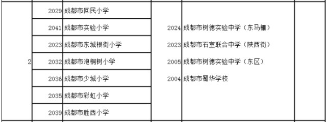

**5片区**
青羊5片，虽然没有五朵金花，但是区内的青羊实验附小、泡小西区、金沙小学都是比较热门的优质小学；
对口初中方面，青羊实验中学本部和泡桐树中学也是成都比较靠前的初中，虽然没有青2出彩，不过整体没有太大短板。

## 对口楼盘
2片区因为是老小区，大多没有名字，基本都集中在几条街上，人民中路一段、上翔街、泡桐树街、支矶石街、实业街等  ；

5片区水映长岛、浪琴湾、华府世家、水岸格林、皇冠花园、贝森园、长顺南苑、金沙云庭、蓝光凯丽美域、上品金沙等；

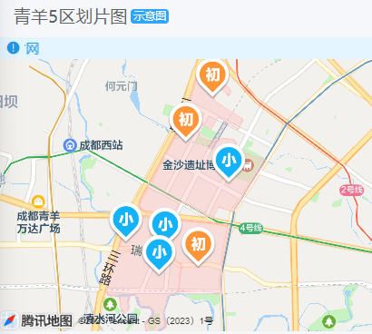

# 高新区——11片区和9片区
## 学校情况
**9片区**
9片的锦晖小学、泡小天府、七中初中附小、芳草小学南区，都是口碑好、人气高的小学。  
对口初中，也十分强，石室天府交子校区和七中初中天环校区，也是区内超级热门的中学，并且石室天府交子校区，不仅有初中还有高中，去年高中录取分数仅次于四七九，进了石室天府的初中，中考还有机会直升本校高中。   
初中算是11片最大的亮点，石室天府锦城湖从诞生之初就是关注度极其高，与石室天府本部是同一法人、同一校长，同一个管理团队，作为石室天府的初中部，锦城湖校区自然也会有中考校内直升的资格进入石室天府高中。才办学第一年就已经因为期末优异的成绩，赢得了家长们极高的评价。教科院附属学校，但也是口碑与成绩极好的初中。没有短板，是11片，最优的地方。  

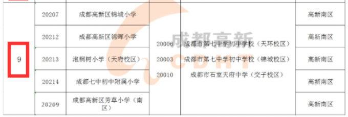

**11片区**
相比9片，11片的学校都比较新，教科院西区和蒙彼利埃小学，都是办学时间并不长的小学，蒙小去年才有第一届毕业生，但蒙小作为成都第一个国际化公办小学，一直都很吃香，益州小学也算是热门小学。初中算是11片最大的亮点，石室天府锦城湖从诞生之初就是关注度极其高。

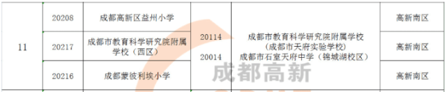

## 对口楼盘
9片其实就是金融城板块，楼盘有人居天府世家、西派国际、中海城南、复地金融岛、长城半岛城邦、东苑A-F区等；

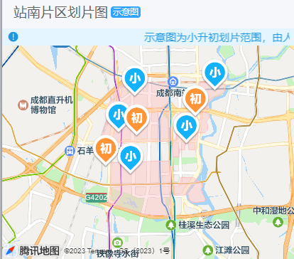

11片就是我们熟知的大源板块，楼盘有天悦府、中环岛、中洲锦城湖岸、峰度天下、中海兰庭、华府西苑、华润凤凰城等；

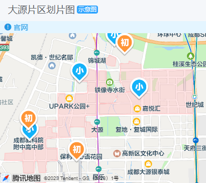

   

# 成华区3片
小学有建设路小学和成华实验小学，算是区内比较好的小学；
对口的初中成都英才、石室初中、四十九中都是区内最优质的一批初中。  
  
# 金牛4片
有新五朵金花——石笋街小学、茶店子小学当门面；初中方面，金牛实验算是区内公办初中的领头羊。
